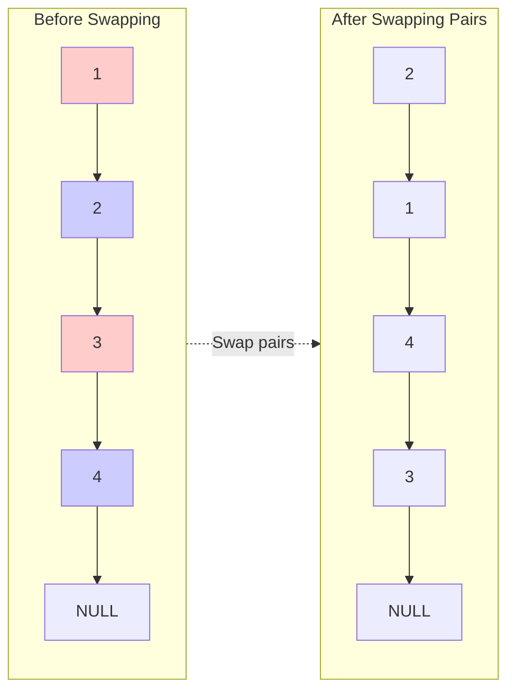

# Swap Nodes in Pairs

## Problem

Given a linked list, swap every pair of adjacent nodes by changing the node pointers themselves, not just their values. For example, given 1→2→3→4, you should return 2→1→4→3. The emphasis on modifying actual node pointers rather than swapping values is crucial: in real systems, nodes might contain large data structures where copying values is expensive or impossible. If the list has an odd number of nodes, the last node remains in place. The pointer manipulation requires careful orchestration: you need to rewire three connections simultaneously without losing references to nodes. Consider what happens when you swap the first pair - the head of the list changes! Edge cases include empty lists, single-node lists, and ensuring you don't skip pairs accidentally.

**Diagram:**




## Why This Matters

Pointer manipulation is fundamental to implementing data structures and managing memory in systems programming. The "pointer dance" you perform here appears in more complex scenarios like reversing sublists, reordering linked lists, and implementing LRU caches. Many production systems avoid swapping values because nodes might contain megabytes of data or represent resources that shouldn't be copied. The dummy node pattern you'll use simplifies edge case handling, a technique that makes production code more maintainable. This problem has both an iterative and recursive solution, teaching you to think about problems from multiple angles. Graph algorithms often require similar pointer rewiring when modifying adjacency lists. Understanding the order of pointer updates prevents bugs where you lose references to parts of your data structure. It's an interview favorite because it reveals whether candidates truly understand pointer mechanics versus just memorizing patterns.

## Examples

**Example 1:**
- Input: `head = []`
- Output: `[]`

**Example 2:**
- Input: `head = [1]`
- Output: `[1]`

## Constraints

- The number of nodes in the list is in the range [0, 100].
- 0 <= Node.val <= 100

## Think About

1. How do you swap two nodes while maintaining list integrity?
2. What happens to the pointers when you swap nodes 1 and 2?
3. How does a dummy node simplify the head swap case?
4. Can you solve this recursively? What's the base case?

---

## Approach Hints

<details>
<summary>💡 Hint 1: Understanding the pointer dance</summary>

Swapping nodes (not just values!) requires rewiring three connections:

```
Before swap:
prev → 1 → 2 → 3 → 4 → NULL

After swap:
prev → 2 → 1 → 3 → 4 → NULL
```

**What needs to change:**
1. `prev.next` should point to node 2 (not node 1)
2. Node 1's next should point to node 3 (skipping node 2)
3. Node 2's next should point to node 1

**Think about:**
- Why do we need to track three nodes at once (prev, first, second)?
- What order should we update the pointers to avoid losing references?

</details>

<details>
<summary>🎯 Hint 2: The iterative algorithm</summary>

The key is to process pairs iteratively while tracking the previous node.

```
Step-by-step for each pair:
1. Save references to the two nodes to swap
2. Update previous node to point to the second node
3. Rewire the two nodes
4. Move to the next pair

Pseudocode:
dummy → head
current = dummy

while current.next AND current.next.next:
    # Save the pair
    first = current.next
    second = current.next.next

    # Rewire (order matters!)
    first.next = second.next
    second.next = first
    current.next = second

    # Move to next pair
    current = first  # first is now after second

return dummy.next
```

**Why dummy node?**
- Handles swapping the first pair cleanly
- Provides a stable starting point

</details>

<details>
<summary>📝 Hint 3: The recursive approach</summary>

Recursion can be more elegant for this problem:

```python
def swapPairs(head):
    # Base case: 0 or 1 node left
    if not head or not head.next:
        return head

    # Save references
    first = head
    second = head.next

    # Recursive call on rest of list
    first.next = swapPairs(second.next)

    # Swap this pair
    second.next = first

    # Return new head (second is now first)
    return second
```

**How it works:**
```
swapPairs(1→2→3→4)
  first=1, second=2
  1.next = swapPairs(3→4)
           first=3, second=4
           3.next = swapPairs(None) = None
           4.next = 3
           return 4 → 3
  1.next = 4→3
  2.next = 1
  return 2→1→4→3
```

**Trade-off:** Elegant but uses O(n) call stack space.

</details>

---

## Complexity Analysis

| Approach | Time | Space | Trade-off |
|----------|------|-------|-----------|
| Swap values only | O(n) | O(1) | Simple but violates "swap nodes" requirement |
| **Iterative pointer manipulation** | **O(n)** | **O(1)** | Optimal space, more complex code |
| Recursive | O(n) | O(n) | Elegant code, uses call stack |

**Where n is the number of nodes**

**Why iterative wins:**
- O(1) space complexity (no recursion overhead)
- Single pass through the list
- Truly swaps nodes, not just values
- Interview-preferred for discussing space optimization

**Space breakdown (iterative):**
- Dummy node: O(1)
- Pointer variables: O(1)
- No auxiliary data structures

**When to use recursive:**
- When code clarity is prioritized over space
- In languages with tail call optimization
- For educational purposes (easier to understand)

---

## Common Mistakes

### 1. Swapping values instead of nodes
```python
# WRONG: This swaps values, not nodes!
def swapPairs(head):
    current = head
    while current and current.next:
        # Swapping values is easier but not what's asked
        current.val, current.next.val = current.next.val, current.val
        current = current.next.next
    return head

# CORRECT: Rewire the actual node pointers
# (See iterative solution above)
```

### 2. Incorrect pointer update order
```python
# WRONG: Loses reference to second.next
current.next = second  # Oops! Now we can't access second.next
first.next = second.next  # Too late!

# CORRECT: Save second.next first
first.next = second.next
second.next = first
current.next = second
```

### 3. Not using a dummy node
```python
# MESSY: Special case for swapping head
if head and head.next:
    new_head = head.next
    # ... complex logic to handle first pair ...
else:
    return head

# CLEAN: Dummy node handles all cases uniformly
dummy = ListNode(0)
dummy.next = head
# ... standard swapping logic ...
return dummy.next
```

### 4. Infinite loop or skipping pairs
```python
# WRONG: Infinite loop!
while current.next and current.next.next:
    # ... swap nodes ...
    current = current.next  # Still points to a swapped node!

# CORRECT: Move to the next pair
while current.next and current.next.next:
    # ... swap nodes ...
    current = first  # first is now the last of the swapped pair
```

---

## Variations

| Variation | Change | Approach Adjustment |
|-----------|--------|---------------------|
| **Swap in groups of K** | Swap every K nodes | Generalize to handle K-sized groups |
| **Reverse pairs** | Reverse every 2 nodes | Same as swapping pairs |
| **Swap odd/even positioned nodes** | All odds with evens | Separate into two lists, merge |
| **Swap specific positions** | Swap node at pos i with pos j | Find both nodes, swap pointers |
| **Rotate pairs** | Rotate groups of 2 | Similar pointer manipulation |

**Swap in groups of K variation:**
```python
def reverseKGroup(head, k):
    """
    Swap in groups of K nodes (e.g., k=3: swap 1-2-3, then 4-5-6, etc.)
    """
    dummy = ListNode(0)
    dummy.next = head
    prev_group = dummy

    while True:
        # Check if k nodes remain
        kth = prev_group
        for _ in range(k):
            kth = kth.next
            if not kth:
                return dummy.next

        # Reverse k nodes
        group_prev = None
        current = prev_group.next
        for _ in range(k):
            next_node = current.next
            current.next = group_prev
            group_prev = current
            current = next_node

        # Connect with previous group
        tail = prev_group.next
        prev_group.next = group_prev
        tail.next = current
        prev_group = tail
```

---

## Visual Walkthrough

```
Input: 1 → 2 → 3 → 4 → NULL

Step 0: Create dummy
dummy → 1 → 2 → 3 → 4 → NULL
  ↑
current

Step 1: Swap first pair (1 and 2)
Identify: first=1, second=2

Before swap:
dummy → 1 → 2 → 3 → 4 → NULL

Rewire:
1. first.next = second.next    →  1 → 3
2. second.next = first          →  2 → 1 → 3
3. current.next = second        →  dummy → 2

After swap:
dummy → 2 → 1 → 3 → 4 → NULL
              ↑
         move current here

Step 2: Swap second pair (3 and 4)
Identify: first=3, second=4

Before swap:
dummy → 2 → 1 → 3 → 4 → NULL
              ↑
          current

Rewire:
1. first.next = second.next    →  3 → NULL
2. second.next = first          →  4 → 3 → NULL
3. current.next = second        →  1 → 4

After swap:
dummy → 2 → 1 → 4 → 3 → NULL
                      ↑
                 move current here

Step 3: No more pairs, exit

Final result: 2 → 1 → 4 → 3 → NULL
```

**Edge case: Odd number of nodes**
```
Input: 1 → 2 → 3 → NULL

After swapping first pair:
2 → 1 → 3 → NULL
      ↑
  current

Check: current.next = 3 (exists)
       current.next.next = NULL (doesn't exist)

Loop exits, leaving node 3 unchanged.

Result: 2 → 1 → 3 → NULL  (3 stays in place)
```

---

## Practice Checklist

**Correctness:**
- [ ] Handles empty list (0 nodes)
- [ ] Handles single node (1 node)
- [ ] Handles even number of nodes (all pairs swapped)
- [ ] Handles odd number of nodes (last node stays)
- [ ] Truly swaps nodes, not values

**Code Quality:**
- [ ] Uses dummy node pattern
- [ ] Correct pointer update order
- [ ] No infinite loops
- [ ] Clean variable naming

**Interview Readiness:**
- [ ] Can explain iterative approach in 3 minutes
- [ ] Can code solution in 10 minutes
- [ ] Can explain recursive approach
- [ ] Can discuss space trade-offs
- [ ] Can handle "swap in groups of K" follow-up

**Spaced Repetition Tracker:**
- [ ] Day 1: Initial solve (iterative)
- [ ] Day 3: Solve recursive version
- [ ] Day 7: Solve "reverse in groups of K" variation
- [ ] Day 14: Explain both approaches to someone
- [ ] Day 30: Quick review and edge case testing

---

**Strategy**: See [Linked List Pattern](../../strategies/data-structures/linked-lists.md)
