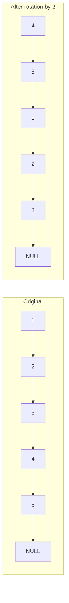
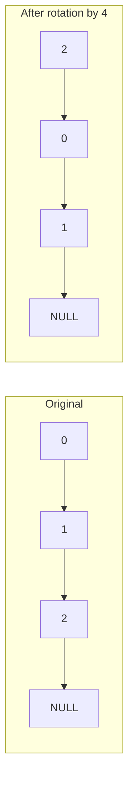

# Rotate List

## Problem

Given the head of a linked list, rotate the list to the right by k positions. A rotation moves the last node to the front of the list. For example, rotating the list 1-2-3-4-5 to the right by 2 positions moves the last two nodes (4 and 5) to the front, resulting in 4-5-1-2-3.

The list is represented as a singly linked list, where each node points to the next node. The rotation value k can be any non-negative integer, including values larger than the list length. When k exceeds the list length, the rotation wraps around. For instance, rotating a list of length 3 by k=4 is equivalent to rotating by k=1, since after 3 rotations the list returns to its original position.

Your task is to perform this rotation in-place by manipulating the node pointers, returning the new head of the rotated list. You should not create new nodes or allocate extra space for another list.

**Diagram:**

Example 1: Rotate list `[1,2,3,4,5]` by k=2

Example 2: Rotate list `[0,1,2]` by k=4

## Why This Matters

This problem teaches essential linked list manipulation techniques that appear throughout software engineering. In circular buffer implementations used by operating system schedulers and network routers, elements shift positions while maintaining connections. Audio and video streaming applications use similar rotation logic to manage playback buffers and handle seek operations. The challenge of handling k values larger than the list length mirrors real-world scenarios where you must process modular arithmetic to avoid redundant work. Understanding how to efficiently locate the new head by finding the node at position (length - k) demonstrates the value of two-pointer techniques and careful edge case handling. This problem frequently appears in coding interviews because it tests your ability to visualize pointer manipulation, handle circular list patterns, and optimize for cases where naive iteration would be wasteful.

## Constraints

- The number of nodes in the list is in the range [0, 500].
- -100 <= Node.val <= 100
- 0 <= k <= 2 * 10⁹

## Think About

1. What's the brute force approach? What's its time complexity?
2. Can you identify any patterns in the examples?
3. What data structure would help organize the information?
