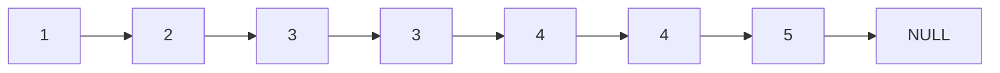
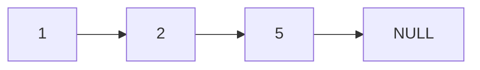
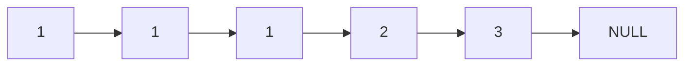
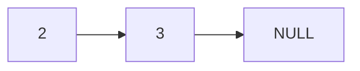

# Remove Duplicates from Sorted List II

## Problem

Given the head of a sorted linked list, delete all nodes that have duplicate values, leaving only distinct numbers from the original list. Unlike the simpler version where you keep one copy of each duplicate value, here you must remove all occurrences of any value that appears more than once.

For example, given the list 1-2-3-3-4-4-5, you must remove both 3 nodes and both 4 nodes, returning 1-2-5. If the list is 1-1-1-2-3, you must remove all three 1 nodes, returning 2-3. If all nodes have duplicate values, return an empty list.

The list is sorted in ascending order, which means duplicates appear consecutively. This property simplifies detection: you can identify a duplicate group by checking if the current node's value equals the next node's value. Once you detect duplicates, you must skip the entire group of nodes with that value.

A common technique is to use a dummy node that points to the head. This dummy node simplifies edge cases where the head itself is part of a duplicate group. You maintain a predecessor pointer that tracks the last node before a potential duplicate group. When you find duplicates, you update the predecessor's next pointer to skip the entire duplicate group, effectively removing all those nodes from the list.

**Diagram:**

Example 1: Input: head = [1,2,3,3,4,4,5]


Output: [1,2,5]


Example 2: Input: head = [1,1,1,2,3]


Output: [2,3]



## Why This Matters

This problem teaches you to handle more complex linked list manipulation where you cannot simply modify nodes in isolation. In data deduplication systems, you often need to remove all instances of corrupted or invalid records rather than keeping one copy. Stream processing pipelines may filter out all events with duplicate timestamps to ensure each unique moment is represented by a single clean record. The dummy node technique is invaluable across linked list problems because it eliminates special-case logic for head modifications, making your code cleaner and less error-prone. Understanding how to correctly advance the predecessor pointer only when keeping nodes, versus when skipping duplicate groups, is a subtle but critical skill. This problem appears frequently in technical interviews as a step up from basic linked list manipulation, testing your ability to manage multiple pointers, handle edge cases like an all-duplicate list, and write code that doesn't leak memory by properly disconnecting removed nodes.

## Constraints

- The number of nodes in the list is in the range [0, 300].
- -100 <= Node.val <= 100
- The list is guaranteed to be **sorted** in ascending order.

## Think About

1. What's the brute force approach? What's its time complexity?
2. Can you identify any patterns in the examples?
3. What data structure would help organize the information?

## Approach Hints

<details>
<summary>💡 Hint 1: Conceptual</summary>

Unlike the version that keeps one duplicate, here you must remove ALL occurrences if a value appears more than once. This means you need to detect when duplicates start and skip the entire group. A dummy node helps handle edge cases when the head itself is part of a duplicate group.

</details>

<details>
<summary>🎯 Hint 2: Approach</summary>

Use a dummy node pointing to the head. Maintain a predecessor pointer that points to the last node before a potential duplicate group. For each node, look ahead to detect duplicates. If duplicates exist, skip the entire group by updating the predecessor's next pointer.

</details>

<details>
<summary>📝 Hint 3: Algorithm</summary>

Pseudocode approach:
1. Create dummy node pointing to head
2. Set predecessor = dummy
3. Set current = head
4. While current exists:
   - Check if current.val == current.next.val (duplicate detected)
   - If yes, skip all nodes with current.val
   - Update predecessor.next to skip the group
   - If no, move predecessor forward
5. Return dummy.next

</details>

## Complexity Analysis

| Approach | Time | Space | Notes |
|----------|------|-------|-------|
| Hash Set Count | O(n) | O(n) | Two passes: count, then rebuild |
| **One Pass with Dummy** | **O(n)** | **O(1)** | Single traversal, constant space |

## Common Mistakes

### 1. Not using a dummy node
```python
# WRONG: Complex head handling when head is duplicate
if head and head.next and head.val == head.next.val:
    # Skip head... but what if all nodes are duplicates?
    while head and head.val == original_val:
        head = head.next

# CORRECT: Dummy node simplifies edge cases
dummy = ListNode(0, head)
pred = dummy
# Now can treat head like any other node
```

### 2. Not skipping entire duplicate group
```python
# WRONG: Only removes one duplicate
if current.val == current.next.val:
    pred.next = current.next.next  # Skips only one node

# CORRECT: Skip all nodes in duplicate group
while current.next and current.val == current.next.val:
    current = current.next
pred.next = current.next  # Skip entire group
```

### 3. Moving predecessor incorrectly
```python
# WRONG: Moving predecessor even when duplicates found
if current.val == current.next.val:
    # skip duplicates
pred = pred.next  # Should NOT move if duplicates skipped

# CORRECT: Only move predecessor when no duplicates
if current.val == current.next.val:
    # skip duplicates
else:
    pred = pred.next  # Move only when keeping node
```

## Variations

| Variation | Change | Approach Adjustment |
|-----------|--------|---------------------|
| Keep one duplicate | Remove extras but keep one | Simpler: just skip duplicates, keep current |
| Unsorted list | No sorted guarantee | Must use hash map to track counts, O(n) space |
| Remove all duplicates from array | Array instead of linked list | Two-pointer technique with in-place modification |
| Return deleted nodes | Return removed duplicates | Collect skipped nodes in separate list |

## Practice Checklist

- [ ] Handles empty/edge cases (empty list, single node, all duplicates)
- [ ] Can explain approach in 2 min
- [ ] Can code solution in 15 min
- [ ] Can discuss time/space complexity
- [ ] Understands difference from "keep one duplicate" version

**Spaced Repetition:** Day 1 → 3 → 7 → 14 → 30

---

**Strategy**: See [Linked List Pattern](../../prerequisites/linked-lists.md)
