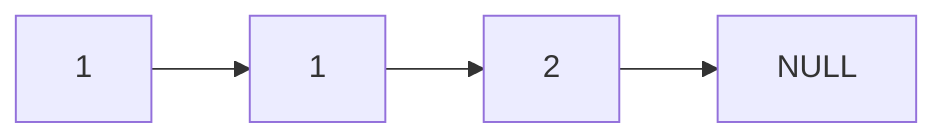
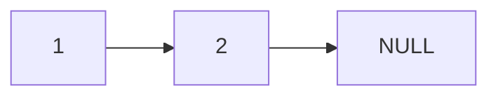
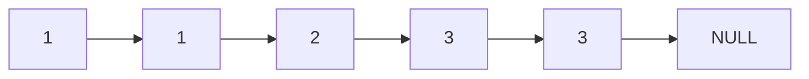
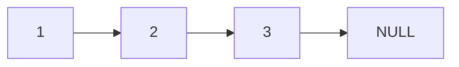

# Remove Duplicates from Sorted List

## Problem

Given a sorted linked list (where each node points to the next node), remove all duplicate values so that each value appears only once. A linked list is a data structure where each element (called a node) contains a value and a pointer to the next node, forming a chain. For example, if you have the list 1 -> 1 -> 2, you should modify it to become 1 -> 2 by removing the duplicate 1. Since the input list is already sorted in ascending order, all duplicates will appear consecutively, which makes detection straightforward. You must modify the list in-place without creating a new list structure. The challenge is to correctly adjust the "next" pointers to skip over duplicate nodes while preserving the overall list structure.

**Diagram:**

Example 1: Input: head = [1,1,2]


Output: [1,2]


Example 2: Input: head = [1,1,2,3,3]


Output: [1,2,3]



## Why This Matters

This problem is fundamental to data cleaning and deduplication tasks common in real-world applications like removing duplicate user records, cleaning sensor data streams, or merging sorted logs. It teaches the essential linked list skill of pointer manipulation - specifically how to "rewire" node connections without losing track of your position in the list. Mastering this pattern prepares you for more complex linked list operations like reversals, partitioning, and cycle detection. In technical interviews, this is often a warm-up problem to assess your understanding of pointer mechanics and edge case handling. The sorted property makes this problem approachable while still requiring careful thought about when to advance your pointer versus when to skip nodes.

## Constraints

- The number of nodes in the list is in the range [0, 300].
- -100 <= Node.val <= 100
- The list is guaranteed to be **sorted** in ascending order.

## Think About

1. What's the brute force approach? What's its time complexity?
2. Can you identify any patterns in the examples?
3. What data structure would help organize the information?

## Approach Hints

<details>
<summary>💡 Hint 1: Conceptual</summary>

Since the list is sorted, all duplicate values appear consecutively. As you traverse the list, you can compare each node with its next node. If they have the same value, skip the next node by adjusting pointers. This is simpler than the "remove all duplicates" version because you always keep the current node.

</details>

<details>
<summary>🎯 Hint 2: Approach</summary>

Use a single pointer traversal. At each node, check if the next node has the same value. If yes, skip it by setting current.next = current.next.next. If no, move to the next node. No dummy node is needed since you never remove the current node.

</details>

<details>
<summary>📝 Hint 3: Algorithm</summary>

Pseudocode approach:
1. Set current = head
2. While current and current.next exist:
   - If current.val == current.next.val:
     - Skip next node: current.next = current.next.next
   - Else:
     - Move forward: current = current.next
3. Return head

</details>

## Complexity Analysis

| Approach | Time | Space | Notes |
|----------|------|-------|-------|
| Hash Set | O(n) | O(n) | Track seen values, rebuild list |
| **Single Pass** | **O(n)** | **O(1)** | One traversal, in-place modification |

## Common Mistakes

### 1. Moving pointer after skipping duplicate
```python
# WRONG: Moves current forward after skipping
if current.val == current.next.val:
    current.next = current.next.next
current = current.next  # Might skip valid nodes

# CORRECT: Only move when values differ
if current.val == current.next.val:
    current.next = current.next.next
else:
    current = current.next
```

### 2. Not handling consecutive duplicates
```python
# WRONG: Only removes one duplicate occurrence
if current.val == current.next.val:
    current.next = current.next.next
    current = current.next  # Misses if 3+ duplicates

# CORRECT: Stay at current until all duplicates removed
while current.next and current.val == current.next.val:
    current.next = current.next.next
current = current.next
```

### 3. Not checking for null before accessing next
```python
# WRONG: Null pointer exception
while current:
    if current.val == current.next.val:  # Fails if current.next is null
        current.next = current.next.next

# CORRECT: Check both current and current.next
while current and current.next:
    if current.val == current.next.val:
        current.next = current.next.next
    else:
        current = current.next
```

## Variations

| Variation | Change | Approach Adjustment |
|-----------|--------|---------------------|
| Remove all duplicates | Delete all occurrences of duplicates | Need dummy node, track predecessor, skip groups |
| Unsorted list | No sorted guarantee | Use hash set to track seen values, O(n) space |
| Remove duplicates from array | Array instead of list | Two-pointer technique with write index |
| Keep k occurrences | Allow up to k duplicates | Track count for each value group |

## Practice Checklist

- [ ] Handles empty/edge cases (empty list, single node, no duplicates)
- [ ] Can explain approach in 2 min
- [ ] Can code solution in 10 min
- [ ] Can discuss time/space complexity
- [ ] Understands difference from "remove all duplicates" version

**Spaced Repetition:** Day 1 → 3 → 7 → 14 → 30

---

**Strategy**: See [Linked List Pattern](../../prerequisites/linked-lists.md)
