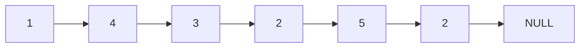
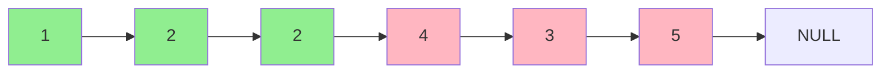

# Partition List

## Problem

Given a linked list and a target value x, rearrange the list so that all nodes with values less than x appear before all nodes with values greater than or equal to x. Importantly, you must preserve the relative order of nodes within each partition. For example, if you have [1,4,3,2,5,2] with x = 3, all nodes with values less than 3 (which are 1,2,2) should come first in their original order, followed by nodes with values >= 3 (which are 4,3,5) in their original order, giving [1,2,2,4,3,5]. This is similar to how the partition step works in the quicksort algorithm, but here you're working with a linked list structure where you can't randomly access elements. You need to manipulate node pointers to achieve this rearrangement, and edge cases like empty lists or all nodes being on one side of the partition need special attention.

**Diagram:**

Example: Input: head = [1,4,3,2,5,2], x = 3

Input list:


Output list (all values < 3 come before values >= 3):



## Why This Matters

Partitioning is a core operation in many sorting and divide-and-conquer algorithms, with quicksort being the most prominent example. This problem demonstrates how to adapt array-based partitioning logic to work with linked lists, teaching you to think about data structure constraints. In real applications, you might use this pattern for task prioritization (urgent tasks before normal tasks), message queue ordering, or organizing data streams by categories while preserving chronological order within categories. The technique of building separate sublists and then connecting them is a powerful pattern that appears in merge operations, list splitting, and even in some graph algorithms. Interviewers use this to evaluate your ability to manage multiple pointers simultaneously and handle edge cases like empty partitions without introducing bugs like cycles or lost references.

## Examples

**Example 1:**
- Input: `head = [2,1], x = 2`
- Output: `[1,2]`

## Constraints

- The number of nodes in the list is in the range [0, 200].
- -100 <= Node.val <= 100
- -200 <= x <= 200

## Think About

1. What's the brute force approach? What's its time complexity?
2. Can you identify any patterns in the examples?
3. What data structure would help organize the information?

## Approach Hints

<details>
<summary>💡 Hint 1: Conceptual</summary>

You need to maintain the relative order of nodes within each partition (less than x, and greater than or equal to x). Instead of trying to rearrange nodes in place, consider building two separate lists and then connecting them.

</details>

<details>
<summary>🎯 Hint 2: Approach</summary>

Create two dummy nodes: one for the "less than x" partition and one for the "greater or equal to x" partition. Traverse the original list once, appending each node to the appropriate partition. Finally, connect the tail of the first partition to the head of the second partition.

</details>

<details>
<summary>📝 Hint 3: Algorithm</summary>

Pseudocode approach:
1. Create two dummy nodes: before_dummy and after_dummy
2. Initialize before = before_dummy, after = after_dummy
3. Traverse original list with current pointer:
   - If current.val < x: append to before list
   - Else: append to after list
4. Connect before tail to after head
5. Set after tail's next to null
6. Return before_dummy.next

</details>

## Complexity Analysis

| Approach | Time | Space | Notes |
|----------|------|-------|-------|
| Array Conversion | O(n) | O(n) | Convert to array, partition, rebuild list |
| In-Place Swap | O(n²) | O(1) | Bubble-sort style swapping |
| **Two Partition Lists** | **O(n)** | **O(1)** | Single pass, constant extra space (only dummy nodes) |

## Common Mistakes

### 1. Not breaking the connection at the end
```python
# WRONG: Creates cycle if last node is in "before" partition
before.next = after_dummy.next
return before_dummy.next  # May have cycle

# CORRECT: Explicitly terminate after partition
before.next = after_dummy.next
after.next = None  # Break potential cycle
return before_dummy.next
```

### 2. Modifying original nodes incorrectly
```python
# WRONG: Losing reference to rest of list
if current.val < x:
    before.next = current
    before = current
    current = current.next  # Lost if before = current

# CORRECT: Save next before modifying pointers
next_node = current.next
if current.val < x:
    before.next = current
    before = current
else:
    after.next = current
    after = current
current = next_node
```

### 3. Not using dummy nodes
```python
# WRONG: Complex handling of first node in each partition
if current.val < x:
    if before_head is None:
        before_head = current  # Special case
    else:
        before_tail.next = current

# CORRECT: Dummy nodes eliminate special cases
before_dummy = ListNode(0)
after_dummy = ListNode(0)
before = before_dummy  # No special case needed
```

## Variations

| Variation | Change | Approach Adjustment |
|-----------|--------|---------------------|
| Three-way partition | Partition into <x, =x, >x | Use three dummy nodes and three lists |
| Stable partition array | Array instead of linked list | Use two-pointer or extra array approach |
| K-way partition | Partition into k groups | Use k dummy nodes, determine group by formula |
| In-place with single pointer | Must modify in place | Complex pointer manipulation, not recommended |

## Practice Checklist

- [ ] Handles empty/edge cases (empty list, single node, all less/greater than x)
- [ ] Can explain approach in 2 min
- [ ] Can code solution in 15 min
- [ ] Can discuss time/space complexity
- [ ] Remembers to terminate the after partition

**Spaced Repetition:** Day 1 → 3 → 7 → 14 → 30

---

**Strategy**: See [Linked List Pattern](../../strategies/data-structures/linked-lists.md)
