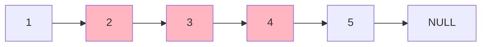
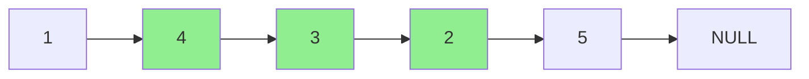

# Reverse Linked List II

## Problem

Given a linked list, reverse only the nodes from position left to position right (1-indexed), leaving the rest of the list unchanged. For example, if you have the list [1,2,3,4,5] and you're asked to reverse from position 2 to position 4, you need to reverse the sublist [2,3,4] to get [4,3,2], resulting in [1,4,3,2,5]. The positions are inclusive, meaning both the left and right positions should be part of the reversed section. You must perform this reversal in-place using a single pass through the list, which requires carefully managing multiple pointers to track the node before the reversal starts, the first node of the reversed section, and the connections to the rest of the list. Edge cases include reversing from the very first node (left=1) or reversing all the way to the last node, both of which require special handling to avoid losing references to the rest of the list.

**Diagram:**

Example: Input: head = [1,2,3,4,5], left = 2, right = 4

Input list:


Output list (nodes 2-4 are reversed):



## Why This Matters

Partial list reversal appears in text editing operations (reversing words or sentences in place), memory management (rearranging blocks), and data structure implementations where you need to reorganize portions of sequences without reallocating. This problem builds on the simpler "reverse entire list" problem by adding the complexity of maintaining connections to unreversed portions, teaching you to think about boundary conditions and multiple simultaneous pointer updates. The dummy node technique introduced here is a fundamental pattern that simplifies many linked list problems by eliminating special cases for head manipulation. In interviews, this is considered a classic medium-difficulty problem that tests whether you can decompose a task into phases: navigate to position, perform reversal, reconnect parts. The one-pass requirement ensures you understand how to manage state during traversal without backtracking.

## Examples

**Example 1:**
- Input: `head = [5], left = 1, right = 1`
- Output: `[5]`

## Constraints

- The number of nodes in the list is n.
- 1 <= n <= 500
- -500 <= Node.val <= 500
- 1 <= left <= right <= n

## Think About

1. What's the brute force approach? What's its time complexity?
2. Can you identify any patterns in the examples?
3. What data structure would help organize the information?

## Approach Hints

<details>
<summary>💡 Hint 1: Conceptual</summary>

This problem combines list traversal with pointer reversal. You need to: (1) navigate to the node before the reversal starts, (2) reverse the sublist in-place, and (3) reconnect the reversed portion to the rest of the list. A dummy node helps handle the edge case when left = 1.

</details>

<details>
<summary>🎯 Hint 2: Approach</summary>

Use a dummy node and track the node before the reversal starts. Reverse the sublist using the standard three-pointer technique (prev, current, next). After reversing, reconnect: the node before the reversal points to the new head of the reversed portion, and the old head of the reversed portion points to the node after.

</details>

<details>
<summary>📝 Hint 3: Algorithm</summary>

Pseudocode approach:
1. Create dummy node pointing to head
2. Move to node before position left (call it pre)
3. Set current = pre.next (start of reversal)
4. For (right - left) times:
   - Save next node
   - Reverse the pointer
   - Move pointers forward
5. Reconnect: pre.next to new head, old head to successor
6. Return dummy.next

Alternative one-pass method:
1. Reach node before left position
2. For each of (right - left) iterations:
   - Extract current.next node
   - Insert it at the beginning of reversed segment
3. Return dummy.next

</details>

## Complexity Analysis

| Approach | Time | Space | Notes |
|----------|------|-------|-------|
| Array Conversion | O(n) | O(n) | Convert to array, reverse subarray, rebuild |
| **In-Place Reversal** | **O(n)** | **O(1)** | Single pass, constant space |
| Recursive | O(n) | O(n) | Uses call stack, less intuitive |

## Common Mistakes

### 1. Not using dummy node for edge cases
```python
# WRONG: Complex handling when left = 1
if left == 1:
    # special case for reversing from head
else:
    # normal case

# CORRECT: Dummy node handles all cases uniformly
dummy = ListNode(0, head)
pre = dummy
for _ in range(left - 1):
    pre = pre.next
```

### 2. Incorrect pointer reconnection
```python
# WRONG: Losing references to parts of list
# Reverse the sublist
# ... but forget to reconnect to rest of list

# CORRECT: Track all necessary nodes
start = pre.next  # Will become tail of reversed portion
prev, current = None, start
for _ in range(right - left + 1):
    # reverse
pre.next = prev  # Connect to new head
start.next = current  # Connect to rest
```

### 3. Off-by-one errors in iteration count
```python
# WRONG: Wrong number of reversals
for _ in range(right - left):  # One less than needed
    # reverse

# CORRECT: Right - left + 1 nodes to reverse
for _ in range(right - left + 1):
    next_node = current.next
    current.next = prev
    prev = current
    current = next_node
```

## Variations

| Variation | Change | Approach Adjustment |
|-----------|--------|---------------------|
| Reverse entire list | left=1, right=n | Simplified version, no need for reconnection |
| Reverse in groups of k | Reverse every k nodes | Apply reversal logic repeatedly in chunks |
| Reverse alternating segments | Reverse 1st, keep 2nd, reverse 3rd... | Track segment number, conditionally reverse |
| Reverse from end | Positions from end instead of start | Two-pass: find length, convert positions |

## Practice Checklist

- [ ] Handles empty/edge cases (single node, left=right, left=1, right=n)
- [ ] Can explain approach in 2 min
- [ ] Can code solution in 20 min
- [ ] Can discuss time/space complexity
- [ ] Can draw pointer movements on paper

**Spaced Repetition:** Day 1 → 3 → 7 → 14 → 30

---

**Strategy**: See [Linked List Pattern](../../prerequisites/linked-lists.md)
