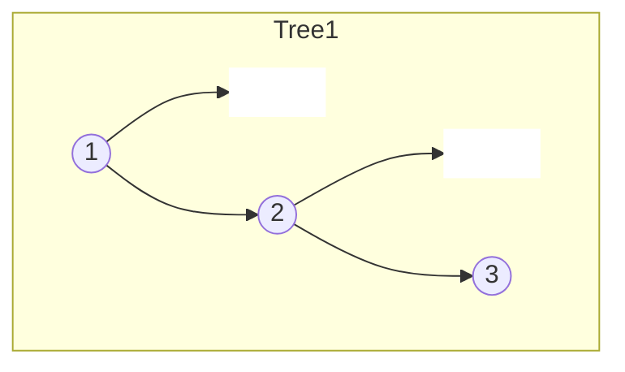
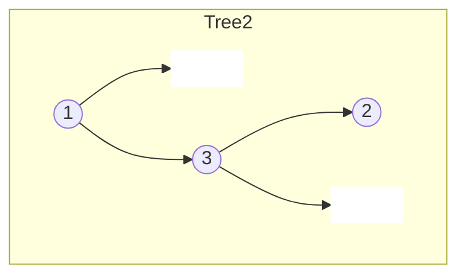
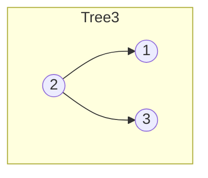
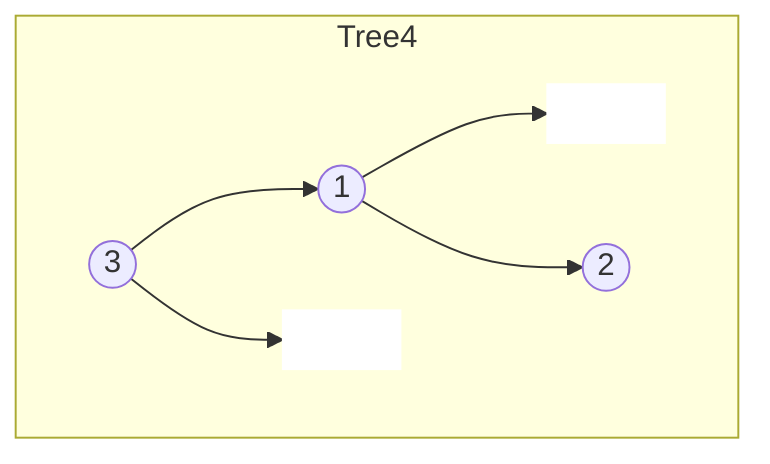
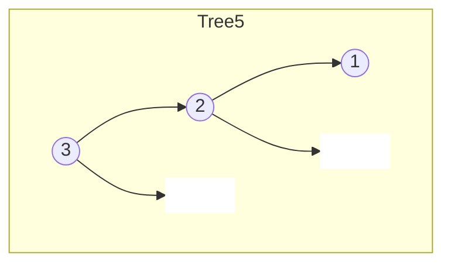

# Unique Binary Search Trees II

## Problem

Given a positive integer n, generate every structurally unique binary search tree (BST) that can be formed using the values 1 through n. A binary search tree is a tree where for every node, all values in its left subtree are smaller and all values in its right subtree are larger. Two trees are structurally unique if they have different shapes or arrangements, even if they contain the same values. For example, with n=3, one tree might have 1 as root with 2 and 3 on the right, while another has 2 as root with 1 on the left and 3 on the right - these are different structures. The key insight is that for any range of consecutive values, each value can serve as the root, which then determines what values must go left versus right. You need to recursively generate all possible left and right subtrees for each potential root, then combine them in all valid ways to produce every unique tree structure. Return these trees as actual tree node objects, not just descriptions.

**Diagram:**

Example: Input: n = 3, Output: 5 unique BSTs












## Why This Matters

This problem appears in compiler design when building parse trees, in database query optimization when exploring different index structures, and in machine learning for generating decision tree ensembles. Understanding how structure affects BST performance is crucial - different arrangements of the same values yield different search times. The number of unique BSTs grows according to Catalan numbers, a sequence that appears throughout combinatorics and computer science. This problem teaches the powerful divide-and-conquer pattern of splitting a problem by choosing a "pivot" (the root), solving subproblems independently, and combining results through Cartesian products. In interviews, it tests your ability to think recursively about tree construction, manage complex recursive state, and avoid common pitfalls like reusing node objects across different trees. The jump from counting structures to actually generating them requires deeper understanding of tree building mechanics.

## Examples

**Example 1:**
- Input: `n = 1`
- Output: `[[1]]`

## Constraints

- 1 <= n <= 8

## Think About

1. What's the brute force approach? What's its time complexity?
2. Can you identify any patterns in the examples?
3. What data structure would help organize the information?

## Approach Hints

<details>
<summary>💡 Hint 1: Conceptual</summary>

For any range of values [start, end], each value can be chosen as the root. When value i is the root, all values [start, i-1] must be in the left subtree and [i+1, end] in the right subtree. This creates a recursive structure: for each possible root, combine all possible left subtrees with all possible right subtrees.

</details>

<details>
<summary>🎯 Hint 2: Approach</summary>

Use divide-and-conquer recursion. For a range [start, end], iterate through each possible root value. Recursively generate all left subtrees (from start to root-1) and all right subtrees (from root+1 to end). Create Cartesian product of left and right subtrees with the current root. Base case: if start > end, return [None].

</details>

<details>
<summary>📝 Hint 3: Algorithm</summary>

Pseudocode approach:
1. Define generate(start, end):
   - If start > end: return [None]
   - all_trees = []
   - For i from start to end:
     - left_trees = generate(start, i - 1)
     - right_trees = generate(i + 1, end)
     - For each left_tree in left_trees:
       - For each right_tree in right_trees:
         - Create new node with value i
         - Set node.left = left_tree
         - Set node.right = right_tree
         - Add node to all_trees
   - Return all_trees
2. Call generate(1, n)

</details>

## Complexity Analysis

| Approach | Time | Space | Notes |
|----------|------|-------|-------|
| **Recursive Generation** | **O(n * C_n)** | **O(n * C_n)** | C_n is the nth Catalan number ≈ 4^n / (n^1.5) |
| With Memoization | O(n * C_n) | O(n² * C_n) | Cache results for each [start, end] pair |

Note: The exact time complexity is related to the nth Catalan number, which counts unique BST structures. For practical purposes, it's exponential in n.

## Common Mistakes

### 1. Not handling empty subtree case
```python
# WRONG: Doesn't generate trees when subtree is empty
def generate(start, end):
    if start > end:
        return []  # Should return [None]

# CORRECT: Return list with None for empty subtree
def generate(start, end):
    if start > end:
        return [None]  # Allows Cartesian product to work
```

### 2. Reusing node objects
```python
# WRONG: Same node used in multiple trees
left_tree = generate(start, i - 1)[0]
for right_tree in right_trees:
    root.left = left_tree  # Shared reference!
    root.right = right_tree

# CORRECT: Create new root for each combination
for left_tree in left_trees:
    for right_tree in right_trees:
        root = TreeNode(i)  # New node each time
        root.left = left_tree
        root.right = right_tree
```

### 3. Not creating Cartesian product
```python
# WRONG: Only pairing up trees one-to-one
for i in range(len(left_trees)):
    root = TreeNode(val)
    root.left = left_trees[i]
    root.right = right_trees[i]  # Misses combinations

# CORRECT: All combinations (Cartesian product)
for left_tree in left_trees:
    for right_tree in right_trees:
        root = TreeNode(val)
        root.left = left_tree
        root.right = right_tree
```

## Variations

| Variation | Change | Approach Adjustment |
|-----------|--------|---------------------|
| Count unique BSTs | Just count, don't generate | Use dynamic programming (see M037) |
| Generate from array | Values not 1 to n | Pass array slice indices instead of start/end |
| Generate balanced BSTs only | Only balanced trees | Add height constraint during generation |
| Unique BSTs with duplicates | Allow duplicate values | Becomes much more complex, need different approach |

## Practice Checklist

- [ ] Handles empty/edge cases (n=0, n=1, n=8)
- [ ] Can explain approach in 2 min
- [ ] Can code solution in 20 min
- [ ] Can discuss time/space complexity
- [ ] Understands Catalan number relationship

**Spaced Repetition:** Day 1 → 3 → 7 → 14 → 30

---

**Strategy**: See [Binary Search Tree Pattern](../../strategies/data-structures/trees.md)
