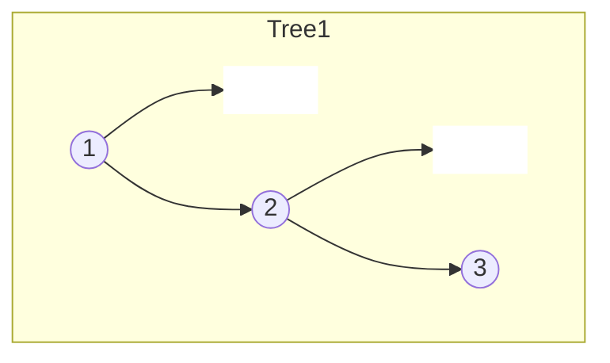
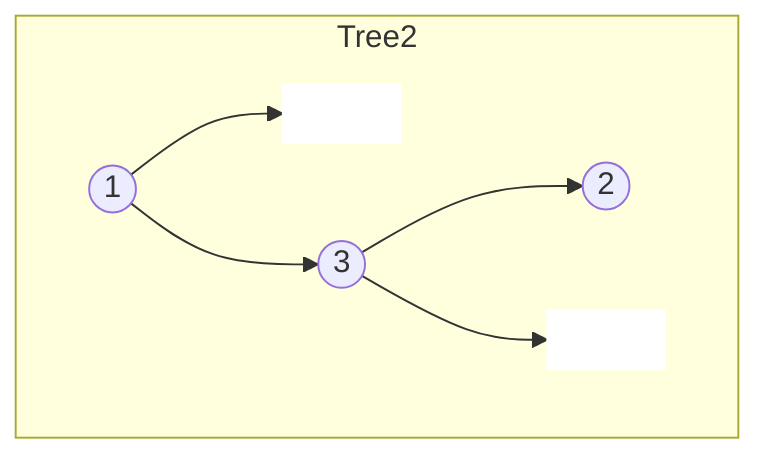
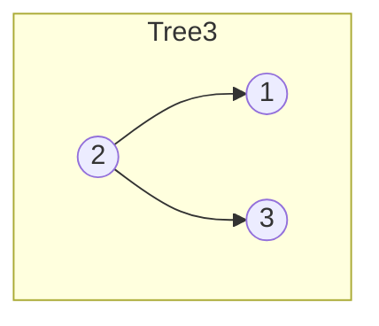
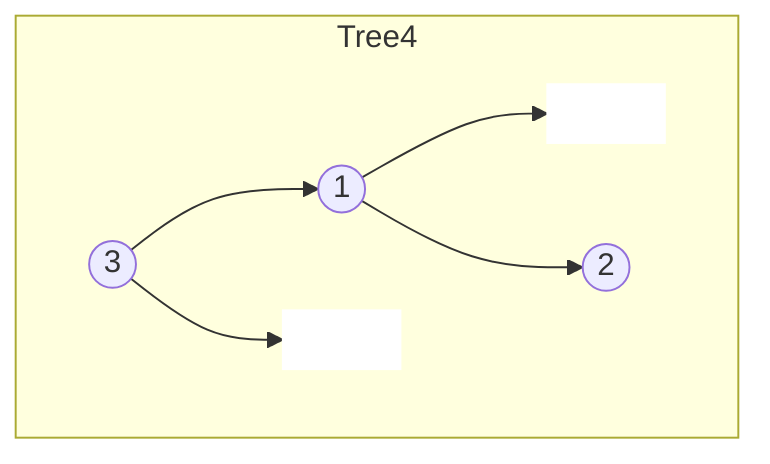
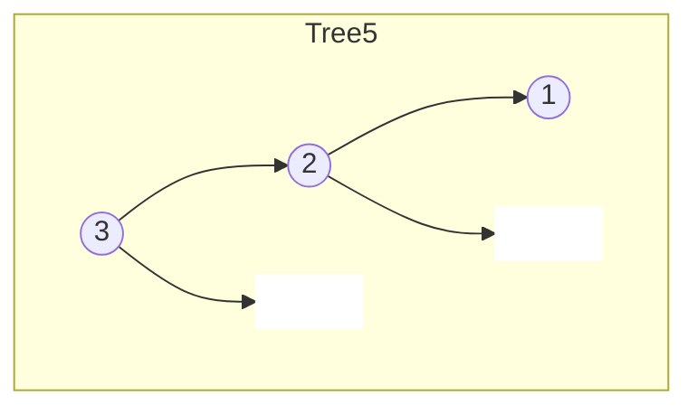

# Unique Binary Search Trees

## Problem

Given a positive integer n, calculate how many structurally unique binary search trees (BSTs) can be formed using exactly the values 1 through n. A BST maintains the property that for any node, all left descendants are smaller and all right descendants are larger. Two trees are considered structurally different if their node arrangements differ, even with the same values. For instance, with n=3 using values 1,2,3, you can have 1 as root (forcing 2,3 to the right), 2 as root (1 left, 3 right), or 3 as root (forcing 1,2 to the left) - each choice leads to different possible tree shapes. The total count is 5 for n=3. The key insight is that this is a dynamic programming problem: for each possible root position, the number of unique trees equals the number of unique left subtrees multiplied by the number of unique right subtrees. This count follows the mathematical pattern of Catalan numbers, which appear in numerous counting problems across mathematics and computer science.

**Diagram:**

Example: Input: n = 3, Output: 5 unique BSTs












## Why This Matters

Understanding the relationship between tree structure and count is fundamental to analyzing average-case performance of BSTs in databases and search applications. This problem introduces Catalan numbers, a sequence that appears in parsing contexts (number of parse trees), expression evaluation (parenthesis arrangements), polygon triangulation, and path counting. The dynamic programming approach teaches you to recognize when a problem has optimal substructure - where the solution to larger instances depends on solutions to smaller, independent subproblems. In compiler design, this counting helps estimate the complexity of parsing ambiguous grammars. For technical interviews, this is a classic DP problem that tests whether you can identify the recursive relationship, set up the correct base cases, and build solutions bottom-up. The contrast with the "generate all trees" variant teaches the difference between counting and construction, with very different complexity implications.

## Examples

**Example 1:**
- Input: `n = 1`
- Output: `1`

## Constraints

- 1 <= n <= 19

## Think About

1. What's the brute force approach? What's its time complexity?
2. Can you identify any patterns in the examples?
3. What data structure would help organize the information?

## Approach Hints

<details>
<summary>💡 Hint 1: Conceptual</summary>

When you choose a value i as the root, all values less than i go to the left subtree and all values greater go to the right. The total number of unique BSTs is the sum over all possible roots of (number of left subtrees × number of right subtrees). This is the definition of Catalan numbers.

</details>

<details>
<summary>🎯 Hint 2: Approach</summary>

Use dynamic programming. Let dp[i] = number of unique BSTs with i nodes. For each i, iterate through each possible root position j. The number of ways is dp[j-1] (left subtree) × dp[i-j] (right subtree). Sum across all j from 1 to i. Base case: dp[0] = 1 (empty tree).

</details>

<details>
<summary>📝 Hint 3: Algorithm</summary>

Pseudocode approach:
1. Create dp array of size n+1
2. dp[0] = 1, dp[1] = 1
3. For i from 2 to n:
   - dp[i] = 0
   - For j from 1 to i (each possible root):
     - left_count = dp[j - 1]
     - right_count = dp[i - j]
     - dp[i] += left_count * right_count
4. Return dp[n]

Alternative (Catalan formula):
- C(n) = C(0)*C(n-1) + C(1)*C(n-2) + ... + C(n-1)*C(0)
- Or direct formula: C(n) = (2n)! / ((n+1)! * n!)

</details>

## Complexity Analysis

| Approach | Time | Space | Notes |
|----------|------|-------|-------|
| Recursive (no memo) | O(C_n) | O(n) | Catalan number is exponential |
| **Dynamic Programming** | **O(n²)** | **O(n)** | Optimal, builds bottom-up |
| Catalan Formula | O(n) | O(1) | Direct calculation, risk of overflow |

## Common Mistakes

### 1. Wrong base case for dp[0]
```python
# WRONG: dp[0] = 0 breaks the calculation
dp[0] = 0  # Empty tree should count as 1 way

# CORRECT: Empty tree is one valid configuration
dp[0] = 1  # Allows multiplication to work correctly
dp[1] = 1
```

### 2. Incorrect loop boundaries
```python
# WRONG: Off-by-one error
for i in range(2, n):  # Should be n+1
    for j in range(1, i):  # Should be i+1
        dp[i] += dp[j-1] * dp[i-j-1]  # Wrong index

# CORRECT: Proper boundaries
for i in range(2, n + 1):
    for j in range(1, i + 1):
        dp[i] += dp[j - 1] * dp[i - j]
```

### 3. Integer overflow with Catalan formula
```python
# WRONG: Can overflow for large n
def catalan(n):
    return factorial(2*n) // (factorial(n+1) * factorial(n))

# CORRECT: Use dynamic programming to avoid large factorials
dp = [0] * (n + 1)
dp[0] = dp[1] = 1
for i in range(2, n + 1):
    for j in range(1, i + 1):
        dp[i] += dp[j - 1] * dp[i - j]
```

## Variations

| Variation | Change | Approach Adjustment |
|-----------|--------|---------------------|
| Generate all trees | Return actual trees | See M036 (Unique Binary Search Trees II) |
| Count full binary trees | Each node has 0 or 2 children | Different recurrence relation |
| Count balanced BSTs | Height constraint | Add height parameter to DP state |
| Count with specific root | Fix root value | Simplifies to single multiplication |

## Practice Checklist

- [ ] Handles empty/edge cases (n=0, n=1, n=19)
- [ ] Can explain approach in 2 min
- [ ] Can code solution in 15 min
- [ ] Can discuss time/space complexity
- [ ] Understands connection to Catalan numbers

**Spaced Repetition:** Day 1 → 3 → 7 → 14 → 30

---

**Strategy**: See [Binary Search Tree Pattern](../../prerequisites/trees.md)
