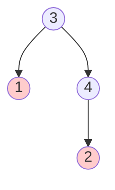

# Recover Binary Search Tree

## Problem

You're given a binary search tree where exactly two nodes have been swapped by mistake, violating the BST property. Your task is to find these two nodes and swap them back to restore the BST. A BST normally satisfies the property that for every node, all values in the left subtree are smaller and all values in the right subtree are larger. When two nodes are swapped, this property is violated in specific, detectable ways. For example, if you have a tree that should be 1-2-3 in sorted order but someone swapped the nodes containing 1 and 3, an inorder traversal would reveal a sequence like [3,2,1] instead of [1,2,3], showing violations where a larger value appears before a smaller one. The challenge is detecting these violations efficiently during a traversal and identifying which two specific nodes need to be swapped back. You must fix the tree by swapping the node values, ideally using only constant extra space beyond the recursion stack.

**Example 1:**


Output: [3,1,null,null,2]

**Example 2:**



Output: [2,1,4,null,null,3]


## Why This Matters

This problem simulates data corruption scenarios in databases where index structures become inconsistent due to bugs, crashes, or hardware failures. Understanding how to detect and repair BST violations is crucial for building self-healing data structures and database recovery mechanisms. The inorder traversal insight - that a valid BST produces a sorted sequence - is a fundamental property used in BST validation, debugging, and testing. The problem teaches an important pattern: detecting anomalies in sequential data by tracking violations against expected invariants. Interview-wise, this is a sophisticated problem that combines tree traversal knowledge with careful state management, testing whether you understand both the theoretical BST property and practical violation detection. The Morris traversal solution, which achieves O(1) space, demonstrates an advanced technique for tree traversal without recursion or explicit stacks, valuable for memory-constrained environments.

## Constraints

- The number of nodes in the tree is in the range [2, 1000].
- -2³¹ <= Node.val <= 2³¹ - 1

## Think About

1. What's the brute force approach? What's its time complexity?
2. Can you identify any patterns in the examples?
3. What data structure would help organize the information?

## Approach Hints

<details>
<summary>💡 Hint 1: BST Property</summary>

What property must hold true for every BST? How would swapping two nodes violate this property? Think about what an inorder traversal of a valid BST should look like.

</details>

<details>
<summary>🎯 Hint 2: Detecting Violations</summary>

Perform an inorder traversal and track the previous node. At what points would prev.val > current.val? How many violations can occur when exactly two nodes are swapped?

</details>

<details>
<summary>📝 Hint 3: Algorithm</summary>

1. Perform inorder traversal (recursive, iterative, or Morris)
2. Track previous node and detect violations where prev > current
3. Store the first and second violating nodes
4. After traversal completes, swap the values of the two nodes

For adjacent swaps: one violation occurs. For non-adjacent swaps: two violations occur.

</details>

## Complexity Analysis

| Approach | Time | Space | Notes |
|----------|------|-------|-------|
| Inorder (Recursive) | O(n) | O(h) | h = tree height; space for recursion stack |
| Inorder (Iterative) | O(n) | O(h) | h = tree height; space for explicit stack |
| **Morris Traversal** | **O(n)** | **O(1)** | Optimal space; modifies tree temporarily |

## Common Mistakes

### 1. Only handling adjacent swaps
```python
# WRONG: Assumes only one violation
def recoverTree(root):
    prev = first = second = None

    def inorder(node):
        nonlocal prev, first, second
        if not node: return
        inorder(node.left)
        if prev and prev.val > node.val:
            if not first:
                first = prev  # Only captures one violation
                second = node
        prev = node
        inorder(node.right)

# CORRECT: Handles both adjacent and non-adjacent swaps
def recoverTree(root):
    prev = first = second = None

    def inorder(node):
        nonlocal prev, first, second
        if not node: return
        inorder(node.left)
        if prev and prev.val > node.val:
            if not first:
                first = prev
            second = node  # Updates for second violation
        prev = node
        inorder(node.right)

    inorder(root)
    first.val, second.val = second.val, first.val
```

### 2. Swapping nodes instead of values
```python
# WRONG: Trying to swap node references
first, second = second, first  # Doesn't affect tree structure

# CORRECT: Swap node values
first.val, second.val = second.val, first.val
```

### 3. Not tracking previous node correctly
```python
# WRONG: prev not updated properly
def inorder(node):
    if not node: return
    inorder(node.left)
    # Check violation but don't update prev
    if prev and prev.val > node.val:
        # ...
    inorder(node.right)

# CORRECT: Always update prev
def inorder(node):
    if not node: return
    inorder(node.left)
    if prev and prev.val > node.val:
        # ... handle violation
    prev = node  # Update after processing
    inorder(node.right)
```

## Variations

| Variation | Change | Approach Adjustment |
|-----------|--------|---------------------|
| K nodes swapped | More than 2 nodes | Sort inorder values, map back to nodes |
| Return swap count | Count operations | Track number of violations detected |
| Validate only | Don't fix, just detect | Return true/false on first violation |
| Multiple swaps | Different nodes each time | Need full sort or multiple passes |

## Practice Checklist

- [ ] Handles empty/edge cases (minimum 2 nodes)
- [ ] Can explain approach in 2 min
- [ ] Can code solution in 20 min
- [ ] Can discuss time/space complexity
- [ ] Understands both adjacent and non-adjacent swaps
- [ ] Can implement Morris traversal for O(1) space

**Spaced Repetition:** Day 1 → 3 → 7 → 14 → 30

---

**Strategy**: See [Binary Search Tree Pattern](../../strategies/data-structures/trees.md)
