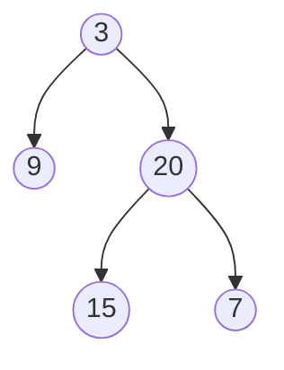

# Binary Tree Level Order Traversal

## Problem

Given a binary tree (where each node has at most two children), return all node values organized by their depth level, collecting all nodes at the same depth together. For example, the root is at level 0 by itself, its children are at level 1 together, their children are at level 2 together, and so on. If you have a tree with root value 3, left child 9, and right child 20 (which itself has children 15 and 7), you should return [[3], [9,20], [15,7]] - three separate lists representing three levels. This is called level-order traversal or breadth-first traversal because you process all nodes at depth d before moving to nodes at depth d+1. The key challenge is maintaining level boundaries: you need to know when you've finished processing all nodes at the current level before starting the next level. Unlike depth-first approaches that use recursion naturally, level-order traversal typically requires a queue data structure to track which nodes to visit next.

**Example:**



Input: root = [3,9,20,null,null,15,7]
Output: [[3],[9,20],[15,7]]


## Why This Matters

Level-order traversal is fundamental to breadth-first search (BFS), which powers web crawlers, social network friend suggestions, shortest path algorithms, and network broadcasting protocols. In file systems, this traversal pattern appears when listing directory contents level by level. Organizational charts, family trees, and dependency graphs are naturally explored this way. The queue-based approach you learn here extends directly to graph BFS, making this a gateway to understanding how Google's PageRank works, how route planning finds shortest paths, and how peer-to-peer networks propagate data. Many tree problems have both depth-first and breadth-first solutions; mastering both patterns gives you flexibility to choose the right approach. For interviews, level-order traversal is considered essential knowledge - it's often combined with other requirements like finding level averages, right-side view, or zigzag patterns, making this a foundation problem worth mastering thoroughly.

## Examples

**Example 1:**
- Input: `root = [1]`
- Output: `[[1]]`

**Example 2:**
- Input: `root = []`
- Output: `[]`

## Constraints

- The number of nodes in the tree is in the range [0, 2000].
- -1000 <= Node.val <= 1000

## Think About

1. What's the brute force approach? What's its time complexity?
2. Can you identify any patterns in the examples?
3. What data structure would help organize the information?

## Approach Hints

<details>
<summary>💡 Hint 1: Level-by-Level Processing</summary>

How can you process all nodes at the same depth before moving to the next level? What data structure naturally supports "first in, first out" ordering?

</details>

<details>
<summary>🎯 Hint 2: Queue-Based Traversal</summary>

Use a queue to store nodes. For each level, process all nodes currently in the queue, adding their children for the next level. Track the queue size at each level start.

</details>

<details>
<summary>📝 Hint 3: Algorithm</summary>

1. Initialize queue with root node
2. While queue is not empty:
   - Get current level size
   - For each node in current level:
     - Process node value
     - Add left child to queue (if exists)
     - Add right child to queue (if exists)
   - Store level results
3. Return all levels

</details>

## Complexity Analysis

| Approach | Time | Space | Notes |
|----------|------|-------|-------|
| **BFS (Queue)** | **O(n)** | **O(w)** | w = max width of tree; optimal |
| DFS with Level Tracking | O(n) | O(h) | h = height; uses recursion |
| Recursive with Depth | O(n) | O(h) | Less intuitive but works |

## Common Mistakes

### 1. Not tracking level boundaries
```python
# WRONG: All nodes in one list
def levelOrder(root):
    if not root: return []
    queue = [root]
    result = []
    while queue:
        node = queue.pop(0)
        result.append(node.val)  # No level separation
        if node.left: queue.append(node.left)
        if node.right: queue.append(node.right)
    return result

# CORRECT: Track level size
def levelOrder(root):
    if not root: return []
    queue = [root]
    result = []
    while queue:
        level_size = len(queue)
        level = []
        for _ in range(level_size):
            node = queue.pop(0)
            level.append(node.val)
            if node.left: queue.append(node.left)
            if node.right: queue.append(node.right)
        result.append(level)
    return result
```

### 2. Using inefficient queue operations
```python
# WRONG: list.pop(0) is O(n)
queue = []
node = queue.pop(0)  # Slow for large trees

# CORRECT: Use collections.deque
from collections import deque
queue = deque()
node = queue.popleft()  # O(1) operation
```

### 3. Forgetting null check
```python
# WRONG: May cause errors
if node.left:
    queue.append(node.left)
# Forgot to check node.right

# CORRECT: Check both children
if node.left: queue.append(node.left)
if node.right: queue.append(node.right)
```

## Variations

| Variation | Change | Approach Adjustment |
|-----------|--------|---------------------|
| Right-to-left order | Reverse each level | Add right child before left |
| Zigzag traversal | Alternate directions | Reverse odd/even levels |
| Bottom-up | Return levels reversed | Reverse result at end |
| Average per level | Compute averages | Sum values, divide by count |
| Max value per level | Find max in each level | Track max while processing |

## Practice Checklist

- [ ] Handles empty/edge cases (null root, single node)
- [ ] Can explain approach in 2 min
- [ ] Can code solution in 15 min
- [ ] Can discuss time/space complexity
- [ ] Understands queue vs stack traversal difference
- [ ] Can implement both iterative and recursive versions

**Spaced Repetition:** Day 1 → 3 → 7 → 14 → 30

---

**Strategy**: See [Tree Pattern](../../prerequisites/trees.md)
