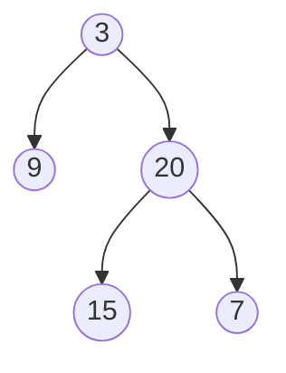

# Binary Tree Zigzag Level Order Traversal

## Problem

Given a binary tree, return node values organized by depth level, but with a twist: alternate the direction at each level. The first level (root) goes left-to-right, the second level goes right-to-left, the third level goes left-to-right again, and so on in a zigzag pattern. For example, with a tree that has root 3, children 9 and 20, and 20's children are 15 and 7, a standard level-order traversal would give [[3],[9,20],[15,7]], but zigzag traversal gives [[3],[20,9],[15,7]] - notice the second level is reversed. This is essentially level-order traversal with conditional reversal at alternating levels. The challenge is efficiently managing the direction flip without making your code overly complex. You need to track which level you're on and decide whether to collect nodes in their natural left-to-right order or reverse them before adding to results. Edge cases include trees with only one level, unbalanced trees where levels have very different widths, and handling the empty tree gracefully.

**Example:**



Input: root = [3,9,20,null,null,15,7]
Output: [[3],[20,9],[15,7]]


## Why This Matters

Zigzag traversal patterns appear in matrix spiral traversals, printer serpentine scanning (how some printers move back and forth), and display rendering algorithms. In data visualization, alternating directions can improve readability of hierarchical displays like org charts or tournament brackets. The pattern teaches you to augment standard traversal algorithms with state tracking - a skill that extends to many variations like vertical order traversal, boundary traversal, or diagonal traversal. This is a common interview follow-up to basic level-order traversal, testing whether you can adapt a known algorithm to meet new requirements without rewriting from scratch. The ability to cleanly toggle behavior with a boolean flag or modulo arithmetic demonstrates code organization skills. Understanding when to reverse during collection versus when to reverse during insertion affects both code clarity and performance, making this a good problem for discussing implementation trade-offs.

## Examples

**Example 1:**
- Input: `root = [1]`
- Output: `[[1]]`

**Example 2:**
- Input: `root = []`
- Output: `[]`

## Constraints

- The number of nodes in the tree is in the range [0, 2000].
- -100 <= Node.val <= 100

## Think About

1. What's the brute force approach? What's its time complexity?
2. Can you identify any patterns in the examples?
3. What data structure would help organize the information?

## Approach Hints

<details>
<summary>💡 Hint 1: Building on Level Order</summary>

This is a variation of standard level-order traversal. What changes between levels? How can you track which direction to traverse?

</details>

<details>
<summary>🎯 Hint 2: Direction Toggle</summary>

Use a boolean flag to track direction. For each level, collect nodes normally but reverse the level list based on the current direction before adding to results.

</details>

<details>
<summary>📝 Hint 3: Algorithm</summary>

1. Initialize queue with root, set left_to_right = True
2. While queue not empty:
   - Get current level size
   - Collect all nodes at this level
   - If left_to_right: add level as-is
   - Else: reverse level before adding
   - Toggle left_to_right flag
   - Add children to queue for next level
3. Return results

Alternative: Use deque and alternate between appendleft/append.

</details>

## Complexity Analysis

| Approach | Time | Space | Notes |
|----------|------|-------|-------|
| **BFS + Reverse** | **O(n)** | **O(w)** | w = max width; simple to implement |
| BFS + Deque Insertion | O(n) | O(w) | Insert at alternating ends |
| Two Stacks | O(n) | O(w) | Alternate between two stacks |

## Common Mistakes

### 1. Reversing node insertion instead of result
```python
# WRONG: Trying to reverse children order
if left_to_right:
    if node.left: queue.append(node.left)
    if node.right: queue.append(node.right)
else:
    if node.right: queue.append(node.right)
    if node.left: queue.append(node.left)
# Children order doesn't affect zigzag output

# CORRECT: Reverse the level values
level = []
for _ in range(level_size):
    node = queue.popleft()
    level.append(node.val)
    if node.left: queue.append(node.left)
    if node.right: queue.append(node.right)
if not left_to_right:
    level.reverse()
result.append(level)
```

### 2. Not toggling direction flag
```python
# WRONG: Flag never changes
left_to_right = True
while queue:
    # ... process level
    # Forgot to toggle!

# CORRECT: Toggle after each level
left_to_right = True
while queue:
    # ... process level
    left_to_right = not left_to_right
```

### 3. Off-by-one errors in direction
```python
# WRONG: Starting with wrong direction
left_to_right = False  # First level should be left-to-right

# CORRECT: Start with True
left_to_right = True  # Level 0 goes left to right
```

## Variations

| Variation | Change | Approach Adjustment |
|-----------|--------|---------------------|
| K-way zigzag | Change direction every k levels | Use counter modulo k |
| Spiral traversal | Clockwise/counterclockwise | More complex boundary tracking |
| Reverse odd levels only | Only reverse odd-indexed levels | Check level index parity |
| Right-to-left start | Start right-to-left | Initialize flag as False |

## Practice Checklist

- [ ] Handles empty/edge cases (null root, single node)
- [ ] Can explain approach in 2 min
- [ ] Can code solution in 20 min
- [ ] Can discuss time/space complexity
- [ ] Understands when to reverse vs when to collect
- [ ] Can implement using both reverse and deque methods

**Spaced Repetition:** Day 1 → 3 → 7 → 14 → 30

---

**Strategy**: See [Tree Pattern](../../strategies/data-structures/trees.md)
