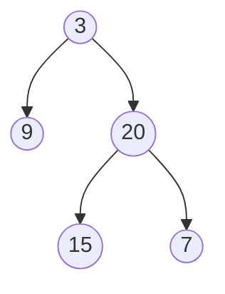

# Construct Binary Tree from Preorder and Inorder Traversal

## Problem

Given two arrays representing a binary tree's traversals, reconstruct the original tree. A preorder traversal visits nodes in the order: root first, then left subtree, then right subtree. An inorder traversal visits them as: left subtree first, then root, then right subtree. Each array contains the same set of unique values, just in different orders based on how the tree was traversed.

The challenge is to use the complementary information from both traversals to rebuild the tree structure. The preorder array tells you which node is the root (it's always the first element), while the inorder array reveals which elements belong to the left versus right subtrees (everything before the root is left, everything after is right). By recursively applying this logic to subarrays, you can reconstruct the entire tree. Edge cases include single-node trees and ensuring your algorithm handles the recursive boundaries correctly.

**Example:**



Input: preorder = [3,9,20,15,7], inorder = [9,3,15,20,7]
Output: [3,9,20,null,null,15,7]


## Why This Matters

Tree reconstruction from traversals is fundamental to understanding how structural information can be encoded and decoded. In serialization systems, trees and graphs are often transmitted as sequences, and receivers must rebuild the structure from these flattened representations. This pattern appears in compiler design where abstract syntax trees are serialized for intermediate representations, in database systems that encode B-tree structures for storage, and in network protocols that transmit hierarchical data. The problem also teaches the critical skill of recognizing how different views of the same data (preorder vs inorder) provide complementary information that, when combined, reveal the complete picture. Interviewers frequently use this problem to assess your understanding of tree properties, recursion, and the ability to identify what information is sufficient to uniquely determine a structure.

## Examples

**Example 1:**
- Input: `preorder = [-1], inorder = [-1]`
- Output: `[-1]`

## Constraints

- 1 <= preorder.length <= 3000
- inorder.length == preorder.length
- -3000 <= preorder[i], inorder[i] <= 3000
- preorder and inorder consist of **unique** values.
- Each value of inorder also appears in preorder.
- preorder is **guaranteed** to be the preorder traversal of the tree.
- inorder is **guaranteed** to be the inorder traversal of the tree.

## Think About

1. What's the brute force approach? What's its time complexity?
2. Can you identify any patterns in the examples?
3. What data structure would help organize the information?

## Approach Hints

<details>
<summary>💡 Hint 1: Understanding Traversals</summary>

Preorder visits nodes as: Root → Left → Right. Inorder visits as: Left → Root → Right. What does the first element of preorder tell you? How can you use inorder to split left and right subtrees?

</details>

<details>
<summary>🎯 Hint 2: Recursive Division</summary>

The first element in preorder is always the root. Find this element in inorder to determine which elements belong to left vs right subtrees. Recursively build each subtree using the corresponding subarrays.

</details>

<details>
<summary>📝 Hint 3: Algorithm</summary>

1. Create a hash map of inorder values to indices for O(1) lookup
2. Define recursive function with bounds for preorder and inorder
3. Base case: if bounds are invalid, return None
4. Take next element from preorder as root
5. Find root position in inorder using hash map
6. Calculate left subtree size
7. Recursively build left subtree with elements before root in inorder
8. Recursively build right subtree with elements after root in inorder
9. Return root node

</details>

## Complexity Analysis

| Approach | Time | Space | Notes |
|----------|------|-------|-------|
| Naive Recursion | O(n²) | O(n) | Linear search for root in inorder each time |
| **Hash Map + Recursion** | **O(n)** | **O(n)** | Hash map enables O(1) root lookup |
| Iterative + Stack | O(n) | O(n) | More complex but possible |

## Common Mistakes

### 1. Not using hash map for inorder lookup
```python
# WRONG: Linear search each time - O(n²)
def buildTree(preorder, inorder):
    if not preorder: return None
    root_val = preorder[0]
    root_idx = inorder.index(root_val)  # O(n) search
    # ... recursive calls

# CORRECT: Precompute indices - O(n)
def buildTree(preorder, inorder):
    inorder_map = {val: i for i, val in enumerate(inorder)}

    def build(pre_start, pre_end, in_start, in_end):
        if pre_start > pre_end: return None
        root_val = preorder[pre_start]
        root_idx = inorder_map[root_val]  # O(1) lookup
        # ... recursive calls
```

### 2. Incorrect subarray bounds
```python
# WRONG: Off-by-one errors
left_size = root_idx - in_start
left = build(pre_start, pre_start + left_size, ...)  # Missing -1

# CORRECT: Careful bound calculation
left_size = root_idx - in_start
left = build(pre_start + 1, pre_start + left_size,
            in_start, root_idx - 1)
right = build(pre_start + left_size + 1, pre_end,
             root_idx + 1, in_end)
```

### 3. Not handling preorder pointer correctly
```python
# WRONG: Not advancing preorder index
root = TreeNode(preorder[0])  # Always uses first element

# CORRECT: Use pointer or slicing
self.pre_idx = 0
root = TreeNode(preorder[self.pre_idx])
self.pre_idx += 1
```

## Variations

| Variation | Change | Approach Adjustment |
|-----------|--------|---------------------|
| Inorder + Postorder | Use postorder instead | Root is last in postorder; build right first |
| Preorder + Postorder | No inorder given | Requires additional constraints |
| Levelorder + Inorder | Use level-order | More complex reconstruction |
| Serialize/Deserialize | Convert to/from string | Add null markers for structure |

## Practice Checklist

- [ ] Handles empty/edge cases (single node, empty tree)
- [ ] Can explain approach in 2 min
- [ ] Can code solution in 25 min
- [ ] Can discuss time/space complexity
- [ ] Understands traversal properties thoroughly
- [ ] Can draw recursion tree for small examples

**Spaced Repetition:** Day 1 → 3 → 7 → 14 → 30

---

**Strategy**: See [Tree Reconstruction Pattern](../../strategies/data-structures/trees.md)
