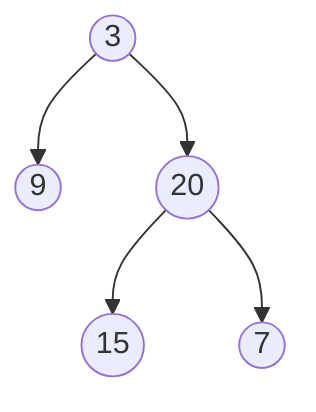

# Construct Binary Tree from Inorder and Postorder Traversal

## Problem

Given two arrays representing a binary tree's inorder and postorder traversals, reconstruct the original tree. An inorder traversal visits nodes as: left subtree, then root, then right subtree. A postorder traversal visits them as: left subtree, then right subtree, then root. Both arrays contain the same unique values but ordered differently based on traversal type.

The key insight is that postorder's last element is always the root (since root is visited last). Once you identify the root, you can find its position in the inorder array to determine which elements belong to the left subtree (before root) versus right subtree (after root). A critical difference from the preorder version is the processing order: you must build the right subtree before the left when using postorder, since postorder places right subtree elements closer to the root than left subtree elements. Edge cases include handling single-node trees and properly managing array boundaries during recursive subdivision.

**Example:**



Input: inorder = [9,3,15,20,7], postorder = [9,15,7,20,3]
Output: [3,9,20,null,null,15,7]


## Why This Matters

Understanding how to reconstruct trees from different traversal pairs is essential for working with serialized data structures. This specific combination (inorder + postorder) appears in systems that process data in bottom-up fashion, such as expression tree evaluation where operands must be processed before operators, or in certain compiler optimization passes that work from leaves upward. The pattern teaches you to think about how the order of processing affects algorithm design - the fact that you must build right subtrees before left subtrees when using postorder is a subtle but important insight about data dependencies. This problem is commonly used in interviews to test whether you truly understand tree traversal properties or have just memorized the preorder version, as it requires adapting your approach based on how the traversal visits nodes. It also reinforces the principle that different representations of the same structure require different reconstruction strategies.

## Examples

**Example 1:**
- Input: `inorder = [-1], postorder = [-1]`
- Output: `[-1]`

## Constraints

- 1 <= inorder.length <= 3000
- postorder.length == inorder.length
- -3000 <= inorder[i], postorder[i] <= 3000
- inorder and postorder consist of **unique** values.
- Each value of postorder also appears in inorder.
- inorder is **guaranteed** to be the inorder traversal of the tree.
- postorder is **guaranteed** to be the postorder traversal of the tree.

## Think About

1. What's the brute force approach? What's its time complexity?
2. Can you identify any patterns in the examples?
3. What data structure would help organize the information?

## Approach Hints

<details>
<summary>💡 Hint 1: Postorder Property</summary>

Postorder visits nodes as: Left → Right → Root. This means the last element in postorder is always the root. How can you use this to recursively build the tree?

</details>

<details>
<summary>🎯 Hint 2: Key Difference from Preorder</summary>

Unlike preorder where you build left-to-right, with postorder you should build right-to-left. Why? Because in postorder, the right subtree appears before the root.

</details>

<details>
<summary>📝 Hint 3: Algorithm</summary>

1. Create hash map of inorder values to indices
2. Start from the last element in postorder (the root)
3. For each node:
   - Find its position in inorder
   - Split inorder into left and right subtrees
   - Recursively build RIGHT subtree first (important!)
   - Then build LEFT subtree
   - Return the node
4. Process postorder from right to left

Key insight: Build right before left when using postorder.

</details>

## Complexity Analysis

| Approach | Time | Space | Notes |
|----------|------|-------|-------|
| Naive Recursion | O(n²) | O(n) | Linear search for root in inorder |
| **Hash Map + Recursion** | **O(n)** | **O(n)** | O(1) root lookup with hash map |
| Iterative + Stack | O(n) | O(n) | More complex implementation |

## Common Mistakes

### 1. Building left subtree before right
```python
# WRONG: Building left first with postorder
def buildTree(inorder, postorder):
    root_val = postorder[-1]
    root_idx = inorder_map[root_val]
    root.left = build(...)   # Wrong order!
    root.right = build(...)

# CORRECT: Build right first with postorder
def buildTree(inorder, postorder):
    if not postorder: return None
    root_val = postorder.pop()  # Take from end
    root = TreeNode(root_val)
    root_idx = inorder_map[root_val]
    # Build RIGHT first since postorder is L→R→Root
    root.right = build(inorder[root_idx+1:], ...)
    root.left = build(inorder[:root_idx], ...)
    return root
```

### 2. Not processing postorder from right to left
```python
# WRONG: Using index from start
self.post_idx = 0
root_val = postorder[self.post_idx]  # Wrong direction

# CORRECT: Process from end
self.post_idx = len(postorder) - 1
root_val = postorder[self.post_idx]
self.post_idx -= 1
```

### 3. Incorrect subarray calculation
```python
# WRONG: Same as preorder approach
left_size = root_idx - in_start
# But postorder needs different handling

# CORRECT: Mind the right-first ordering
right_size = in_end - root_idx
# Build right subtree first with correct bounds
```

## Variations

| Variation | Change | Approach Adjustment |
|-----------|--------|---------------------|
| Preorder + Inorder | Use preorder instead | Root is first; build left before right |
| Without hash map | No preprocessing | O(n²) time with linear search |
| Return level-order | Different output format | Build tree, then BFS |
| Mirror tree | Reverse structure | Swap left/right construction |

## Practice Checklist

- [ ] Handles empty/edge cases (single node)
- [ ] Can explain approach in 2 min
- [ ] Can code solution in 25 min
- [ ] Can discuss time/space complexity
- [ ] Understands why right subtree is built first
- [ ] Can compare with preorder+inorder approach

**Spaced Repetition:** Day 1 → 3 → 7 → 14 → 30

---

**Strategy**: See [Tree Reconstruction Pattern](../../strategies/data-structures/trees.md)
