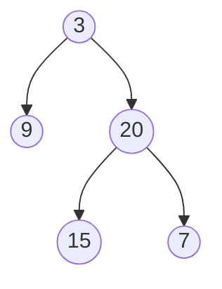

# Binary Tree Level Order Traversal II

## Problem

Given a binary tree, return the values of its nodes grouped by level, but with the levels listed from bottom to top instead of top to bottom. A level-order traversal normally visits nodes level by level from the root downward, grouping all nodes at depth 0 (root), then depth 1, then depth 2, and so on. This problem asks for the same grouping, but with the deepest level listed first and the root level last.

For example, if a tree has three levels, you should return a list where the first sublist contains all leaf nodes, the second sublist contains their parents, and the final sublist contains just the root. The solution is straightforward once you recognize it's just standard breadth-first search (BFS) followed by reversing the result. The main consideration is whether to reverse the entire result list at the end, or build it in reverse order from the start using a data structure that supports efficient front insertion. Edge cases include empty trees and single-node trees where the bottom-up ordering makes no visible difference.

**Example:**



Input: root = [3,9,20,null,null,15,7]
Output: [[15,7],[9,20],[3]]


## Why This Matters

While this problem might seem like a simple twist on standard level-order traversal, it represents an important category of requirements in real systems: displaying hierarchical data in reverse depth order. This pattern appears in rendering directory structures where you want to show the deepest files first, in organizational charts that emphasize leaf employees before management, or in dependency graphs where you need to process or display the most dependent items before their dependencies. The problem teaches you to recognize when a simple post-processing step (like reversing a result) is more elegant than complicating your core algorithm. It's also a gentle introduction to thinking about how data structures affect your approach: using a standard list with a final reverse is simpler than front-insertion, but understanding both options demonstrates algorithmic flexibility. In interviews, this problem tests whether you can identify that it's just a variation of a standard pattern rather than a completely new challenge.

## Examples

**Example 1:**
- Input: `root = [1]`
- Output: `[[1]]`

**Example 2:**
- Input: `root = []`
- Output: `[]`

## Constraints

- The number of nodes in the tree is in the range [0, 2000].
- -1000 <= Node.val <= 1000

## Think About

1. What's the brute force approach? What's its time complexity?
2. Can you identify any patterns in the examples?
3. What data structure would help organize the information?

## Approach Hints

<details>
<summary>💡 Hint 1: Build on Standard Level Order</summary>

This is nearly identical to standard level-order traversal. What simple operation can you perform at the end to reverse the order of levels?

</details>

<details>
<summary>🎯 Hint 2: Two Approaches</summary>

Approach 1: Perform normal level-order traversal, then reverse the result list.
Approach 2: Use a deque and insert levels at the front as you process them.

</details>

<details>
<summary>📝 Hint 3: Algorithm</summary>

**Method 1 (Simplest):**
1. Do standard BFS level-order traversal
2. Reverse the result list before returning

**Method 2 (Single pass):**
1. Use deque for result
2. For each level, insert at index 0 (or appendleft)
3. This builds result in reverse order naturally

</details>

## Complexity Analysis

| Approach | Time | Space | Notes |
|----------|------|-------|-------|
| **BFS + Reverse** | **O(n)** | **O(w)** | w = max width; simplest approach |
| BFS + Front Insert | O(n) | O(w) | Builds bottom-up directly |
| DFS + Level Tracking | O(n) | O(h) | h = height; recursive approach |

## Common Mistakes

### 1. Inefficient list insertion
```python
# WRONG: Inserting at front of list is O(n) per insertion
result = []
for level in levels:
    result.insert(0, level)  # O(n) each time = O(n²) total

# CORRECT: Use reverse() or appendleft
result = []
# ... collect levels normally
result.reverse()  # O(n) once

# OR use deque
from collections import deque
result = deque()
result.appendleft(level)  # O(1) per insertion
```

### 2. Reversing individual levels instead of order
```python
# WRONG: Reversing each level's contents
for level in levels:
    level.reverse()  # This reverses values in level

# CORRECT: Reverse the list of levels
levels.reverse()  # This reverses order of levels
```

### 3. Overcomplicating the solution
```python
# WRONG: Trying to do complex DFS tracking
def levelOrderBottom(root):
    # Complicated recursive depth tracking...
    # When simple reverse() would work

# CORRECT: Keep it simple
def levelOrderBottom(root):
    # Standard BFS
    result = standardBFS(root)
    result.reverse()
    return result
```

## Variations

| Variation | Change | Approach Adjustment |
|-----------|--------|---------------------|
| Right-side view | Return rightmost node per level | Track last node in each level |
| Left-side view | Return leftmost node per level | Track first node in each level |
| Reverse each level too | Bottom-up AND right-to-left | Reverse result + reverse each level |
| Level sums bottom-up | Sum of each level | Calculate sums during BFS, then reverse |

## Practice Checklist

- [ ] Handles empty/edge cases (null root, single node)
- [ ] Can explain approach in 2 min
- [ ] Can code solution in 10 min
- [ ] Can discuss time/space complexity
- [ ] Knows when to use reverse vs deque
- [ ] Can implement both approaches

**Spaced Repetition:** Day 1 → 3 → 7 → 14 → 30

---

**Strategy**: See [Tree Pattern](../../prerequisites/trees.md)
