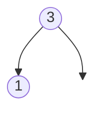

# Convert Sorted Array to Binary Search Tree

## Problem

Given an array of integers sorted in ascending order, construct a height-balanced binary search tree (BST). A BST is a tree where for every node, all values in its left subtree are smaller and all values in its right subtree are larger. A height-balanced tree is one where the depths of any node's two subtrees differ by at most one, ensuring logarithmic height and efficient operations.

The core insight is that to maintain balance, you should choose the middle element of the array as the root. This ensures roughly equal numbers of elements go into the left and right subtrees. Then recursively apply the same logic: the middle of the left half becomes the left child's root, and the middle of the right half becomes the right child's root. This divide-and-conquer approach naturally produces a balanced tree. The key edge cases are handling arrays with one or two elements, and ensuring your middle-finding logic works correctly for both even and odd-length arrays. The sorted order of the input guarantees that the resulting structure will satisfy the BST property automatically.

**Diagram:**

Example 1: Input: nums = [-10,-3,0,5,9], Output: [0,-3,9,-10,null,5]

```mermaid
flowchart TD
    A((0)) --> B((-3))
    A --> C((9))
    B --> D((-10))
    B --> E(( ))
    C --> F((5))
    C --> G(( ))

    style E fill:none,stroke:none
    style G fill:none,stroke:none
```

Example 2: Input: nums = [1,3], Output: [3,1]



Example 3: Input: nums = [1], Output: [1]


## Why This Matters

Converting sorted sequences into balanced trees is a fundamental operation in database indexing and in-memory data structure optimization. Many systems receive data in sorted order (from queries, file reads, or sorted logs) and need to build search structures that support fast lookups. Building an unbalanced tree by inserting elements sequentially would create a degenerate linked-list structure with O(n) search time, but using the middle-element technique produces a balanced tree with O(log n) operations. This pattern appears when initializing B-trees for databases, creating search indexes from sorted data exports, or optimizing in-memory caches. The problem also teaches the important principle that the input format (sorted array) suggests the algorithm: random access to the middle enables the divide-and-conquer approach. This is a high-frequency interview question because it tests recursion, understanding of BST properties, and the ability to recognize when a simple greedy choice (pick the middle) leads to an optimal solution.

## Constraints

- 1 <= nums.length <= 10⁴
- -10⁴ <= nums[i] <= 10⁴
- nums is sorted in a **strictly increasing** order.

## Think About

1. What's the brute force approach? What's its time complexity?
2. Can you identify any patterns in the examples?
3. What data structure would help organize the information?

## Approach Hints

<details>
<summary>💡 Hint 1: Height-Balanced Property</summary>

For a BST to be height-balanced, the left and right subtrees must have similar heights. How can you ensure this when choosing the root? What element position guarantees balance?

</details>

<details>
<summary>🎯 Hint 2: Middle Element Pattern</summary>

Choose the middle element as the root. This ensures roughly equal elements on left and right. Recursively apply the same logic to left and right subarrays.

</details>

<details>
<summary>📝 Hint 3: Algorithm</summary>

1. Define recursive function with start and end indices
2. Base case: if start > end, return None
3. Find middle index: mid = (start + end) // 2
4. Create root node with nums[mid]
5. Recursively build left subtree from nums[start:mid-1]
6. Recursively build right subtree from nums[mid+1:end]
7. Return root

Time: O(n) - visit each element once
Space: O(log n) - recursion depth

</details>

## Complexity Analysis

| Approach | Time | Space | Notes |
|----------|------|-------|-------|
| **Recursive (Divide & Conquer)** | **O(n)** | **O(log n)** | Optimal; O(log n) is recursion stack |
| Iterative + Queue | O(n) | O(n) | Less intuitive but possible |
| Naive Insertion | O(n log n) | O(log n) | Insert one by one; not balanced |

## Common Mistakes

### 1. Not handling empty subarrays correctly
```python
# WRONG: Incorrect base case
def sortedArrayToBST(nums):
    if len(nums) == 0:  # Works but inefficient slicing
        return None
    mid = len(nums) // 2
    root = TreeNode(nums[mid])
    root.left = sortedArrayToBST(nums[:mid])  # Creates new arrays

# CORRECT: Use indices to avoid copying
def sortedArrayToBST(nums):
    def helper(left, right):
        if left > right:
            return None
        mid = (left + right) // 2
        root = TreeNode(nums[mid])
        root.left = helper(left, mid - 1)
        root.right = helper(mid + 1, right)
        return root
    return helper(0, len(nums) - 1)
```

### 2. Integer overflow in middle calculation
```python
# WRONG: Potential overflow with large indices
mid = (start + end) // 2  # Could overflow in some languages

# CORRECT: Avoid overflow
mid = start + (end - start) // 2
# Or in Python where overflow isn't an issue:
mid = (start + end) // 2  # This is fine in Python
```

### 3. Off-by-one errors in recursive calls
```python
# WRONG: Including mid in both subtrees
root.left = helper(left, mid)    # Should be mid-1
root.right = helper(mid, right)  # Should be mid+1

# CORRECT: Exclude mid from both subtrees
root.left = helper(left, mid - 1)
root.right = helper(mid + 1, right)
```

## Variations

| Variation | Change | Approach Adjustment |
|-----------|--------|---------------------|
| Sorted linked list | Input is linked list | Find middle with fast/slow pointers |
| Maximum height BST | Allow imbalanced tree | Always choose leftmost/rightmost |
| Minimum height BST | Minimize depth | Same as original (use middle) |
| Left-biased BST | Prefer left-heavy | Use left-middle instead of middle |
| Complete BST | Fill levels left-to-right | More complex level-by-level construction |

## Practice Checklist

- [ ] Handles empty/edge cases (single element, two elements)
- [ ] Can explain approach in 2 min
- [ ] Can code solution in 15 min
- [ ] Can discuss time/space complexity
- [ ] Understands height-balanced definition
- [ ] Can draw recursion tree for small examples

**Spaced Repetition:** Day 1 → 3 → 7 → 14 → 30

---

**Strategy**: See [Divide and Conquer Pattern](../../prerequisites/trees.md)
