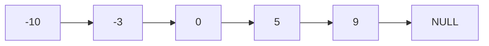

# Convert Sorted List to Binary Search Tree

## Problem

Given a singly linked list where elements are sorted in ascending order, construct a height-balanced binary search tree. This is similar to converting a sorted array to a BST, but with a crucial constraint: linked lists don't support random access, so finding the middle element takes linear time rather than constant time.

The naive approach of repeatedly finding the middle using the slow-fast pointer technique works but has O(n log n) time complexity since you find the middle at each level of recursion. A more elegant solution simulates inorder traversal: since inorder visits nodes in sorted order (matching the list order), you can traverse the list sequentially while building the tree bottom-up. This requires knowing the total length upfront to calculate subtree sizes, but processes each node exactly once for O(n) time. Alternatively, converting the list to an array first simplifies the problem but uses O(n) extra space. Edge cases include empty lists, single-node lists, and ensuring you properly disconnect list segments when using the slow-fast pointer approach.

**Diagram:**

Input: Linked list head = [-10,-3,0,5,9]



Output: Height-balanced BST

```mermaid
flowchart TD
    A((0)) --> B((-3))
    A --> C((9))
    B --> D((-10))
    B --> E(( ))
    C --> F((5))
    C --> G(( ))

    style E fill:none,stroke:none
    style G fill:none,stroke:none
```


## Why This Matters

This problem illustrates how data structure choice impacts algorithm efficiency and design. The linked list constraint forces you to think differently than the array version, teaching you to recognize when sequential access patterns can be exploited. The inorder simulation technique is particularly valuable: by aligning your tree construction order with the natural list traversal order, you achieve optimal time complexity. This pattern appears in memory-constrained systems where you receive sorted data as a stream or in chunks (like linked list nodes) rather than having it all in memory. Understanding the tradeoffs between different approaches (slow-fast pointers, inorder simulation, or conversion to array) demonstrates algorithmic maturity. The problem is common in interviews specifically because it tests whether you can adapt solutions to different input formats and recognize when a clever observation (inorder matches list order) leads to a better algorithm.

## Examples

**Example 1:**
- Input: `head = []`
- Output: `[]`

## Constraints

- The number of nodes in head is in the range [0, 2 * 10⁴].
- -10⁵ <= Node.val <= 10⁵

## Think About

1. What's the brute force approach? What's its time complexity?
2. Can you identify any patterns in the examples?
3. What data structure would help organize the information?

## Approach Hints

<details>
<summary>💡 Hint 1: Challenge vs Array Version</summary>

Unlike arrays where you can access the middle element in O(1), linked lists require O(n) to find the middle. How does this affect your approach? Can you use the two-pointer technique?

</details>

<details>
<summary>🎯 Hint 2: Two Approaches</summary>

**Approach 1:** Convert linked list to array first (O(n) space but simpler).
**Approach 2:** Use slow/fast pointers to find middle each time (O(1) extra space but O(n log n) time to find all middles).
**Approach 3:** Simulate inorder traversal with list pointer (O(n) time, O(log n) space).

</details>

<details>
<summary>📝 Hint 3: Inorder Simulation Algorithm</summary>

The key insight: inorder traversal visits nodes in sorted order, same as the linked list!

1. Count total nodes in list
2. Use a pointer that advances through the list
3. Recursively build tree using inorder pattern:
   - Build left subtree (advances pointer through left elements)
   - Create current node (consumes current list node)
   - Build right subtree (advances pointer through right elements)
4. Use size information to determine subtree sizes

This processes each node exactly once in O(n) time.

</details>

## Complexity Analysis

| Approach | Time | Space | Notes |
|----------|------|-------|-------|
| Convert to Array First | O(n) | O(n) | Simplest but uses extra space |
| Slow/Fast Pointer | O(n log n) | O(log n) | Finding middle each time is O(n) |
| **Inorder Simulation** | **O(n)** | **O(log n)** | Most efficient; processes each node once |

## Common Mistakes

### 1. Finding middle repeatedly (inefficient)
```python
# WRONG: O(n log n) due to repeated middle finding
def sortedListToBST(head):
    if not head: return None
    if not head.next: return TreeNode(head.val)

    # Find middle - O(n)
    slow = fast = head
    prev = None
    while fast and fast.next:
        prev = slow
        slow = slow.next
        fast = fast.next.next

    # Cut list and recurse - repeats for each level
    prev.next = None
    root = TreeNode(slow.val)
    root.left = sortedListToBST(head)
    root.right = sortedListToBST(slow.next)
    return root

# CORRECT: Inorder simulation - O(n)
def sortedListToBST(head):
    # Count nodes
    size = 0
    curr = head
    while curr:
        size += 1
        curr = curr.next

    # Use closure to maintain list pointer
    self.curr = head

    def buildBST(start, end):
        if start > end:
            return None

        mid = (start + end) // 2

        # Build left subtree (advances pointer)
        left = buildBST(start, mid - 1)

        # Create node with current list element
        root = TreeNode(self.curr.val)
        self.curr = self.curr.next

        # Build right subtree
        right = buildBST(mid + 1, end)

        root.left = left
        root.right = right
        return root

    return buildBST(0, size - 1)
```

### 2. Not handling list disconnection properly
```python
# WRONG: Modifying list without proper cleanup
prev.next = None  # Cuts list but loses reference to right half

# CORRECT: Save reference before cutting
mid_next = slow.next
prev.next = None
root.right = sortedListToBST(mid_next)
```

### 3. Converting to array when not needed
```python
# ACCEPTABLE but not optimal: Uses O(n) extra space
def sortedListToBST(head):
    arr = []
    while head:
        arr.append(head.val)
        head = head.next
    # Now just solve like array version
    # Simple but uses O(n) space
```

## Variations

| Variation | Change | Approach Adjustment |
|-----------|--------|---------------------|
| Sorted array input | Array instead of list | Direct middle access, simpler |
| Maximum height | Allow imbalanced | Choose leftmost/rightmost each time |
| Doubly linked list | Prev pointers available | Can traverse backwards |
| Circular linked list | Last node points to first | Detect cycle, break it first |

## Practice Checklist

- [ ] Handles empty/edge cases (null head, single node)
- [ ] Can explain approach in 2 min
- [ ] Can code solution in 25 min
- [ ] Can discuss time/space complexity
- [ ] Understands inorder simulation technique
- [ ] Can compare all three approaches

**Spaced Repetition:** Day 1 → 3 → 7 → 14 → 30

---

**Strategy**: See [Linked List Pattern](../../strategies/data-structures/linked-lists.md)
