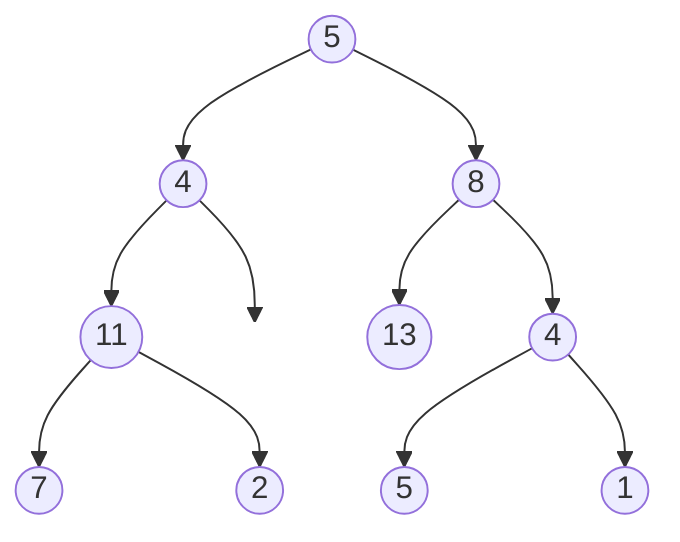

# Path Sum II

## Problem

Given a binary tree and a target sum, find all root-to-leaf paths where the node values along the path add up to the target. A root-to-leaf path starts at the root node and ends at any leaf node (a node with no children). You need to return all such paths, not just count them or determine if one exists.

This is a classic backtracking problem. As you traverse the tree using depth-first search, you maintain a current path and running sum. When you reach a leaf node, check if the sum equals the target - if so, save a copy of the current path to your results. The key word is "copy": you must duplicate the path list before adding it to results, because the same path list is reused and modified as you backtrack. After exploring a node's children, you must remove that node from the current path (backtrack) before returning to explore other branches. Edge cases include trees where all values are negative (making some paths have negative sums), trees with a single node, and ensuring you only check the sum at leaf nodes, not at internal nodes.

**Diagram:**

Example: Input: root = [5,4,8,11,null,13,4,7,2,null,null,5,1], targetSum = 22
Output: [[5,4,11,2], [5,8,4,5]]



Two paths sum to 22:
- Path 1: 5 -> 4 -> 11 -> 2 = 22
- Path 2: 5 -> 8 -> 4 -> 5 = 22


## Why This Matters

Path finding with constraints is fundamental to many real-world applications. This pattern appears in network routing where you need paths meeting cost or latency requirements, in game AI for finding valid movement paths, in workflow systems tracking execution paths that meet certain criteria, and in debugging tools that trace execution paths through code. The backtracking technique is essential: maintaining state as you explore, then undoing changes as you retreat, is a pattern that extends far beyond trees to constraint satisfaction problems, puzzle solving, and combinatorial search. The requirement to find all solutions (rather than just one) mirrors many real scenarios where you need to compare alternatives. This problem is excellent interview material because it tests multiple skills simultaneously: tree traversal, backtracking mechanics, proper list copying (a common bug source), and the ability to correctly identify base cases (leaf nodes only, not all nodes matching the sum).

## Examples

**Example 1:**
- Input: `root = [1,2], targetSum = 0`
- Output: `[]`

## Constraints

- The number of nodes in the tree is in the range [0, 5000].
- -1000 <= Node.val <= 1000
- -1000 <= targetSum <= 1000

## Think About

1. What's the brute force approach? What's its time complexity?
2. Can you identify any patterns in the examples?
3. What data structure would help organize the information?

## Approach Hints

<details>
<summary>💡 Hint 1: Backtracking Pattern</summary>

You need to explore all root-to-leaf paths and track which ones sum to the target. What technique allows you to explore paths and "undo" choices when backtracking?

</details>

<details>
<summary>🎯 Hint 2: Path Tracking</summary>

Maintain a current path as you traverse. When you reach a leaf, check if the sum equals target. After exploring a node's subtrees, remove it from the path (backtrack).

</details>

<details>
<summary>📝 Hint 3: Algorithm</summary>

1. Use DFS with a current path list
2. At each node:
   - Add node value to current path
   - Subtract node value from remaining sum
3. At leaf nodes:
   - If remaining sum is 0, add copy of current path to results
4. Recursively explore left and right children
5. After exploring both children, remove current node from path (backtrack)

Key: Make a copy of the path when adding to results!

</details>

## Complexity Analysis

| Approach | Time | Space | Notes |
|----------|------|-------|-------|
| **DFS + Backtracking** | **O(n²)** | **O(n)** | Visit each node; copy paths when found |
| BFS with Path Tracking | O(n²) | O(n) | Less natural but possible |
| Iterative DFS | O(n²) | O(n) | Stack-based approach |

Note: Time is O(n²) worst case when all paths are valid and we copy them.

## Common Mistakes

### 1. Not making a copy of the path
```python
# WRONG: All results point to same list
def pathSum(root, targetSum):
    result = []
    path = []

    def dfs(node, remaining):
        if not node: return
        path.append(node.val)
        if not node.left and not node.right and remaining == node.val:
            result.append(path)  # BUG: Reference to same list
        dfs(node.left, remaining - node.val)
        dfs(node.right, remaining - node.val)
        path.pop()

    dfs(root, targetSum)
    return result

# CORRECT: Make a copy
def pathSum(root, targetSum):
    result = []
    path = []

    def dfs(node, remaining):
        if not node: return
        path.append(node.val)
        if not node.left and not node.right and remaining == node.val:
            result.append(path[:])  # or list(path) or path.copy()
        dfs(node.left, remaining - node.val)
        dfs(node.right, remaining - node.val)
        path.pop()

    dfs(root, targetSum)
    return result
```

### 2. Checking sum at non-leaf nodes
```python
# WRONG: Includes partial paths
if remaining == node.val:
    result.append(path[:])  # May not be a leaf!

# CORRECT: Check leaf condition
if not node.left and not node.right and remaining == node.val:
    result.append(path[:])
```

### 3. Forgetting to backtrack
```python
# WRONG: Path keeps growing
path.append(node.val)
dfs(node.left, remaining - node.val)
dfs(node.right, remaining - node.val)
# Forgot path.pop()!

# CORRECT: Always backtrack
path.append(node.val)
dfs(node.left, remaining - node.val)
dfs(node.right, remaining - node.val)
path.pop()  # Remove current node before returning
```

## Variations

| Variation | Change | Approach Adjustment |
|-----------|--------|---------------------|
| Any path (not just root-to-leaf) | Paths can start/end anywhere | Track path sums with prefix sum |
| Count paths only | Return count not paths | No need to store paths |
| Maximum path sum | Find max instead of target | Track max globally |
| K shortest paths | Find k paths with smallest sums | Use min heap |
| Path with max product | Product instead of sum | Track current product |

## Practice Checklist

- [ ] Handles empty/edge cases (null root, no valid paths)
- [ ] Can explain approach in 2 min
- [ ] Can code solution in 20 min
- [ ] Can discuss time/space complexity
- [ ] Understands backtracking necessity
- [ ] Remembers to copy path before adding to results

**Spaced Repetition:** Day 1 → 3 → 7 → 14 → 30

---

**Strategy**: See [Backtracking Pattern](../../strategies/patterns/backtracking.md)
