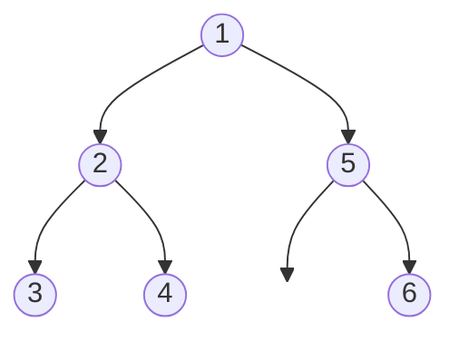

# Flatten Binary Tree to Linked List

## Problem

Given a binary tree, transform it in-place into a "flattened" linked list structure where all nodes are connected via their right pointers in preorder traversal order (root, then left subtree, then right subtree). All left pointers should be set to null. The transformation must be done in-place, meaning you modify the existing tree nodes rather than creating new ones.

The challenge is managing pointers carefully to avoid losing parts of the tree. If you naively move the left subtree to the right, you'll lose the original right subtree. The key is to first save references to both subtrees before rewiring. An elegant O(1) space solution works iteratively: for each node with a left child, find the rightmost node in the left subtree, connect it to the current node's right child, then move the entire left subtree to become the right subtree. This processes each node and edge exactly once. Alternative approaches include collecting nodes via preorder traversal (O(n) space), or using recursion with careful pointer manipulation (O(h) space for the call stack). Edge cases include trees that are already right-skewed, single-node trees, and ensuring all left pointers are properly nullified.

**Diagram:**

Input: Binary tree [1,2,5,3,4,null,6]



Output: Flattened to linked list (preorder: 1,2,3,4,5,6)


## Why This Matters

In-place tree transformation is crucial in memory-constrained environments and systems that need to restructure data without allocation overhead. This pattern appears in serialization systems that convert trees to linear formats for storage or transmission, in memory allocators that flatten hierarchical free-lists, and in compiler optimizations that linearize abstract syntax trees. The technique of finding the rightmost node in a subtree and using it as a connection point is a general pointer manipulation pattern applicable to many tree restructuring problems. Understanding how to preserve information while rewiring pointers (saving the right subtree before moving the left) is a fundamental skill for working with any linked data structure. This is a popular interview question because it tests pointer manipulation under constraints (in-place modification), the ability to think through edge cases, and whether you can optimize space complexity beyond the obvious solutions.

## Examples

**Example 1:**
- Input: `root = []`
- Output: `[]`

**Example 2:**
- Input: `root = [0]`
- Output: `[0]`

## Constraints

- The number of nodes in the tree is in the range [0, 2000].
- -100 <= Node.val <= 100

## Think About

1. What's the brute force approach? What's its time complexity?
2. Can you identify any patterns in the examples?
3. What data structure would help organize the information?

## Approach Hints

<details>
<summary>💡 Hint 1: Understanding the Pattern</summary>

The flattened structure follows preorder traversal (root → left → right). After flattening, each node's right pointer points to the next node in preorder, and all left pointers are null.

</details>

<details>
<summary>🎯 Hint 2: Multiple Approaches</summary>

**Approach 1:** Store preorder in list, rebuild (O(n) space)
**Approach 2:** Recursive with global pointer (O(h) space)
**Approach 3:** Iterative with stack (O(h) space)
**Approach 4:** Morris-like traversal (O(1) space, in-place)

</details>

<details>
<summary>📝 Hint 3: O(1) Space Algorithm</summary>

For each node:
1. If it has a left child:
   - Find the rightmost node in left subtree
   - Connect rightmost node's right pointer to current node's right child
   - Move current node's left subtree to its right
   - Set left pointer to null
2. Move to the right child
3. Repeat

This processes each node and each edge once.

</details>

## Complexity Analysis

| Approach | Time | Space | Notes |
|----------|------|-------|-------|
| Preorder + Rebuild | O(n) | O(n) | Store all nodes, rebuild |
| Recursive | O(n) | O(h) | h = height; recursion stack |
| Iterative + Stack | O(n) | O(h) | Explicit stack for traversal |
| **Morris-like (In-place)** | **O(n)** | **O(1)** | Optimal space; modifies tree |

## Common Mistakes

### 1. Losing right subtree reference
```python
# WRONG: Right subtree lost when moving left to right
def flatten(root):
    if not root: return
    root.right = root.left  # Lost original right!
    root.left = None
    flatten(root.right)

# CORRECT: Save right subtree first
def flatten(root):
    if not root: return

    # Save references
    left = root.left
    right = root.right

    # Move left to right
    root.left = None
    root.right = left

    # Find tail of left subtree
    curr = root
    while curr.right:
        curr = curr.right

    # Attach original right
    curr.right = right
```

### 2. Not setting left pointers to null
```python
# WRONG: Left pointers still exist
root.right = root.left
# Forgot root.left = None

# CORRECT: Clear left pointers
root.right = root.left
root.left = None
```

### 3. Incorrect rightmost node finding
```python
# WRONG: May stop at internal node
def findRightmost(node):
    while node.right and node.right != right:  # Complex condition
        node = node.right
    return node

# CORRECT: Simple traversal
def findRightmost(node):
    while node.right:
        node = node.right
    return node
```

## Common Mistakes

### Using extra space when O(1) is possible
```python
# ACCEPTABLE but not optimal: O(n) space
def flatten(root):
    nodes = []

    def preorder(node):
        if not node: return
        nodes.append(node)
        preorder(node.left)
        preorder(node.right)

    preorder(root)

    for i in range(len(nodes) - 1):
        nodes[i].left = None
        nodes[i].right = nodes[i + 1]

# BETTER: O(1) space in-place approach
def flatten(root):
    curr = root
    while curr:
        if curr.left:
            # Find rightmost in left subtree
            rightmost = curr.left
            while rightmost.right:
                rightmost = rightmost.right

            # Rewire connections
            rightmost.right = curr.right
            curr.right = curr.left
            curr.left = None

        curr = curr.right
```

## Variations

| Variation | Change | Approach Adjustment |
|-----------|--------|---------------------|
| Inorder flattening | Use inorder instead of preorder | Change traversal order |
| Postorder flattening | Use postorder | Start from leaves |
| Reverse preorder | Right before left | Mirror the approach |
| Flatten to doubly linked list | Add prev pointers | Track previous node |
| Return head and tail | Return both ends | Track tail during traversal |

## Practice Checklist

- [ ] Handles empty/edge cases (null root, single node)
- [ ] Can explain approach in 2 min
- [ ] Can code solution in 25 min
- [ ] Can discuss time/space complexity
- [ ] Can implement both O(n) and O(1) space versions
- [ ] Understands pointer manipulation thoroughly

**Spaced Repetition:** Day 1 → 3 → 7 → 14 → 30

---

**Strategy**: See [Tree Traversal Pattern](../../strategies/data-structures/trees.md)
