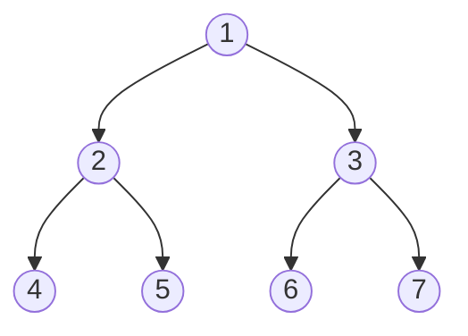
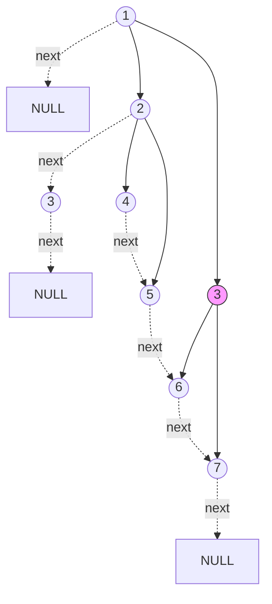

# Populating Next Right Pointers in Each Node

## Problem

Given a perfect binary tree (where all interior nodes have exactly two children and all leaves are at the same depth), populate each node's "next" pointer to point to its next right neighbor in the same level. If there's no next right neighbor, the next pointer should point to null. Initially, all next pointers are null.

A perfect binary tree's structure allows for an elegant O(1) space solution. The key insight is that once you've established the next pointers for a level, you can use those pointers to navigate horizontally across that level while setting up the next pointers for the level below. For each node, you connect its left child to its right child. Then, if the current node has a next pointer, you connect your right child to the next node's left child. This creates the cross-parent connections that link nodes across different subtrees. You process level by level, using the leftmost node as your starting point for each level. Edge cases include handling the empty tree and recognizing that the algorithm works because the perfect tree property guarantees both children always exist until you reach the leaf level.

**Diagram:**

Input: Perfect binary tree [1,2,3,4,5,6,7]



Output: Each node's next pointer points to its next right node



Level 1: 1 -> NULL
Level 2: 2 -> 3 -> NULL
Level 3: 4 -> 5 -> 6 -> 7 -> NULL


## Why This Matters

Augmenting tree nodes with horizontal links is a fundamental technique in systems that need level-by-level processing or fast access to sibling nodes. This pattern appears in rendering engines that process display elements level by level, in distributed systems that organize nodes by tier for load balancing, and in B-trees where sibling pointers enable efficient range queries. The O(1) space solution demonstrates an important principle: sometimes you can use the structure you're building to assist in building the rest of it, creating a bootstrapping effect. The perfect tree constraint teaches you to recognize when structural guarantees enable optimizations that wouldn't work for general trees. This is a high-frequency interview problem because it tests whether you can achieve constant space complexity by leveraging problem-specific properties, and it naturally leads to the harder variant (next problem) where the tree isn't perfect, forcing you to handle missing children gracefully.

## Examples

**Example 1:**
- Input: `root = []`
- Output: `[]`

## Constraints

- The number of nodes in the tree is in the range [0, 2¹² - 1].
- -1000 <= Node.val <= 1000

## Think About

1. What's the brute force approach? What's its time complexity?
2. Can you identify any patterns in the examples?
3. What data structure would help organize the information?

## Approach Hints

<details>
<summary>💡 Hint 1: Level by Level</summary>

Since you need to connect nodes at the same level, think about how to process the tree level by level. What traversal technique naturally groups nodes by their depth?

</details>

<details>
<summary>🎯 Hint 2: Perfect Binary Tree Property</summary>

In a perfect binary tree, every node has either two children or none. This means if you're at a node and have already connected the current level, you can use the next pointers to navigate horizontally while setting up connections for the level below. Can you avoid using extra space for a queue?

</details>

<details>
<summary>📝 Hint 3: Two-Level Processing</summary>

**Pseudocode approach:**
1. Start with leftmost node of current level
2. While current level exists:
   - Connect left child to right child
   - If current node has next pointer, connect right child to next's left child
   - Move to next node in current level
3. Move down to the next level (go to leftmost child)
4. Repeat until all levels processed

</details>

## Complexity Analysis

| Approach | Time | Space | Notes |
|----------|------|-------|-------|
| BFS with Queue | O(n) | O(n) | Standard level-order traversal, queue holds up to n/2 nodes |
| **Using Next Pointers** | **O(n)** | **O(1)** | Optimal - leverages perfect tree property to avoid queue |

## Common Mistakes

### 1. Using Unnecessary Space
```python
# WRONG: Using queue when O(1) space is possible
def connect(root):
    if not root:
        return root
    queue = [root]  # O(n) space - not optimal for perfect tree
    while queue:
        level_size = len(queue)
        for i in range(level_size):
            node = queue.pop(0)
            # ... process

# CORRECT: Use existing next pointers to navigate
def connect(root):
    if not root:
        return root
    leftmost = root
    while leftmost.left:  # Has next level
        head = leftmost
        while head:  # Traverse current level
            head.left.next = head.right
            if head.next:
                head.right.next = head.next.left
            head = head.next
        leftmost = leftmost.left
    return root
```

### 2. Forgetting to Handle Empty Tree
```python
# WRONG: No null check
def connect(root):
    leftmost = root
    while leftmost.left:  # Crashes on empty tree!
        # ...

# CORRECT: Guard against null
def connect(root):
    if not root:
        return root
    leftmost = root
    while leftmost.left:
        # ...
```

### 3. Not Connecting Across Parents
```python
# WRONG: Only connecting siblings of same parent
def connect(node):
    if node.left:
        node.left.next = node.right  # Good
    # Missing: node.right.next = node.next.left

# CORRECT: Connect children across different parents
def connect_level(node):
    if node.left:
        node.left.next = node.right
    if node.right and node.next:
        node.right.next = node.next.left
```

## Variations

| Variation | Change | Approach Adjustment |
|-----------|--------|---------------------|
| Any Binary Tree (M049) | Tree not perfect | Must use queue or track rightmost node per level |
| Return Level Lists | Return list of lists | Use BFS and collect nodes per level |
| Right Side View | Only rightmost nodes | Track last node in each level |
| Zigzag Level Order | Alternate direction | Use deque or reverse alternate levels |

## Practice Checklist

- [ ] Handles empty tree edge case
- [ ] Can explain O(1) space approach in 2 min
- [ ] Can code optimal solution in 15 min
- [ ] Can discuss time/space complexity tradeoffs
- [ ] Understands difference from non-perfect tree variant

**Spaced Repetition:** Day 1 → 3 → 7 → 14 → 30

---

**Strategy**: See [Tree Traversal Patterns](../../prerequisites/trees.md)
