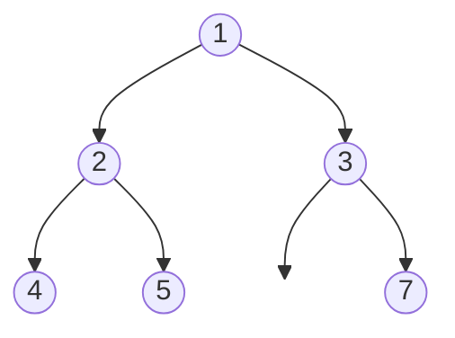
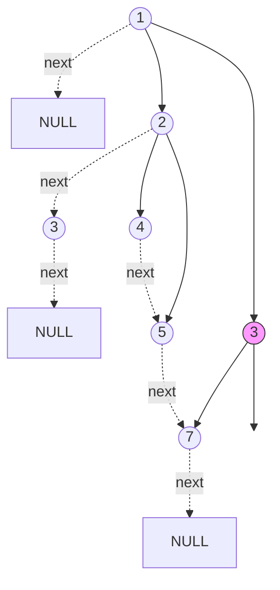

# Populating Next Right Pointers in Each Node II

## Problem

Given any binary tree (not necessarily perfect), populate each node's "next" pointer to point to its next right neighbor at the same level. Unlike the perfect tree version, nodes may have only one child or no children, so you can't assume both left and right children exist. The next pointer should point to null if there's no right neighbor.

The challenge here is handling the irregular structure. You can't simply assume that connecting a right child to next.left will work, because the next node might not have a left child, or might not have any children at all. The solution is to maintain a linked list of the next level as you traverse the current level. For each level, use a dummy node and a tail pointer to build the linked list of children. As you traverse the current level using existing next pointers, append each non-null child to the growing list. The dummy node's next pointer always points to the first node of the next level. This approach achieves O(1) space by building each level's connections using the previous level's already-established next pointers. Edge cases include trees with many null children, completely unbalanced trees, and ensuring you don't attempt to access children of null nodes.

**Diagram:**

Input: Any binary tree [1,2,3,4,5,null,7]



Output: Each node's next pointer points to its next right node



Level 1: 1 -> NULL
Level 2: 2 -> 3 -> NULL
Level 3: 4 -> 5 -> 7 -> NULL


## Why This Matters

This generalized version handles real-world tree structures that rarely have perfect balance. The dummy node technique for building level-by-level linked lists is a versatile pattern that appears whenever you need to collect or organize nodes at the same depth without knowing the structure in advance. This is common in file system traversals (where directories may have varying numbers of subdirectories), in organizational hierarchies (where managers have different numbers of reports), and in HTML DOM manipulation (where elements have varying numbers of children). The ability to achieve O(1) space despite the irregular structure demonstrates advanced pointer manipulation skills: you're essentially using the tree's existing structure plus temporary dummy nodes to build the connections without auxiliary data structures. This problem is frequently used in interviews as a follow-up to the perfect tree version, testing whether you can adapt your solution when structural guarantees are removed and handle the complexity of null-checking and irregular level sizes.

## Examples

**Example 1:**
- Input: `root = []`
- Output: `[]`

## Constraints

- The number of nodes in the tree is in the range [0, 6000].
- -100 <= Node.val <= 100

## Think About

1. What's the brute force approach? What's its time complexity?
2. Can you identify any patterns in the examples?
3. What data structure would help organize the information?

## Approach Hints

<details>
<summary>💡 Hint 1: Non-Perfect Tree Challenge</summary>

Unlike a perfect binary tree, nodes may have only one child or no children. This means you can't rely on predictable structure. How can you track which child should be connected next when children might be missing?

</details>

<details>
<summary>🎯 Hint 2: Maintaining Level Links</summary>

You can still achieve O(1) space by building next-level connections while traversing the current level using already-established next pointers. The key is maintaining a "dummy" head for each new level and tracking the tail of that level as you add children.

</details>

<details>
<summary>📝 Hint 3: Level-by-Level Algorithm</summary>

**Pseudocode approach:**
1. For each level, maintain a dummy node and tail pointer
2. Traverse current level using next pointers
3. For each node, append non-null children to the next level's linked list
4. Update tail pointer as you add children
5. Move to next level (dummy.next)
6. Repeat until no more levels

</details>

## Complexity Analysis

| Approach | Time | Space | Notes |
|----------|------|-------|-------|
| BFS with Queue | O(n) | O(n) | Standard approach, queue can hold up to n/2 nodes |
| **Next Pointer Building** | **O(n)** | **O(1)** | Optimal - uses dummy node technique for each level |
| Recursive DFS | O(n) | O(h) | Space for recursion stack, harder to implement correctly |

## Common Mistakes

### 1. Assuming Perfect Tree Structure
```python
# WRONG: Assuming both children always exist
def connect(node):
    if node.left and node.next:
        node.right.next = node.next.left  # Crashes if no right child!

# CORRECT: Check for null children
def process_child(parent, prev, leftmost):
    if parent.left:
        if prev:
            prev.next = parent.left
        prev = parent.left
        if not leftmost:
            leftmost = parent.left
    # Similar for right child with null checks
```

### 2. Losing Track of Next Level Start
```python
# WRONG: No way to find start of next level
prev = None
while current_level:
    if current.left:
        prev = current.left
    # ... but how to get to next level start?

# CORRECT: Use dummy node to track next level head
dummy = Node(0)
tail = dummy
while process_current_level:
    # Add children to tail
    # ...
next_level = dummy.next  # Always have next level start
```

### 3. Not Handling Single-Child Nodes
```python
# WRONG: Only processing when both children exist
if node.left and node.right:
    node.left.next = node.right

# CORRECT: Process each child independently
for child in [node.left, node.right]:
    if child:
        if prev:
            prev.next = child
        prev = child
```

## Variations

| Variation | Change | Approach Adjustment |
|-----------|--------|---------------------|
| Perfect Binary Tree (M048) | All nodes have 0 or 2 children | Can use simpler O(1) space approach |
| Return Level Averages | Calculate average per level | Track sum and count during traversal |
| Vertical Order Traversal | Group by column instead of level | Use hash map with column indices |
| Connect by Value | Connect nodes with same value | Track value-to-node mappings |

## Practice Checklist

- [ ] Handles trees with missing children correctly
- [ ] Can explain dummy node technique in 2 min
- [ ] Can code O(1) space solution in 20 min
- [ ] Can discuss why BFS queue is acceptable alternative
- [ ] Understands difference from perfect tree version

**Spaced Repetition:** Day 1 → 3 → 7 → 14 → 30

---

**Strategy**: See [Tree Traversal Patterns](../../prerequisites/trees.md)
