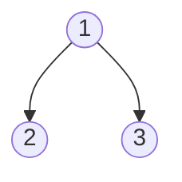
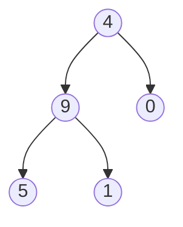

# Sum Root to Leaf Numbers

## Problem

You're given a binary tree where each node contains a single digit (0-9). Your task is to compute the sum of all numbers formed by root-to-leaf paths. A root-to-leaf path is a sequence of nodes from the root down to a leaf node (a node with no children). Each path forms a number by concatenating the digits from root to leaf. For example, a path from root 1 to left child 2 to right child 3 forms the number 123. If the tree has multiple paths, you sum all the numbers they form. Consider a tree with root 4, left child 9 (with children 5 and 1), and right child 0. This creates three paths: 4-9-5 (495), 4-9-1 (491), and 4-0 (40), which sum to 1026. The challenge is efficiently traversing the tree while building numbers digit-by-digit and accumulating the total. Edge cases include single-node trees (just return that digit) and trees with zeros in the middle of paths (which affect the numerical value).

**Diagram:**

Example 1:


Example 2:



## Why This Matters

This problem demonstrates how tree structures can encode hierarchical numbering systems, similar to how file systems use path-based identifiers or how prefix tries represent numeric data. The technique of accumulating values during tree traversal appears in expression evaluation (where you compute results while traversing parse trees), decision trees in machine learning (calculating probabilities along paths), and routing algorithms (summing costs along network paths). The pattern of building state incrementally during depth-first search is fundamental to backtracking algorithms, constraint satisfaction problems, and game tree evaluation. This also teaches you to think about efficiently representing numbers without string manipulation, a crucial optimization in performance-critical systems.

## Constraints

- The number of nodes in the tree is in the range [1, 1000].
- 0 <= Node.val <= 9
- The depth of the tree will not exceed 10.

## Think About

1. What's the brute force approach? What's its time complexity?
2. Can you identify any patterns in the examples?
3. What data structure would help organize the information?

## Approach Hints

<details>
<summary>💡 Hint 1: Building Numbers Along Path</summary>

As you traverse from root to leaf, you're building a number digit by digit. For example, path 1→2→3 represents 123. How can you efficiently construct this number as you go down the tree? Think about how each new digit affects the current number.

</details>

<details>
<summary>🎯 Hint 2: DFS with Accumulated Value</summary>

Use depth-first search while maintaining the current number formed so far. When moving from parent (with current value X) to child (with value Y), the new number becomes X * 10 + Y. When you reach a leaf, add the complete number to your total sum.

</details>

<details>
<summary>📝 Hint 3: Recursive Algorithm</summary>

**Pseudocode approach:**
```
function dfs(node, current_number):
    if node is null:
        return 0

    current_number = current_number * 10 + node.val

    if node is leaf:
        return current_number

    left_sum = dfs(node.left, current_number)
    right_sum = dfs(node.right, current_number)

    return left_sum + right_sum

result = dfs(root, 0)
```

</details>

## Complexity Analysis

| Approach | Time | Space | Notes |
|----------|------|-------|-------|
| **DFS Recursive** | **O(n)** | **O(h)** | Optimal - visit each node once, h is tree height |
| DFS Iterative | O(n) | O(h) | Uses explicit stack, same complexity |
| BFS with Pairs | O(n) | O(w) | Store (node, number) pairs, w is max width |
| Collect All Paths First | O(n) | O(n) | Wastes space storing all paths as strings |

## Common Mistakes

### 1. Building Number as String
```python
# WRONG: String concatenation is inefficient and unnecessary
def sumNumbers(root):
    def dfs(node, path_str):
        if not node:
            return 0
        path_str += str(node.val)  # String operation
        if not node.left and not node.right:
            return int(path_str)  # Converting back
        return dfs(node.left, path_str) + dfs(node.right, path_str)
    return dfs(root, "")

# CORRECT: Build number arithmetically
def sumNumbers(root):
    def dfs(node, current_num):
        if not node:
            return 0
        current_num = current_num * 10 + node.val  # O(1) arithmetic
        if not node.left and not node.right:
            return current_num
        return dfs(node.left, current_num) + dfs(node.right, current_num)
    return dfs(root, 0)
```

### 2. Not Handling Null Nodes Correctly
```python
# WRONG: Doesn't check for null, will crash
def sumNumbers(root):
    def dfs(node, num):
        num = num * 10 + node.val
        if not node.left and not node.right:
            return num
        return dfs(node.left, num) + dfs(node.right, num)  # Crashes if leaf!

# CORRECT: Check for null before recursion
def sumNumbers(root):
    def dfs(node, num):
        if not node:
            return 0
        num = num * 10 + node.val
        if not node.left and not node.right:
            return num
        return dfs(node.left, num) + dfs(node.right, num)
    return dfs(root, 0)
```

### 3. Forgetting to Return Sum from Both Subtrees
```python
# WRONG: Only returns one subtree's result
def sumNumbers(root):
    def dfs(node, num):
        if not node:
            return 0
        num = num * 10 + node.val
        if not node.left and not node.right:
            return num
        return dfs(node.left, num)  # Missing right subtree!

# CORRECT: Sum both subtrees
def sumNumbers(root):
    def dfs(node, num):
        if not node:
            return 0
        num = num * 10 + node.val
        if not node.left and not node.right:
            return num
        return dfs(node.left, num) + dfs(node.right, num)
    return dfs(root, 0)
```

## Variations

| Variation | Change | Approach Adjustment |
|-----------|--------|---------------------|
| Binary Tree Paths (M257) | Return all paths as strings | Collect path strings instead of summing |
| Path Sum (E112) | Check if any path equals target | Return boolean instead of sum |
| Path Sum II (M113) | Find all paths with target sum | Collect matching paths |
| Sum of Left Leaves | Only sum left leaf values | Track parent direction, filter leaves |
| Maximum Path Sum | Can start/end anywhere | Need to track max through any node |

## Practice Checklist

- [ ] Handles single-node tree correctly
- [ ] Can explain number-building technique in 2 min
- [ ] Can code recursive solution in 10 min
- [ ] Can implement iterative version with stack
- [ ] Understands why arithmetic is better than string manipulation

**Spaced Repetition:** Day 1 → 3 → 7 → 14 → 30

---

**Strategy**: See [Tree DFS Patterns](../../strategies/data-structures/trees.md)
