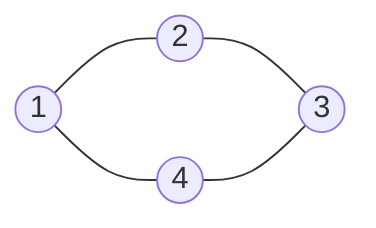

# Clone Graph

## Problem

You're given a reference to a node in a connected undirected graph, and your task is to create a complete deep copy of the entire graph. Each node has a value and a list of neighbors. A deep copy means creating entirely new node objects with the same values and connections, not just copying references. The challenge is handling the circular references inherent in graphs: if node A points to node B, and B points back to A, you need to ensure your clones maintain this relationship without creating infinite loops. For example, if you naively clone each node and recursively clone its neighbors, you'll get stuck in cycles. You need a way to track which nodes you've already cloned so that when you encounter them again, you return the existing clone rather than creating a new one. Edge cases include single-node graphs, fully connected graphs, and empty graphs (null input).

## Why This Matters

Graph deep copying is essential in distributed systems when serializing and deserializing complex object graphs, in version control systems when creating branches of interconnected objects, and in game engines when instantiating prefabs with internal references. The hash map tracking technique used here appears in garbage collection (tracking visited objects), object serialization frameworks, and dependency injection systems. This problem teaches you how to handle circular references safely, a critical skill when working with complex data structures in production systems. The pattern of maintaining visited state during traversal is fundamental to cycle detection, deadlock prevention, and state space exploration in AI systems.

**Diagram:**

Example graph (undirected):


Single node graph:


## Why This Matters

Graph deep copying is essential in distributed systems when serializing and deserializing complex object graphs, in version control systems when creating branches of interconnected objects, and in game engines when instantiating prefabs with internal references. The hash map tracking technique used here appears in garbage collection (tracking visited objects), object serialization frameworks, and dependency injection systems. This problem teaches you how to handle circular references safely, a critical skill when working with complex data structures in production systems. The pattern of maintaining visited state during traversal is fundamental to cycle detection, deadlock prevention, and state space exploration in AI systems.

## Examples

**Example 1:**
- Input: `adjList = []`
- Output: `[]`
- Explanation: This an empty graph, it does not have any nodes.

## Constraints

- The number of nodes in the graph is in the range [0, 100].
- 1 <= Node.val <= 100
- Node.val is unique for each node.
- There are no repeated edges and no self-loops in the graph.
- The Graph is connected and all nodes can be visited starting from the given node.

## Think About

1. What's the brute force approach? What's its time complexity?
2. Can you identify any patterns in the examples?
3. What data structure would help organize the information?

## Approach Hints

<details>
<summary>💡 Hint 1: The Core Challenge</summary>

The tricky part about cloning a graph is handling the circular references. If node A points to node B, and node B points back to node A, you need to ensure both clones point to each other without creating infinite loops. How can you track which nodes you've already cloned?

</details>

<details>
<summary>🎯 Hint 2: Hash Map for Tracking</summary>

Use a hash map to store the mapping from original nodes to their clones. Before creating a new clone, check if you've already cloned that node. This prevents duplicates and handles cycles. The key insight: clone the node first, then recursively clone its neighbors using the same map.

</details>

<details>
<summary>📝 Hint 3: DFS/BFS Algorithm</summary>

**Pseudocode (DFS):**
```
visited = {} # maps original -> clone

function clone(node):
    if node is null:
        return null

    if node in visited:
        return visited[node]  # Already cloned

    clone_node = new Node(node.val)
    visited[node] = clone_node  # Mark as cloned BEFORE processing neighbors

    for neighbor in node.neighbors:
        clone_node.neighbors.append(clone(neighbor))

    return clone_node
```

**BFS alternative:** Use queue instead of recursion, same map tracking.

</details>

## Complexity Analysis

| Approach | Time | Space | Notes |
|----------|------|-------|-------|
| **DFS with HashMap** | **O(V + E)** | **O(V)** | Optimal - visit each vertex and edge once |
| BFS with HashMap | O(V + E) | O(V) | Same complexity, iterative instead of recursive |
| Without HashMap | Infinite | - | Will loop forever on cycles |
| Deep Copy All Paths | O(V!) | O(V!) | Exponential - explores redundant paths |

V = number of vertices (nodes), E = number of edges

## Common Mistakes

### 1. Not Using HashMap (Infinite Loop)
```python
# WRONG: Creates infinite loop on cycles
def cloneGraph(node):
    if not node:
        return None
    clone = Node(node.val)
    for neighbor in node.neighbors:
        clone.neighbors.append(cloneGraph(neighbor))  # Infinite recursion!
    return clone

# CORRECT: Track visited nodes
def cloneGraph(node):
    if not node:
        return None
    visited = {}

    def dfs(node):
        if node in visited:
            return visited[node]
        clone = Node(node.val)
        visited[node] = clone  # Mark BEFORE recursing
        for neighbor in node.neighbors:
            clone.neighbors.append(dfs(neighbor))
        return clone

    return dfs(node)
```

### 2. Cloning After Recursion
```python
# WRONG: Adds to map after processing neighbors
def dfs(node, visited):
    if node in visited:
        return visited[node]
    clone = Node(node.val)
    for neighbor in node.neighbors:
        clone.neighbors.append(dfs(neighbor, visited))
    visited[node] = clone  # TOO LATE! Already recursed
    return clone

# CORRECT: Add to map immediately after creating clone
def dfs(node, visited):
    if node in visited:
        return visited[node]
    clone = Node(node.val)
    visited[node] = clone  # Add BEFORE processing neighbors
    for neighbor in node.neighbors:
        clone.neighbors.append(dfs(neighbor, visited))
    return clone
```

### 3. Shallow Copy Instead of Deep Copy
```python
# WRONG: Shares neighbor list references
def cloneGraph(node):
    visited = {}
    clone = Node(node.val)
    clone.neighbors = node.neighbors  # Shallow copy!
    return clone

# CORRECT: Clone each neighbor recursively
def cloneGraph(node):
    # ... proper DFS/BFS that clones each neighbor
```

## Variations

| Variation | Change | Approach Adjustment |
|-----------|--------|---------------------|
| Copy List with Random Pointer (M057) | Linked list with random pointers | Same hash map technique, 1D structure |
| Clone Binary Tree | Tree structure | Simpler - no cycles, can use pure recursion |
| Clone N-ary Tree | N children per node | Similar to graph but no cycles |
| Serialize/Deserialize Graph | Convert to/from string | Need to encode structure, more complex |
| Clone with Modifications | Add/modify during clone | Process nodes while cloning |

## Practice Checklist

- [ ] Handles empty graph (null input)
- [ ] Can explain why hash map is necessary in 2 min
- [ ] Can code DFS solution in 12 min
- [ ] Can implement BFS alternative
- [ ] Understands when to add node to visited map

**Spaced Repetition:** Day 1 → 3 → 7 → 14 → 30

---

**Strategy**: See [Graph Traversal and Deep Copy Patterns](../../strategies/data-structures/graphs.md)
