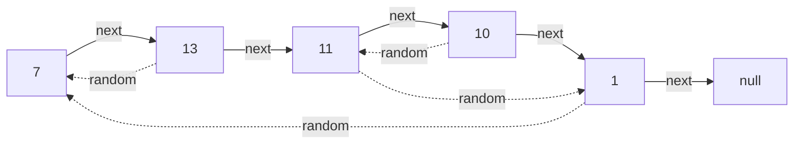
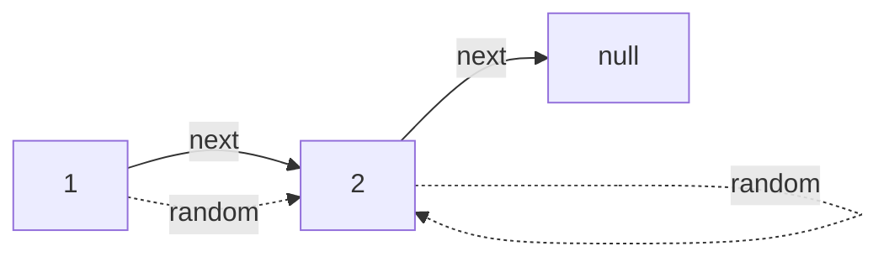
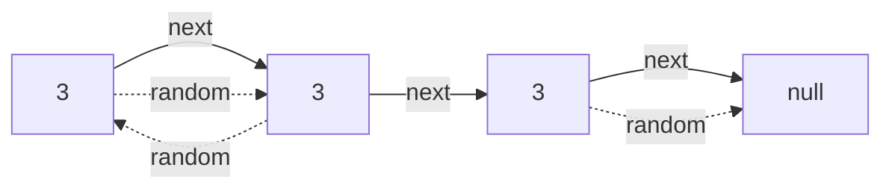

# Copy List with Random Pointer

## Problem

You're given a linked list where each node contains three components: a value, a next pointer (standard linked list), and a random pointer that can point to any node in the list or null. Your task is to create a complete deep copy of this structure. A deep copy means creating entirely new node objects rather than just copying references. The challenge is more complex than a regular linked list because you can't simply traverse and copy sequentially. When you're copying a node, its random pointer might point to a node you haven't copied yet, or it might point backward to an already-copied node. You need a strategy to ensure all random pointers in your copy point to the correct new nodes, not the original nodes. For example, if node A's random points to node C, your copied A must point to copied C. Edge cases include random pointers forming cycles (node pointing to itself), random pointers all being null, or the entire list being a single node.

**Diagram:**

Example 1:


Example 2:


Example 3:



## Why This Matters

This problem models the challenge of serializing and deserializing complex data structures with arbitrary internal references, which appears in object persistence frameworks, undo/redo systems, and snapshot mechanisms in editors. The hash map approach teaches you how to maintain mappings between original and copied objects, a pattern used in object cloning libraries, deep copy implementations in languages like Python, and game state serialization. The space-optimized interweaving technique demonstrates creative pointer manipulation used in memory-constrained environments like embedded systems. This problem also appears in implementing copy constructors for complex objects, checkpoint-restart systems in distributed computing, and version control systems that need to duplicate object graphs efficiently.

## Constraints

- 0 <= n <= 1000
- -10⁴ <= Node.val <= 10⁴
- Node.random is null or is pointing to some node in the linked list.

## Think About

1. What's the brute force approach? What's its time complexity?
2. Can you identify any patterns in the examples?
3. What data structure would help organize the information?

## Approach Hints

<details>
<summary>💡 Hint 1: The Two-Pointer Problem</summary>

The challenge is handling two different pointer types: next pointers form a simple chain, but random pointers can point anywhere. If you clone nodes in order, how do you ensure random pointers point to the correct cloned nodes, especially if the random target hasn't been cloned yet?

</details>

<details>
<summary>🎯 Hint 2: Hash Map Mapping</summary>

Create a hash map that maps each original node to its clone. First pass: create all clone nodes and populate the map. Second pass: set next and random pointers on clones using the map. This ensures all target nodes exist before setting pointers.

</details>

<details>
<summary>📝 Hint 3: Two Approaches</summary>

**Approach 1: Hash Map (O(n) space)**
```
1. First pass: Create map[original] = clone for each node
2. Second pass: For each original node:
   - clone.next = map[original.next]
   - clone.random = map[original.random]
```

**Approach 2: Interweaving (O(1) space, more complex)**
```
1. Insert clones between original nodes: A->A'->B->B'->C->C'
2. Set random pointers: A'.random = A.random.next
3. Separate lists: restore original, extract clone
```

</details>

## Complexity Analysis

| Approach | Time | Space | Notes |
|----------|------|-------|-------|
| **Hash Map (Two Pass)** | **O(n)** | **O(n)** | Most readable, space for hash map |
| **Interweaving Nodes** | **O(n)** | **O(1)** | Optimal space, more complex logic |
| Recursive with Map | O(n) | O(n) | Recursion stack + map, less intuitive |
| Multiple Scans | O(n²) | O(1) | Inefficient, searching for nodes repeatedly |

## Common Mistakes

### 1. Cloning Only Next Pointers
```python
# WRONG: Forgets random pointers or shallow copies them
def copyRandomList(head):
    if not head:
        return None
    clone = Node(head.val)
    clone.next = copyRandomList(head.next)
    clone.random = head.random  # WRONG: points to original!
    return clone

# CORRECT: Use map to ensure random points to clone
def copyRandomList(head):
    if not head:
        return None
    old_to_new = {}

    # First pass: create all nodes
    curr = head
    while curr:
        old_to_new[curr] = Node(curr.val)
        curr = curr.next

    # Second pass: set pointers
    curr = head
    while curr:
        if curr.next:
            old_to_new[curr].next = old_to_new[curr.next]
        if curr.random:
            old_to_new[curr].random = old_to_new[curr.random]
        curr = curr.next

    return old_to_new[head]
```

### 2. Not Handling None Random Pointers
```python
# WRONG: Crashes when random is None
def copyRandomList(head):
    old_to_new = {node: Node(node.val) for node in iterate(head)}
    for old_node in iterate(head):
        old_to_new[old_node].random = old_to_new[old_node.random]  # KeyError if None!

# CORRECT: Check for None
def copyRandomList(head):
    old_to_new = {}
    # ... create nodes ...
    for old_node in iterate(head):
        if old_node.random:
            old_to_new[old_node].random = old_to_new[old_node.random]
        # None.random stays None by default
```

### 3. Interweaving Separation Error
```python
# WRONG: Doesn't restore original list properly
def copyRandomList(head):
    # ... interweave nodes ...
    # ... set random pointers ...

    # Extract clone
    clone_head = head.next
    curr = head
    while curr:
        curr.next = curr.next.next  # Breaks clone list!
        curr = curr.next
    return clone_head

# CORRECT: Properly separate both lists
def copyRandomList(head):
    # ... interweave and set random ...

    # Separate lists
    clone_head = head.next
    old_curr = head
    while old_curr:
        new_curr = old_curr.next
        old_curr.next = new_curr.next
        if new_curr.next:
            new_curr.next = new_curr.next.next
        old_curr = old_curr.next
    return clone_head
```

## Variations

| Variation | Change | Approach Adjustment |
|-----------|--------|---------------------|
| Clone Graph (M055) | Undirected graph structure | Same hash map approach, DFS/BFS traversal |
| Copy Binary Tree | Tree with parent pointers | Similar three-pointer problem |
| Clone N-ary Tree | Multiple child pointers | Hash map for arbitrary pointer count |
| Deep Copy with Arrays | Nodes contain arrays | Need to deep copy array contents too |
| Cycle Detection First | Check for cycles before clone | Might simplify interweaving approach |

## Practice Checklist

- [ ] Handles empty list (null head)
- [ ] Can explain hash map approach in 2 min
- [ ] Can code hash map solution in 12 min
- [ ] Can implement interweaving O(1) space version
- [ ] Understands when to use each approach

**Spaced Repetition:** Day 1 → 3 → 7 → 14 → 30

---

**Strategy**: See [Linked List Deep Copy Patterns](../../prerequisites/linked-lists.md)
