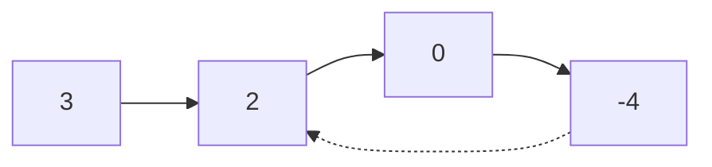

# Linked List Cycle II

## Problem

You're given the head of a linked list that may contain a cycle. A cycle exists when a node's next pointer points back to a previous node, creating a loop. Your task is to find the exact node where the cycle begins, or return null if no cycle exists. This goes beyond simple cycle detection (which just answers yes/no) to pinpointing the cycle's entry point. For example, if the list is 3→2→0→-4, and -4 points back to 2, the answer is the node with value 2. The challenge is finding this node efficiently without using extra space. A hash set approach works but uses O(n) memory. The optimal solution uses Floyd's cycle detection algorithm with a clever mathematical insight: after detecting a cycle using fast and slow pointers, if you reset one pointer to the head and advance both at the same speed, they'll meet exactly at the cycle's start. Edge cases include lists with no cycle, single-node cycles (node pointing to itself), and empty lists.

**Diagram:**

Example 1 (cycle starts at node with value 2):


Example 2 (cycle starts at node with value 1):


Example 3 (no cycle):


## Why This Matters

Cycle detection and location is critical in operating systems for detecting deadlocks in resource allocation graphs, in garbage collection for identifying circular references that prevent memory reclamation, and in distributed systems for detecting routing loops. Floyd's algorithm demonstrates how mathematical insights can eliminate space complexity, a technique that appears in stream processing where you can't store all data in memory. The fast-slow pointer pattern is used in detecting duplicate elements, finding middle points in single-pass scenarios, and analyzing periodic patterns in data streams. Understanding this algorithm helps you recognize when clever pointer manipulation can replace hash-based solutions, saving memory in resource-constrained environments.

## Constraints

- The number of the nodes in the list is in the range [0, 10⁴].
- -10⁵ <= Node.val <= 10⁵
- pos is -1 or a **valid index** in the linked-list.

## Think About

1. What's the brute force approach? What's its time complexity?
2. Can you identify any patterns in the examples?
3. What data structure would help organize the information?

## Approach Hints

<details>
<summary>💡 Hint 1: Detection vs. Location</summary>

First detect if a cycle exists using the fast-slow pointer technique. Once you know there's a cycle, the challenge is finding where it begins. Think about the mathematical relationship between the distances traveled by fast and slow pointers when they meet.

</details>

<details>
<summary>🎯 Hint 2: Mathematical Insight</summary>

When fast and slow pointers meet inside a cycle, they've established a specific mathematical relationship. If you move one pointer to the head and advance both at the same speed, they'll meet exactly at the cycle start. This works because of the distance relationships in the cycle.

</details>

<details>
<summary>📝 Hint 3: Two-Phase Algorithm</summary>

**Phase 1:** Use fast (2 steps) and slow (1 step) pointers to detect cycle
- If they meet, cycle exists
- If fast reaches null, no cycle

**Phase 2:** Reset one pointer to head
- Move both pointers one step at a time
- Where they meet is the cycle start

</details>

## Complexity Analysis

| Approach | Time | Space | Notes |
|----------|------|-------|-------|
| Hash Set | O(n) | O(n) | Store visited nodes, return first duplicate |
| **Floyd's Algorithm** | **O(n)** | **O(1)** | Two-phase pointer technique, optimal |

## Common Mistakes

### 1. Not Handling No-Cycle Case
```python
# WRONG: Assumes cycle always exists
def detectCycle(head):
    fast = slow = head
    while True:  # Infinite loop if no cycle!
        slow = slow.next
        fast = fast.next.next
```

```python
# CORRECT: Check for null pointers
def detectCycle(head):
    fast = slow = head
    while fast and fast.next:
        slow = slow.next
        fast = fast.next.next
        if slow == fast:
            break
    else:
        return None  # No cycle found
```

### 2. Incorrect Phase 2 Logic
```python
# WRONG: Moving both pointers from meeting point
def detectCycle(head):
    # ... phase 1 ...
    ptr1 = slow
    ptr2 = fast  # Should reset to head!
    while ptr1 != ptr2:
        ptr1 = ptr1.next
        ptr2 = ptr2.next
```

```python
# CORRECT: Reset one pointer to head
def detectCycle(head):
    # ... phase 1 ...
    ptr1 = head  # Reset to head
    ptr2 = slow  # Keep at meeting point
    while ptr1 != ptr2:
        ptr1 = ptr1.next
        ptr2 = ptr2.next
    return ptr1
```

### 3. Empty List Edge Case
```python
# WRONG: Doesn't handle empty list
def detectCycle(head):
    fast = slow = head
    # Crashes if head is None
```

```python
# CORRECT: Check for empty list
def detectCycle(head):
    if not head:
        return None
    fast = slow = head
    # ... rest of logic ...
```

## Variations

| Variation | Change | Approach Adjustment |
|-----------|--------|---------------------|
| Return cycle length | Find length instead of start | Count steps in one full cycle after detection |
| Remove cycle | Break the cycle | Find node before cycle start and set next to null |
| K-length cycle | Detect only if cycle length is K | After detection, measure cycle length |
| Multiple linked lists | Find which lists have cycles | Apply algorithm to each list independently |

## Practice Checklist

- [ ] Handles empty list
- [ ] Handles single node (with and without self-loop)
- [ ] Handles no cycle case
- [ ] Can explain Floyd's cycle detection mathematics
- [ ] Can code solution in 15 min
- [ ] Can discuss time/space complexity

**Spaced Repetition:** Day 1 → 3 → 7 → 14 → 30

---

**Strategy**: See [Fast-Slow Pointers Pattern](../../strategies/patterns/fast-slow-pointers.md)
