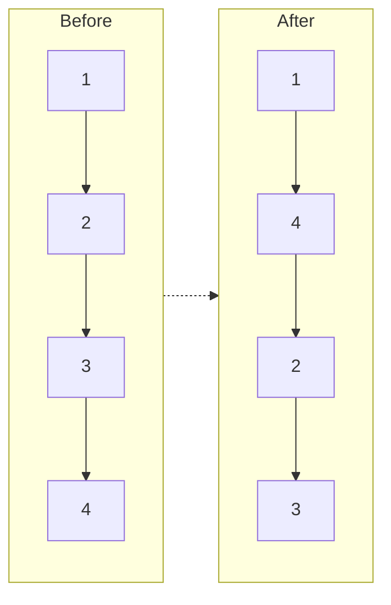
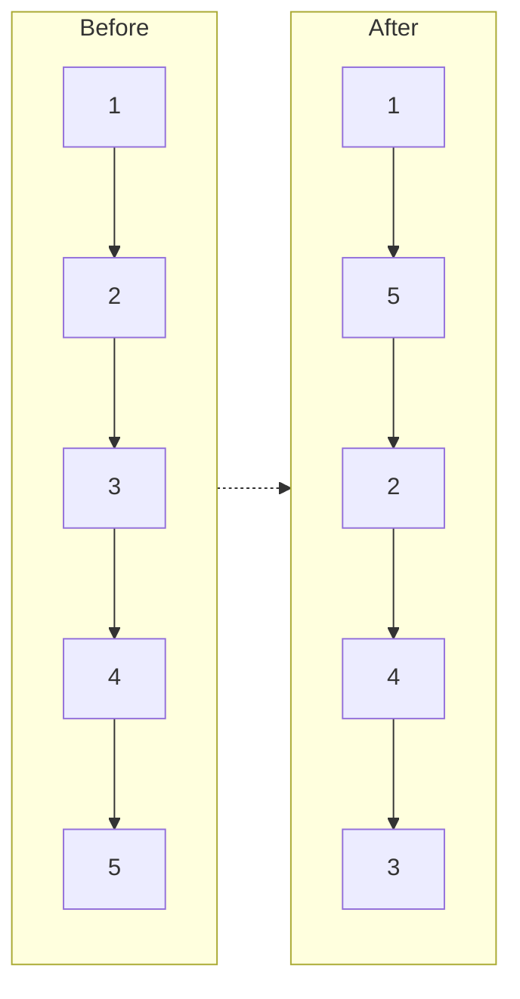

# Reorder List

## Problem

You're given a linked list L0→L1→L2→...→Ln-1→Ln and need to reorder it in-place to follow the pattern L0→Ln→L1→Ln-1→L2→Ln-2→... In other words, you interleave nodes from the start and end, moving inward. For example, the list 1→2→3→4 becomes 1→4→2→3, and 1→2→3→4→5 becomes 1→5→2→4→3. You must modify the original list without creating a new one or using extra space beyond a few pointers. The challenge is rearranging the pointers correctly without losing track of nodes. This problem combines three classic linked list operations: finding the middle (using fast-slow pointers), reversing a portion of the list, and merging two lists in an alternating pattern. Edge cases include single-node lists (no reordering needed), two-node lists (just swap them), and lists where the middle division needs careful handling for both even and odd lengths.

**Diagram:**

Example 1:


Example 2:



## Why This Matters

This reordering pattern appears in optimizing cache locality for data access patterns (alternating between beginning and end improves performance for certain algorithms), in implementing certain scheduling algorithms where you alternate between high-priority and low-priority tasks, and in data visualization where you want to interleave samples from different sources. The technique of decomposing a complex transformation into standard operations (find middle, reverse, merge) is a powerful problem-solving approach used in compiler optimization passes, image processing pipelines, and ETL (extract-transform-load) systems. Mastering in-place list manipulation teaches you how to minimize memory allocation in systems programming and prepare for scenarios where dynamic memory allocation is restricted or expensive.

## Constraints

- The number of nodes in the list is in the range [1, 5 * 10⁴].
- 1 <= Node.val <= 1000

## Think About

1. What's the brute force approach? What's its time complexity?
2. Can you identify any patterns in the examples?
3. What data structure would help organize the information?

## Approach Hints

<details>
<summary>💡 Hint 1: Break Down the Problem</summary>

This problem combines three classic linked list operations. Think about how you could split the list into two halves, manipulate one half, then merge them together in an alternating pattern.

</details>

<details>
<summary>🎯 Hint 2: Three-Step Strategy</summary>

The solution requires three distinct phases:
1. Find the middle of the list (fast-slow pointer technique)
2. Reverse the second half of the list
3. Merge the first half and reversed second half alternately

Each step is a common linked list pattern you should know independently.

</details>

<details>
<summary>📝 Hint 3: Implementation Steps</summary>

**Step 1:** Use fast/slow pointers to find middle
- Slow moves 1 step, fast moves 2 steps
- When fast reaches end, slow is at middle

**Step 2:** Reverse second half starting from slow.next
- Use standard reverse linked list algorithm

**Step 3:** Merge two halves
- Take one node from first half, one from second half
- Alternate until second half is exhausted

</details>

## Complexity Analysis

| Approach | Time | Space | Notes |
|----------|------|-------|-------|
| Array Conversion | O(n) | O(n) | Store nodes in array, relink by index |
| Stack | O(n) | O(n) | Push second half to stack, pop while merging |
| **Three-Step In-Place** | **O(n)** | **O(1)** | Find middle, reverse, merge - optimal |

## Common Mistakes

### 1. Not Severing the Middle Connection
```python
# WRONG: First half still connected to reversed second half
def reorderList(head):
    slow = fast = head
    while fast.next and fast.next.next:
        slow = slow.next
        fast = fast.next.next
    second = reverse(slow.next)  # Didn't break connection!
    # This creates unexpected behavior during merge
```

```python
# CORRECT: Break the connection at middle
def reorderList(head):
    slow = fast = head
    while fast.next and fast.next.next:
        slow = slow.next
        fast = fast.next.next
    second = slow.next
    slow.next = None  # Break connection!
    second = reverse(second)
```

### 2. Incorrect Merge Logic
```python
# WRONG: Loses pointers during merge
def merge(first, second):
    while second:
        first.next = second
        second.next = first.next  # Lost pointer!
```

```python
# CORRECT: Save next pointers before modifying
def merge(first, second):
    while second:
        tmp1, tmp2 = first.next, second.next
        first.next = second
        second.next = tmp1
        first, second = tmp1, tmp2
```

### 3. Off-by-One in Middle Finding
```python
# WRONG: For even-length lists, this gives wrong middle
def findMiddle(head):
    slow = fast = head
    while fast and fast.next:  # Should check fast.next.next
        slow = slow.next
        fast = fast.next.next
```

```python
# CORRECT: Stops slow at end of first half
def findMiddle(head):
    slow = fast = head
    while fast.next and fast.next.next:
        slow = slow.next
        fast = fast.next.next
    return slow
```

## Variations

| Variation | Change | Approach Adjustment |
|-----------|--------|---------------------|
| Every K nodes | Reorder in groups of K | Apply pattern to K-sized segments |
| Preserve order | Return new list without modifying | Use extra space to build result |
| Reverse pattern | L0→L1→Ln→Ln-1→... | Reverse first half instead of second |
| Three-way merge | Interleave three parts | Split into thirds, merge alternately |

## Practice Checklist

- [ ] Handles single node list
- [ ] Handles two node list
- [ ] Handles odd-length lists
- [ ] Handles even-length lists
- [ ] Can implement reverse linked list from scratch
- [ ] Can explain each of the three phases
- [ ] Can code solution in 20 min
- [ ] Can discuss time/space complexity

**Spaced Repetition:** Day 1 → 3 → 7 → 14 → 30

---

**Strategy**: See [Linked List Pattern](../../strategies/data-structures/linked-lists.md)
