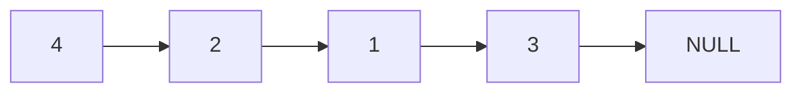
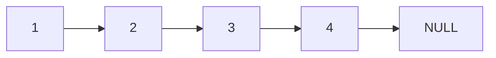

# Sort List

## Problem

Given the head of a singly linked list, sort the entire list in ascending order and return the new head. The catch is that you need to achieve O(n log n) time complexity and ideally O(1) space complexity (constant extra space, not counting the space used by the list itself). A linked list is a data structure where each node contains a value and a pointer to the next node, making it different from arrays where you can't randomly access elements by index. You'll need to rearrange the nodes by changing their next pointers rather than swapping values. This is challenging because common sorting algorithms like quicksort or heapsort aren't as naturally suited to linked lists as they are to arrays. The key is finding an algorithm that works well with sequential access and can be implemented without recursion's stack overhead. Consider how you might divide the problem into smaller subproblems, sort those subproblems, and then combine them back together.

**Diagram:**

Input list (unsorted):


Output list (sorted):



## Why This Matters

Sorting linked lists appears in embedded systems and memory-constrained environments where data is naturally stored in linked structures and you can't afford to copy everything into an array. Database systems use linked list sorting when processing records that don't fit in memory, implementing external merge sort where data is streamed from disk. File systems organize directory entries using linked structures that need periodic sorting. Music players and playlist managers maintain song queues as linked lists that need reordering by title, artist, or play count. The O(1) space constraint is especially important in real-time systems like medical devices or automotive software where you have strict memory limits. Learning this problem teaches you how to adapt classic divide-and-conquer algorithms to pointer-based structures, a skill that transfers to many systems programming challenges.

## Examples

**Example 1:**
- Input: `head = []`
- Output: `[]`

## Constraints

- The number of nodes in the list is in the range [0, 5 * 10⁴].
- -10⁵ <= Node.val <= 10⁵

## Think About

1. What's the brute force approach? What's its time complexity?
2. Can you identify any patterns in the examples?
3. What data structure would help organize the information?

## Approach Hints

<details>
<summary>💡 Hint 1: Which Sorting Algorithm?</summary>

To achieve O(n log n) time, consider merge sort or heap sort. For linked lists, merge sort is more natural because you can easily merge two sorted lists without extra space, and you can find the middle using the fast-slow pointer technique.

</details>

<details>
<summary>🎯 Hint 2: Divide and Conquer Strategy</summary>

Merge sort works in three steps:
1. Divide: Find the middle and split into two halves
2. Conquer: Recursively sort each half
3. Combine: Merge the two sorted halves

The key insight is that merging two sorted linked lists is straightforward and can be done in O(n) time with O(1) space.

</details>

<details>
<summary>📝 Hint 3: Bottom-Up vs Top-Down</summary>

**Top-Down (Recursive):** O(log n) space for call stack
- Find middle with fast/slow pointers
- Recursively sort left and right
- Merge sorted halves

**Bottom-Up (Iterative):** O(1) space - TRUE optimal!
- Start with sublists of size 1
- Merge pairs to size 2, then 4, 8, etc.
- No recursion needed

</details>

## Complexity Analysis

| Approach | Time | Space | Notes |
|----------|------|-------|-------|
| Insertion Sort | O(n²) | O(1) | Simple but too slow for large lists |
| Top-Down Merge Sort | O(n log n) | O(log n) | Recursion call stack |
| **Bottom-Up Merge Sort** | **O(n log n)** | **O(1)** | Iterative, truly optimal |
| Convert to Array | O(n log n) | O(n) | Extra space for array |

## Common Mistakes

### 1. Not Severing the Middle Link
```python
# WRONG: Left half still connected to right half
def sortList(head):
    if not head or not head.next:
        return head
    slow, fast = head, head
    while fast.next and fast.next.next:
        slow = slow.next
        fast = fast.next.next
    mid = slow.next
    # Missing: slow.next = None
    left = sortList(head)  # Infinite loop!
    right = sortList(mid)
```

```python
# CORRECT: Break the connection
def sortList(head):
    if not head or not head.next:
        return head
    slow, fast = head, head
    while fast.next and fast.next.next:
        slow = slow.next
        fast = fast.next.next
    mid = slow.next
    slow.next = None  # Critical!
    left = sortList(head)
    right = sortList(mid)
    return merge(left, right)
```

### 2. Incorrect Merge Logic
```python
# WRONG: Doesn't handle when one list is exhausted
def merge(l1, l2):
    dummy = ListNode(0)
    tail = dummy
    while l1 and l2:  # What about remaining nodes?
        if l1.val < l2.val:
            tail.next = l1
            l1 = l1.next
        else:
            tail.next = l2
            l2 = l2.next
        tail = tail.next
    # Missing: append remaining
    return dummy.next
```

```python
# CORRECT: Append remaining nodes
def merge(l1, l2):
    dummy = ListNode(0)
    tail = dummy
    while l1 and l2:
        if l1.val < l2.val:
            tail.next = l1
            l1 = l1.next
        else:
            tail.next = l2
            l2 = l2.next
        tail = tail.next
    tail.next = l1 if l1 else l2  # Append remaining!
    return dummy.next
```

### 3. O(log n) Space Instead of O(1)
```python
# WRONG: Uses recursion (O(log n) space)
def sortList(head):
    # ... top-down merge sort with recursion ...
```

```python
# CORRECT: Iterative bottom-up merge sort (O(1) space)
def sortList(head):
    # Calculate length
    # Iterate through sizes: 1, 2, 4, 8, ...
    # For each size, merge adjacent sublists
    # No recursion needed!
```

## Variations

| Variation | Change | Approach Adjustment |
|-----------|--------|---------------------|
| Descending order | Sort largest to smallest | Flip comparison in merge function |
| K-sorted lists | Merge K sorted lists | Use min-heap or divide-and-conquer |
| Custom comparator | Sort by custom criteria | Modify comparison logic in merge |
| Remove duplicates | Keep only unique values | Skip duplicates during merge |

## Practice Checklist

- [ ] Handles empty list
- [ ] Handles single node
- [ ] Handles already sorted list
- [ ] Handles reverse sorted list
- [ ] Can implement both top-down and bottom-up
- [ ] Can implement merge two lists from scratch
- [ ] Can code solution in 25 min
- [ ] Can discuss time/space complexity trade-offs

**Spaced Repetition:** Day 1 → 3 → 7 → 14 → 30

---

**Strategy**: See [Divide and Conquer Pattern](../../strategies/patterns/divide-and-conquer.md)
