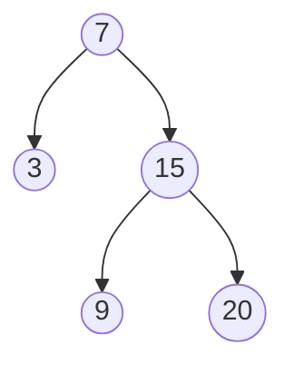

# Binary Search Tree Iterator

## Problem

Implement an iterator for a Binary Search Tree (BST) that returns node values in ascending sorted order, one at a time. A BST is a tree where each node's left children are smaller and right children are larger, creating an implicit ordering. Your iterator needs two methods: next() which returns the next smallest element, and hasNext() which checks if more elements remain. The key constraint is memory efficiency - you cannot simply traverse the entire tree upfront and store all values in a list. Instead, you need to traverse "lazily," processing nodes on-demand as next() is called. Think about how to pause and resume an in-order traversal (left subtree, current node, right subtree) using iteration instead of recursion. Edge cases include trees with only one node, highly unbalanced trees (all nodes in a chain), and calling next() exactly once for each node.

**Diagram:**



Example BST: `[7,3,15,null,null,9,20]`
In-order traversal: `[3,7,9,15,20]`


## Why This Matters

Iterator patterns are fundamental to modern programming - they power foreach loops, database cursors, and streaming APIs. Search engines use BST iterators to efficiently traverse indexed terms in alphabetical order when building search suggestions. Database systems employ this exact pattern for index scans, where you need to retrieve sorted records one page at a time without loading the entire index into memory. File system explorers use tree iterators to traverse directory structures in sorted order. The technique of using a stack to simulate recursion (converting recursive in-order traversal to iterative) is a critical skill that applies broadly to any tree or graph traversal problem. This problem teaches you how to maintain state across multiple function calls efficiently, a pattern you'll use when building stateful APIs, generators, and streaming processors.

## Constraints

- The number of nodes in the tree is in the range [1, 10⁵].
- 0 <= Node.val <= 10⁶
- At most 10⁵ calls will be made to hasNext, and next.

## Think About

1. What's the brute force approach? What's its time complexity?
2. Can you identify any patterns in the examples?
3. What data structure would help organize the information?

## Approach Hints

<details>
<summary>💡 Hint 1: Inorder Traversal Property</summary>

In a BST, inorder traversal (left → root → right) visits nodes in ascending order. The challenge is to traverse iteratively rather than recursively, yielding one element at a time. What data structure helps simulate recursive call stack?

</details>

<details>
<summary>🎯 Hint 2: Controlled Stack Traversal</summary>

Use a stack to store nodes. Initialize by pushing all left children from root to leftmost node. For next(), pop from stack, save the value, then push all left children of the popped node's right child. This simulates pausing and resuming inorder traversal.

</details>

<details>
<summary>📝 Hint 3: Implementation Pattern</summary>

```python
class BSTIterator:
    def __init__(self, root):
        self.stack = []
        self._push_left(root)

    def _push_left(self, node):
        while node:
            self.stack.append(node)
            node = node.left

    def next():
        node = self.stack.pop()
        if node.right:
            self._push_left(node.right)
        return node.val

    def hasNext():
        return len(self.stack) > 0
```

Time: O(1) amortized for next(), O(1) for hasNext()
Space: O(h) where h is tree height

</details>

## Complexity Analysis

| Approach | Time (next/hasNext) | Space | Notes |
|----------|---------------------|-------|-------|
| Pre-compute All | O(1) / O(1) | O(n) | Store full inorder traversal |
| **Controlled Stack** | **O(1) amortized / O(1)** | **O(h)** | h is height, amortized constant |
| Naive Recursion | N/A | N/A | Can't pause/resume easily |

Note: "Amortized O(1)" means each node is pushed and popped exactly once across all next() calls.

## Common Mistakes

### 1. Storing Entire Traversal

```python
# WRONG: Uses O(n) space unnecessarily
class BSTIterator:
    def __init__(self, root):
        self.nodes = []
        self.inorder(root)
        self.index = 0

    def inorder(self, node):
        if node:
            self.inorder(node.left)
            self.nodes.append(node.val)
            self.inorder(node.right)

# CORRECT: Use controlled stack for O(h) space
class BSTIterator:
    def __init__(self, root):
        self.stack = []
        self._push_left(root)
```

### 2. Not Handling Right Subtree

```python
# WRONG: Forgets to traverse right subtree
def next(self):
    node = self.stack.pop()
    return node.val  # Missing right child processing!

# CORRECT: Process right child's left spine
def next(self):
    node = self.stack.pop()
    if node.right:
        self._push_left(node.right)
    return node.val
```

### 3. Incorrect Initialization

```python
# WRONG: Only pushes root
def __init__(self, root):
    self.stack = [root]

# CORRECT: Push entire left spine
def __init__(self, root):
    self.stack = []
    self._push_left(root)
```

## Variations

| Variation | Change | Approach Adjustment |
|-----------|--------|---------------------|
| Reverse Iterator | Return in descending order | Push right children instead of left |
| Range Iterator | Only return values in [low, high] | Skip nodes outside range |
| Two Iterators | Find pair summing to target | Use two iterators (forward + backward) |
| K-th Element | Find k-th smallest element | Call next() k times |

## Practice Checklist

- [ ] Handles empty/edge cases (single node, skewed tree)
- [ ] Can explain approach in 2 min (controlled stack for inorder traversal)
- [ ] Can code solution in 20 min
- [ ] Can discuss time/space complexity (amortized O(1) time, O(h) space)
- [ ] Understands why it's amortized O(1) not worst-case O(1)

**Spaced Repetition:** Day 1 → 3 → 7 → 14 → 30

---

**Strategy**: See [Tree Pattern](../../strategies/data-structures/trees.md)
