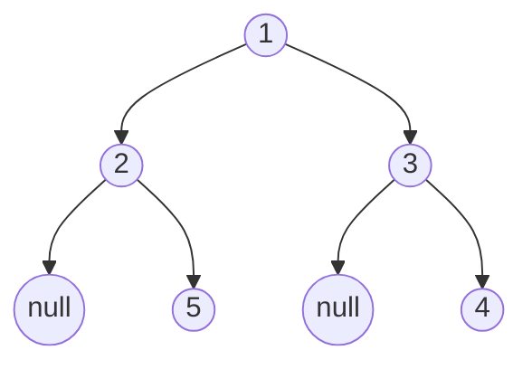

# Binary Tree Right Side View

## Problem

Imagine standing to the right of a binary tree and looking at it from that side - which node values would you see? Return these values in top-to-bottom order. More technically, for each level of the tree, you need to identify the rightmost node, because that's what would be visible from a right-side perspective. A crucial insight: the rightmost visible node at a level isn't necessarily a right child - if a left child extends deeper than its sibling right child, that left child becomes visible. For example, if the right subtree is shallow but the left subtree has nodes extending further down, those deep left nodes would be visible from the right. You can solve this using level-order traversal (processing each level completely) or depth-first traversal (visiting right children before left). Consider edge cases like an empty tree, a single node, trees that lean entirely to one side, and trees where left branches extend deeper than right branches.

**Diagram:**



Example tree: `[1,2,3,null,5,null,4]`
Right side view: `[1,3,4]` (rightmost node at each level)


## Why This Matters

This problem directly models rendering and visibility calculations in computer graphics and UI frameworks. 3D game engines use similar algorithms to determine which objects are visible from a camera's perspective, culling hidden geometry to improve performance. DOM rendering engines in web browsers employ level-by-level traversal to paint elements in the correct z-order, similar to how this problem processes tree levels. File system visualizers and organization charts use this pattern to display hierarchical structures with proper visual layering, showing only the visible nodes at each depth. The level-order traversal technique (BFS) you practice here is fundamental to networking (shortest path routing), social networks (friend suggestion by degree of separation), and AI pathfinding. The alternative depth-first approach teaches you how to maintain state across recursive calls, tracking which depth level you've already seen. This visibility pattern appears in countless applications where hierarchical data needs depth-aware rendering or processing.

## Examples

**Example 1:**
- Input: `root = [1,null,3]`
- Output: `[1,3]`

**Example 2:**
- Input: `root = []`
- Output: `[]`

## Constraints

- The number of nodes in the tree is in the range [0, 100].
- -100 <= Node.val <= 100

## Think About

1. What's the brute force approach? What's its time complexity?
2. Can you identify any patterns in the examples?
3. What data structure would help organize the information?

## Approach Hints

<details>
<summary>💡 Hint 1: Level Order Traversal</summary>

The right side view contains the rightmost node at each level. What traversal algorithm processes trees level by level? How can you identify the last node in each level?

</details>

<details>
<summary>🎯 Hint 2: BFS with Level Tracking</summary>

Use BFS (breadth-first search) with a queue. Process each level completely before moving to the next. The last node processed in each level is the rightmost node visible from the right side.

Alternative: Use DFS and track depth. Visit right children before left children, and record the first node seen at each depth.

</details>

<details>
<summary>📝 Hint 3: Implementation Approaches</summary>

Approach 1 (BFS):
```python
def rightSideView(root):
    if not root:
        return []

    result = []
    queue = [root]

    while queue:
        level_size = len(queue)
        for i in range(level_size):
            node = queue.pop(0)
            if i == level_size - 1:  # Last node in level
                result.append(node.val)
            if node.left:
                queue.append(node.left)
            if node.right:
                queue.append(node.right)

    return result
```

Approach 2 (DFS - Right First):
```python
def rightSideView(root):
    result = []

    def dfs(node, depth):
        if not node:
            return
        if depth == len(result):  # First time seeing this depth
            result.append(node.val)
        dfs(node.right, depth + 1)  # Right first!
        dfs(node.left, depth + 1)

    dfs(root, 0)
    return result
```

</details>

## Complexity Analysis

| Approach | Time | Space | Notes |
|----------|------|-------|-------|
| BFS (Queue) | O(n) | O(w) | w is max width of tree |
| DFS (Right-First) | O(n) | O(h) | h is height (recursion stack) |
| **Both are optimal** | **O(n)** | **O(n) worst** | Balanced tree: O(log n) space |

## Common Mistakes

### 1. Taking All Right Children

```python
# WRONG: Only follows right pointers (misses nodes)
def rightSideView(root):
    result = []
    while root:
        result.append(root.val)
        root = root.right  # Misses cases where left is visible!
    return result

# CORRECT: Consider all nodes at each level
# Use BFS or DFS with depth tracking
```

### 2. Wrong Level Tracking in BFS

```python
# WRONG: Doesn't track level boundaries
def rightSideView(root):
    queue = [root]
    result = []
    while queue:
        node = queue.pop(0)
        result.append(node.val)  # Adds all nodes!

# CORRECT: Track level size
while queue:
    level_size = len(queue)
    for i in range(level_size):
        # ... only add last node
```

### 3. DFS Left-First Instead of Right-First

```python
# WRONG: Visits left before right
def dfs(node, depth):
    if depth == len(result):
        result.append(node.val)
    dfs(node.left, depth + 1)   # Wrong order!
    dfs(node.right, depth + 1)

# CORRECT: Right before left
def dfs(node, depth):
    if depth == len(result):
        result.append(node.val)
    dfs(node.right, depth + 1)  # Right first
    dfs(node.left, depth + 1)
```

## Variations

| Variation | Change | Approach Adjustment |
|-----------|--------|---------------------|
| Left Side View | View from left side | Take first node at each level |
| Bottom View | View from bottom | Track horizontal distance, keep last at each column |
| Top View | View from top | Track horizontal distance, keep first at each column |
| Vertical Order | All nodes column by column | Use hash map with horizontal distance |

## Practice Checklist

- [ ] Handles empty/edge cases (null root, single node, skewed tree)
- [ ] Can explain approach in 2 min (BFS level-order or DFS right-first)
- [ ] Can code solution in 15 min
- [ ] Can discuss time/space complexity (O(n) time, O(w) or O(h) space)
- [ ] Can implement both BFS and DFS approaches

**Spaced Repetition:** Day 1 → 3 → 7 → 14 → 30

---

**Strategy**: See [Tree Pattern](../../strategies/data-structures/trees.md)
