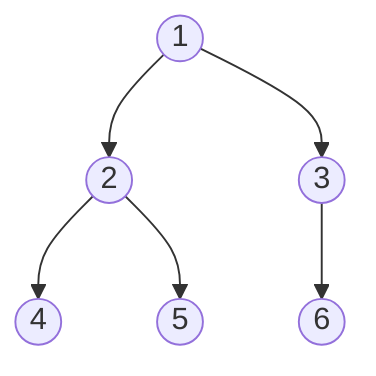

# Count Complete Tree Nodes

## Problem

You receive the `root` node of a **complete** binary tree, and your goal is to calculate how many nodes exist within this tree. A complete binary tree has a specific structure: all levels are fully populated except potentially the final level, where nodes are positioned as far to the left as possible, without gaps. For example, a complete tree of height 3 has levels 0-2 fully filled, and level 3 might have some nodes starting from the leftmost positions. The bottom level h may contain anywhere from 1 to 2^h nodes. The key challenge is that your solution must achieve better than O(n) time complexity, meaning you cannot simply traverse every node and count them. You need to exploit the structural properties of complete binary trees to count nodes more efficiently. Edge cases include perfect binary trees (all levels completely full), trees with only one node on the last level, empty trees, and trees with varying numbers of nodes on the incomplete level.

**Diagram:**



Complete binary tree with 6 nodes. All levels filled except last, which is filled left to right.


## Why This Matters

Complete binary trees are fundamental in implementing heaps, which power priority queues used in Dijkstra's shortest path algorithm, Huffman coding for compression, and operating system task scheduling. Database indexing structures like B-trees leverage complete tree properties to minimize height and guarantee logarithmic search times. Memory allocators use complete binary tree structures to track free blocks efficiently. Understanding how to count nodes efficiently in complete trees teaches you to recognize when structural invariants enable algorithmic shortcuts, turning O(n) problems into O(log²n) solutions. This pattern appears in binary search on trees, where combining height calculations with targeted recursive exploration yields dramatic performance improvements. The technique of checking subtree heights to determine if a subtree is perfect (and thus using the 2^h - 1 formula) versus recursively processing it demonstrates a powerful strategy: using mathematics to skip computation when structure allows. This problem exemplifies how domain knowledge about data structure properties enables algorithmic optimization, a principle applicable to segment trees, fenwick trees, and many other specialized data structures.

## Examples

**Example 1:**
- Input: `root = []`
- Output: `0`

**Example 2:**
- Input: `root = [1]`
- Output: `1`

## Constraints

- The number of nodes in the tree is in the range [0, 5 * 10⁴].
- 0 <= Node.val <= 5 * 10⁴
- The tree is guaranteed to be **complete**.

## Think About

1. What's the brute force approach? Why is it inefficient?
2. What property of the input can you exploit?
3. Would sorting or preprocessing help?
4. Can you reduce this to a problem you've seen before?

## Approach Hints

<details>
<summary>💡 Hint 1: Conceptual</summary>

A complete binary tree has a special property: all levels are filled except possibly the last one. If the left and right subtree heights are equal, one subtree is a perfect binary tree. How many nodes does a perfect binary tree of height h have? It's 2^h - 1.

</details>

<details>
<summary>🎯 Hint 2: Approach</summary>

Use binary search combined with height calculations. Find the height by going all the way left. Then, check if the leftmost and rightmost paths have the same height. If they do, it's a perfect tree and you can use the formula. Otherwise, recursively count left and right subtrees.

</details>

<details>
<summary>📝 Hint 3: Algorithm</summary>

```
function countNodes(root):
  if root is null: return 0

  leftHeight = getLeftHeight(root)
  rightHeight = getRightHeight(root)

  if leftHeight == rightHeight:
    return (1 << leftHeight) - 1  // 2^h - 1
  else:
    return 1 + countNodes(root.left) + countNodes(root.right)

function getLeftHeight(node):
  height = 0
  while node:
    height += 1
    node = node.left
  return height
```

</details>

## Complexity Analysis

| Approach | Time | Space | Notes |
|----------|------|-------|-------|
| Simple Traversal | O(n) | O(h) | Visit every node, doesn't meet requirement |
| Binary Search on Nodes | O(log²n) | O(log n) | Binary search which level, then binary search position |
| **Height-Based Recursion** | **O(log²n)** | **O(log n)** | Check heights, use formula for perfect subtrees |

## Common Mistakes

### Mistake 1: Simple O(n) traversal without using complete tree property
```python
# Wrong - doesn't leverage complete tree structure
def countNodes(root):
    if not root:
        return 0
    return 1 + countNodes(root.left) + countNodes(root.right)
# This is O(n), doesn't meet the better-than-O(n) requirement

# Correct - use height comparison
def countNodes(root):
    if not root:
        return 0
    left_height = get_left_height(root)
    right_height = get_right_height(root)
    if left_height == right_height:
        return (1 << left_height) - 1
    return 1 + countNodes(root.left) + countNodes(root.right)
```

### Mistake 2: Incorrect height calculation
```python
# Wrong - calculating full subtree height instead of path height
def get_height(node):
    if not node:
        return 0
    return 1 + max(get_height(node.left), get_height(node.right))

# Correct - follow single path (left or right)
def get_left_height(node):
    height = 0
    while node:
        height += 1
        node = node.left
    return height
```

### Mistake 3: Off-by-one errors in power calculation
```python
# Wrong - forgetting the -1 in the formula
return (1 << height)  # This gives 2^h, not node count

# Correct - perfect tree has 2^h - 1 nodes
return (1 << height) - 1
```

## Variations

| Variation | Difficulty | Key Difference |
|-----------|-----------|----------------|
| Count Nodes in Full Binary Tree | Easy | All nodes have 0 or 2 children |
| Find Kth Node in Complete Tree | Medium | Locate specific node by index |
| Insert into Complete Binary Tree | Medium | Maintain complete property while inserting |
| Validate Complete Binary Tree | Medium | Check if tree satisfies complete property |

## Practice Checklist

- [ ] Implement simple O(n) traversal first
- [ ] Implement height-based O(log²n) solution
- [ ] Test with perfect binary tree (all levels full)
- [ ] Test with incomplete last level
- [ ] Test with single node
- [ ] Test with empty tree
- [ ] Verify time complexity improvement over O(n)

**Spaced Repetition Schedule:**
- Day 1: Initial attempt, understand complete tree property
- Day 3: Implement without hints
- Day 7: Optimize and explain time complexity
- Day 14: Solve similar tree structure problems
- Day 30: Speed solve under 15 minutes

**Strategy**: See [Tree Pattern](../prerequisites/trees.md)
