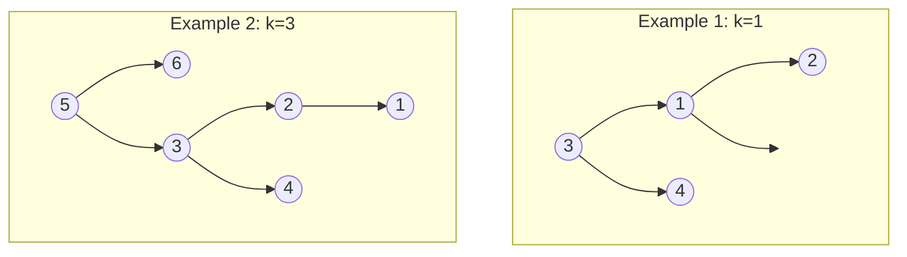

# Kth Smallest Element in a BST

## Problem

You are provided with a binary search tree (BST) represented by its `root` node, along with an integer `k`. Your task is to find and return the `kth` smallest value in the tree, using 1-based indexing (so `k=1` means the smallest element, `k=2` means the second smallest, and so on). Remember that a BST has a special property: for every node, all values in its left subtree are smaller, and all values in its right subtree are larger. This ordering property gives us a powerful tool. When you perform an inorder traversal (visit left subtree, then current node, then right subtree), you naturally visit nodes in sorted ascending order. The challenge is to leverage this property efficiently, especially when k is small compared to the total number of nodes. You want to avoid traversing the entire tree if possible, stopping as soon as you've found the kth element.


**Diagram:**



Inorder traversal gives sorted order: Example 1: [1,2,3,4], Example 2: [1,2,3,4,5,6]


## Why This Matters

This problem appears in database query optimization, where indexes are often implemented as BSTs or similar structures. When executing a query like "SELECT * FROM users ORDER BY age LIMIT 10", the database needs to efficiently retrieve the k smallest values without sorting the entire table. Operating system schedulers use similar techniques to track processes by priority, quickly finding the next process to run. In financial trading systems, order books maintain buy and sell orders in sorted structures, and algorithms need to rapidly find the best k prices. Understanding how to efficiently extract ranked elements from BSTs is fundamental to building high-performance systems that handle sorted data, which is one of the most common patterns in computer science.

## Constraints

- The number of nodes in the tree is n.
- 1 <= k <= n <= 10⁴
- 0 <= Node.val <= 10⁴

## Think About

1. What's the brute force approach? Why is it inefficient?
2. What property of the input can you exploit?
3. Would sorting or preprocessing help?
4. Can you reduce this to a problem you've seen before?

## Approach Hints

<details>
<summary>💡 Hint 1: Conceptual</summary>

In a Binary Search Tree (BST), there's a special property: an inorder traversal (left-root-right) visits nodes in ascending sorted order. How can you use this property to find the kth smallest element without sorting?

</details>

<details>
<summary>🎯 Hint 2: Approach</summary>

Perform an inorder traversal and count nodes as you visit them. When your counter reaches k, you've found the kth smallest element. You can implement this iteratively with a stack or recursively. For optimization, you can stop the traversal once you've found the kth element.

</details>

<details>
<summary>📝 Hint 3: Algorithm</summary>

```
# Iterative approach with stack
stack = []
current = root
count = 0

while current or stack:
  # Go to leftmost node
  while current:
    stack.append(current)
    current = current.left

  # Process node
  current = stack.pop()
  count += 1
  if count == k:
    return current.val

  # Move to right subtree
  current = current.right

return -1
```

</details>

## Complexity Analysis

| Approach | Time | Space | Notes |
|----------|------|-------|-------|
| Flatten to Array | O(n) | O(n) | Full inorder traversal, store all values |
| **Inorder with Early Stop** | **O(H + k)** | **O(H)** | H is height; stop after k nodes |
| Augmented BST | O(log n) | O(1) | Store subtree sizes, requires tree modification |

## Common Mistakes

### Mistake 1: Using a max heap instead of leveraging BST property
```python
# Wrong - treating as general tree, not using BST property
import heapq
heap = []
def traverse(node):
    if node:
        heapq.heappush(heap, node.val)
        traverse(node.left)
        traverse(node.right)
# This works but doesn't exploit BST ordering

# Correct - use inorder traversal of BST
def kthSmallest(root, k):
    result = []
    def inorder(node):
        if not node or len(result) >= k:
            return
        inorder(node.left)
        result.append(node.val)
        inorder(node.right)
    inorder(root)
    return result[k-1]
```

### Mistake 2: Not stopping traversal after finding kth element
```python
# Wrong - traverses entire tree even after finding answer
def inorder(node, result):
    if node:
        inorder(node.left, result)
        result.append(node.val)
        inorder(node.right, result)
inorder(root, result)
return result[k-1]  # Waste of time if k is small

# Correct - stop early
def inorder(node):
    if not node or len(result) >= k:
        return
    inorder(node.left)
    if len(result) < k:
        result.append(node.val)
    inorder(node.right)
```

### Mistake 3: Off-by-one error (0-indexed vs 1-indexed)
```python
# Wrong - k is 1-indexed but treating as 0-indexed
count = 0
if count == k - 1:  # Incorrect logic
    return current.val

# Correct - increment first, then check
count += 1
if count == k:
    return current.val
```

## Variations

| Variation | Difficulty | Key Difference |
|-----------|-----------|----------------|
| Kth Largest Element in BST | Medium | Reverse inorder (right-root-left) |
| Kth Smallest in Sorted Matrix | Medium | 2D structure, merge k sorted lists |
| Closest BST Value | Easy | Find value closest to target |
| Inorder Successor in BST | Medium | Find next larger element |

## Practice Checklist

- [ ] Implement recursive inorder traversal
- [ ] Implement iterative inorder with stack
- [ ] Add early stopping optimization
- [ ] Test with k=1 (smallest element)
- [ ] Test with k=n (largest element)
- [ ] Test with balanced tree
- [ ] Test with skewed tree (worst case height)

**Spaced Repetition Schedule:**
- Day 1: Initial attempt, understand inorder traversal
- Day 3: Implement both recursive and iterative
- Day 7: Solve kth largest variant
- Day 14: Implement augmented BST approach
- Day 30: Speed solve under 15 minutes

**Strategy**: See [Heap Pattern](../strategies/data-structures/heaps.md)
