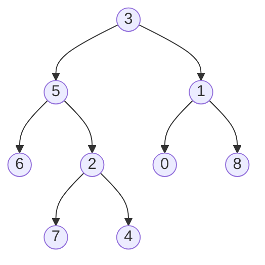

# Lowest Common Ancestor of a Binary Tree

## Problem

You're provided with a binary tree along with references to two distinct nodes `p` and `q` that exist somewhere in the tree. Your task is to find their lowest common ancestor (LCA), which is the deepest node in the tree that has both `p` and `q` as descendants. Think of it as finding the "meeting point" where the paths from the root to `p` and `q` diverge. Importantly, a node can be considered its own descendant, so if `p` is an ancestor of `q`, then `p` itself is the LCA. For example, imagine a family tree: the LCA of two cousins would be their shared grandparent. The challenge is to find this efficiently using the tree's structure rather than storing complete paths for both nodes. You need to think recursively: for any node, are both targets in its left subtree, both in its right subtree, or one in each? The answer to this question determines whether the current node is the LCA or whether you need to search deeper.


**Diagram:**



Example: For nodes p=5 and q=1, the LCA is 3.
For nodes p=5 and q=4, the LCA is 5.


## Why This Matters

Lowest common ancestor queries are fundamental to many hierarchical systems in software engineering. Version control systems like Git use LCA algorithms to find the merge base when combining branches, which determines how to reconcile conflicting changes. File systems use LCA concepts to find the shortest relative path between two directories. In organizational charts and permission systems, finding the LCA helps determine the lowest-level manager with authority over multiple employees. Bioinformatics tools use LCA on phylogenetic trees to trace evolutionary relationships between species. Network routing protocols find LCAs in topology graphs to optimize packet forwarding. Understanding this algorithm deepens your grasp of tree traversal patterns and recursive problem decomposition, which are essential skills for tackling complex hierarchical data structures in real-world systems.

## Examples

**Example 1:**
- Input: `root = [1,2], p = 1, q = 2`
- Output: `1`

## Constraints

- The number of nodes in the tree is in the range [2, 10⁵].
- -10⁹ <= Node.val <= 10⁹
- All Node.val are **unique**.
- p != q
- p and q will exist in the tree.

## Think About

1. What's the brute force approach? Why is it inefficient?
2. What property of the input can you exploit?
3. Would sorting or preprocessing help?
4. Can you reduce this to a problem you've seen before?

## Approach Hints

<details>
<summary>💡 Hint 1: Conceptual</summary>

Think recursively. For any node, there are three possibilities: (1) both p and q are in its left subtree, (2) both are in its right subtree, or (3) one is in the left and one is in the right. In which case is the current node the LCA?

</details>

<details>
<summary>🎯 Hint 2: Approach</summary>

Use post-order traversal (process children before parent). Recursively search for p and q in left and right subtrees. If a node finds p in one subtree and q in another, that node is the LCA. If both are found in the same subtree, continue searching deeper. Return p or q when found to propagate information upward.

</details>

<details>
<summary>📝 Hint 3: Algorithm</summary>

```
function lowestCommonAncestor(root, p, q):
  # Base case: reached null or found one of the targets
  if root is null or root == p or root == q:
    return root

  # Search in left and right subtrees
  left = lowestCommonAncestor(root.left, p, q)
  right = lowestCommonAncestor(root.right, p, q)

  # If both sides return non-null, current node is LCA
  if left and right:
    return root

  # Otherwise, return whichever side found something
  return left if left else right
```

</details>

## Complexity Analysis

| Approach | Time | Space | Notes |
|----------|------|-------|-------|
| Path Storage | O(n) | O(n) | Store paths to both nodes, find divergence |
| Parent Pointers | O(n) | O(n) | Store parent refs, trace p's ancestors, find q's match |
| **Recursive DFS** | **O(n)** | **O(h)** | Post-order traversal, h is tree height for call stack |

## Common Mistakes

### Mistake 1: Forgetting that a node can be its own ancestor
```python
# Wrong - doesn't handle case where one node is ancestor of other
def lowestCommonAncestor(root, p, q):
    if not root:
        return None
    # Missing: if root == p or root == q: return root

# Correct - handle node being its own ancestor
def lowestCommonAncestor(root, p, q):
    if not root or root == p or root == q:
        return root
    # Continue search...
```

### Mistake 2: Not properly propagating found nodes upward
```python
# Wrong - doesn't return found nodes
def lowestCommonAncestor(root, p, q):
    if not root:
        return None
    left = lowestCommonAncestor(root.left, p, q)
    right = lowestCommonAncestor(root.right, p, q)
    if left and right:
        return root
    # Missing return statement!

# Correct - propagate findings
def lowestCommonAncestor(root, p, q):
    if not root or root == p or root == q:
        return root
    left = lowestCommonAncestor(root.left, p, q)
    right = lowestCommonAncestor(root.right, p, q)
    if left and right:
        return root
    return left if left else right
```

### Mistake 3: Comparing node values instead of node references
```python
# Wrong - comparing values (may not be unique in general case)
if root.val == p.val or root.val == q.val:
    return root

# Correct - compare node references
if root == p or root == q:
    return root
```

## Variations

| Variation | Difficulty | Key Difference |
|-----------|-----------|----------------|
| LCA of BST | Easy | Can use BST property to guide search |
| LCA with Parent Pointer | Medium | Nodes have parent reference |
| LCA of Multiple Nodes | Hard | Find LCA of k nodes, not just 2 |
| LCA in DAG | Hard | Directed acyclic graph, multiple paths possible |

## Practice Checklist

- [ ] Implement recursive solution
- [ ] Test when LCA is root
- [ ] Test when one node is ancestor of the other
- [ ] Test when nodes are in different subtrees
- [ ] Understand why post-order traversal works
- [ ] Implement iterative solution with parent pointers
- [ ] Solve LCA of BST variant

**Spaced Repetition Schedule:**
- Day 1: Initial attempt, understand recursion
- Day 3: Implement without hints
- Day 7: Solve BST variant
- Day 14: Explain all three cases clearly
- Day 30: Speed solve under 15 minutes

**Strategy**: See [Tree Pattern](../strategies/data-structures/trees.md)
