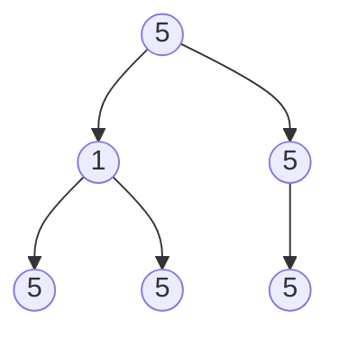

# Count Univalue Subtrees

## Problem

Given a binary tree, you need to count how many subtrees are "uni-value" subtrees. A uni-value subtree is one where every single node in that subtree has the same value. For example, a leaf node by itself is always a uni-value subtree since it contains only one value. A subtree with three nodes containing values [5, 5, 5] would also be uni-value since all values match. However, a subtree with [5, 1, 5] would not qualify, even though the parent and one child match. The challenge here is efficiently identifying these subtrees without redundant tree traversals. Think about how you might process the tree from the bottom up, validating each subtree before moving to its parent. Edge cases to consider include empty trees (which should return 0), trees with all identical values (where every subtree counts), and trees where only leaf nodes qualify.


**Diagram:**



Uni-value subtrees (nodes with same value in entire subtree):
- Leaf nodes: 5, 5, 5 (3 subtrees)
- Node with value 1 and its children 5,5: Not uni-value (different values)
- Right subtree with 5->5: 2 uni-value subtrees
Total: 4 uni-value subtrees


## Why This Matters

This problem appears in file system analysis tools that identify redundant directory structures, where folders containing only identical file types can be compressed or optimized. Database query optimizers use similar subtree pattern matching to identify repetitive query substructures that can be cached. In computer graphics, scene graph optimization employs this technique to batch-render objects with identical properties. The post-order traversal pattern you'll use here is fundamental for any bottom-up processing task, from syntax tree evaluation in compilers to dependency resolution in build systems. Understanding how to validate properties that depend on child nodes before processing parent nodes is crucial for many real-world hierarchical data problems.

## Examples

**Example 1:**
- Input: `root = []`
- Output: `0`

**Example 2:**
- Input: `root = [5,5,5,5,5,null,5]`
- Output: `6`

## Constraints

- The number of the node in the tree will be in the range [0, 1000].
- -1000 <= Node.val <= 1000

## Think About

1. What's the brute force approach? Why is it inefficient?
2. What property of the input can you exploit?
3. Would sorting or preprocessing help?
4. Can you reduce this to a problem you've seen before?

## Approach Hints

<details>
<summary>💡 Hint 1: Bottom-Up Validation</summary>

A subtree can only be univalue if both its left and right children are univalue subtrees with the same value as the root. Think about processing children before parents - which traversal order does this suggest?

</details>

<details>
<summary>🎯 Hint 2: Post-Order Traversal</summary>

Use post-order traversal (left, right, root) to check subtrees from leaves upward. For each node, first verify if left and right subtrees are univalue, then check if current node's value matches its children's values. Maintain a global counter.

</details>

<details>
<summary>📝 Hint 3: Algorithm Structure</summary>

Pseudocode approach:
```
count = 0

function isUnivalue(node):
    if node is None:
        return True

    left_uni = isUnivalue(node.left)
    right_uni = isUnivalue(node.right)

    # If either child is not univalue, current subtree can't be
    if not left_uni or not right_uni:
        return False

    # Check if children have same value as current node
    if node.left and node.left.val != node.val:
        return False
    if node.right and node.right.val != node.val:
        return False

    # Current subtree is univalue
    count += 1
    return True
```

</details>

## Complexity Analysis

| Approach | Time | Space | Notes |
|----------|------|-------|-------|
| Brute Force | O(n²) | O(h) | For each node, traverse entire subtree |
| **Optimal Post-Order** | **O(n)** | **O(h)** | Visit each node once, h = tree height for recursion stack |

Where n is the number of nodes and h is the height of the tree.

## Common Mistakes

**Mistake 1: Not checking children separately**
```python
# Wrong: Doesn't properly validate children
def count_univalue_subtrees(root):
    count = 0

    def is_univalue(node):
        if not node:
            return True

        # Missing validation of children before comparing
        if node.left and node.left.val != node.val:
            return False
        if node.right and node.right.val != node.val:
            return False

        count += 1
        return True
```

```python
# Correct: First ensure children are univalue subtrees
def count_univalue_subtrees(root):
    count = 0

    def is_univalue(node):
        nonlocal count
        if not node:
            return True

        left_uni = is_univalue(node.left)
        right_uni = is_univalue(node.right)

        if not left_uni or not right_uni:
            return False

        if node.left and node.left.val != node.val:
            return False
        if node.right and node.right.val != node.val:
            return False

        count += 1
        return True

    is_univalue(root)
    return count
```

**Mistake 2: Incrementing counter at wrong time**
```python
# Wrong: Counts before validating
def is_univalue(node):
    if not node:
        return True

    count += 1  # Too early!

    left_uni = is_univalue(node.left)
    right_uni = is_univalue(node.right)
    # ... validation
```

```python
# Correct: Count only after confirming univalue
def is_univalue(node):
    if not node:
        return True

    left_uni = is_univalue(node.left)
    right_uni = is_univalue(node.right)

    if not left_uni or not right_uni:
        return False
    # ... validate values

    count += 1  # Only after validation passes
    return True
```

**Mistake 3: Forgetting null node base case**
```python
# Wrong: Doesn't handle null nodes properly
def is_univalue(node):
    # Missing: if not node: return True

    left_uni = is_univalue(node.left)  # Crashes on null!
    right_uni = is_univalue(node.right)
```

```python
# Correct: Handle null nodes first
def is_univalue(node):
    if not node:
        return True  # Empty tree is trivially univalue

    left_uni = is_univalue(node.left)
    right_uni = is_univalue(node.right)
    # ... rest of logic
```

## Variations

| Variation | Description | Difficulty |
|-----------|-------------|------------|
| Longest Univalue Path | Find longest path with same values | Medium |
| Count Complete Subtrees | Count complete binary tree subtrees | Medium |
| Count BST Subtrees | Count valid BST subtrees | Medium |
| Sum of Univalue Subtrees | Sum all values in univalue subtrees | Medium |
| K-Univalue Subtrees | Subtrees where all values differ by at most k | Hard |

## Practice Checklist

- [ ] Initial attempt (Day 0)
- [ ] Reviewed post-order traversal approach (Day 0)
- [ ] Implemented with proper validation order (Day 0)
- [ ] First spaced repetition (Day 1)
- [ ] Second spaced repetition (Day 3)
- [ ] Third spaced repetition (Day 7)
- [ ] Fourth spaced repetition (Day 14)
- [ ] Can explain why post-order is needed (Day 14)
- [ ] Can code without references (Day 30)
- [ ] Interview-ready confidence (Day 30)

**Strategy**: See [Tree Pattern](../strategies/data-structures/trees.md)
