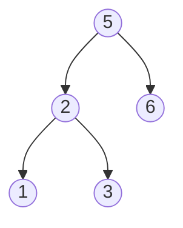

# Verify Preorder Sequence in Binary Search Tree

## Problem

You're given an array of unique integers that supposedly came from a preorder traversal of a binary search tree. Preorder traversal visits the root first, then the left subtree, then the right subtree. Your task is to verify whether this sequence could have actually come from a valid BST, without building the tree itself. Remember, a BST has the property that all values in the left subtree are less than the root, and all values in the right subtree are greater than the root. When you traverse in preorder and move from a left subtree to a right subtree, all subsequent values must be greater than a certain threshold. The key insight is tracking this lower bound as you scan through the array. You can use a stack to simulate the traversal and maintain the invariant that values respect BST ordering. Consider cases like a strictly increasing sequence (valid right-skewed BST), strictly decreasing sequence (valid left-skewed BST), and sequences that violate BST properties by having a value appear in the wrong position relative to its ancestors.


**Diagram:**



Valid preorder traversal: [5, 2, 1, 3, 6]
- Root is visited first (5)
- Then left subtree (2, 1, 3)
- Then right subtree (6)

Invalid example: [5, 2, 6, 1, 3] - violates BST property


## Why This Matters

This problem is crucial for data serialization and validation in distributed systems. When transmitting BST data across networks, you often send the preorder sequence because it's compact and can reconstruct the tree. Validation ensures data integrity before expensive reconstruction operations. Database systems use similar techniques to verify index structures after recovery from crashes or corruption. In compiler construction, validating parse tree structures follows similar patterns. The stack-based simulation technique you'll learn translates directly to parsing algorithms and expression evaluation. Understanding how to validate tree properties from linear sequences without full reconstruction is essential for efficient data validation in systems where building full data structures is too expensive. This appears frequently in technical interviews because it tests your understanding of both BSTs and creative use of monotonic stacks.

## Examples

**Example 1:**
- Input: `preorder = [5,2,6,1,3]`
- Output: `false`

## Constraints

- 1 <= preorder.length <= 10⁴
- 1 <= preorder[i] <= 10⁴
- All the elements of preorder are **unique**.

## Think About

1. What's the brute force approach? Why is it inefficient?
2. What property of the input can you exploit?
3. Would sorting or preprocessing help?
4. Can you reduce this to a problem you've seen before?

## Approach Hints

<details>
<summary>💡 Hint 1: BST Property and Bounds</summary>

In a BST preorder traversal, when you finish visiting a left subtree and move to a right subtree, all subsequent values must be greater than the root of that subtree. Can you track a lower bound that values must exceed?

</details>

<details>
<summary>🎯 Hint 2: Stack to Track Ancestors</summary>

Use a stack to simulate the tree traversal. When you encounter a value greater than the stack top, you're moving to a right subtree. Pop all smaller values from the stack and update a "lower bound" to be the last popped value. All future values must exceed this bound.

</details>

<details>
<summary>📝 Hint 3: Algorithm Design</summary>

Pseudocode approach:
```
stack = []
lower_bound = -infinity

for value in preorder:
    # If value violates lower bound, invalid BST
    if value < lower_bound:
        return False

    # Pop all values smaller than current (we're going right)
    while stack and stack[-1] < value:
        lower_bound = stack.pop()

    stack.append(value)

return True

# Alternative O(1) space: Use input array as stack
low = -infinity
i = -1  # Stack pointer

for value in preorder:
    if value < low:
        return False

    while i >= 0 and preorder[i] < value:
        low = preorder[i]
        i -= 1

    i += 1
    preorder[i] = value

return True
```

</details>

## Complexity Analysis

| Approach | Time | Space | Notes |
|----------|------|-------|-------|
| Recursive Build | O(n²) | O(n) | Build tree and verify at each step |
| Stack with Bounds | O(n) | O(n) | Each element pushed/popped once |
| **In-place Stack** | **O(n)** | **O(1)** | Use input array as stack, optimal |

Where n is the length of the preorder array.

## Common Mistakes

**Mistake 1: Not updating lower bound correctly**
```python
# Wrong: Doesn't track the lower bound properly
def verify_preorder(preorder):
    stack = []
    for val in preorder:
        while stack and stack[-1] < val:
            stack.pop()  # Should update lower_bound here!
        stack.append(val)
    return True
```

```python
# Correct: Update lower bound when moving to right subtree
def verify_preorder(preorder):
    stack = []
    lower_bound = float('-inf')

    for val in preorder:
        if val < lower_bound:
            return False

        while stack and stack[-1] < val:
            lower_bound = stack.pop()  # Update bound

        stack.append(val)

    return True
```

**Mistake 2: Checking bounds at wrong time**
```python
# Wrong: Checks after popping instead of before
def verify_preorder(preorder):
    stack = []
    lower_bound = float('-inf')

    for val in preorder:
        while stack and stack[-1] < val:
            lower_bound = stack.pop()

        if val < lower_bound:  # Too late!
            return False

        stack.append(val)

    return True
```

```python
# Correct: Check bound before processing
def verify_preorder(preorder):
    stack = []
    lower_bound = float('-inf')

    for val in preorder:
        if val < lower_bound:  # Check first
            return False

        while stack and stack[-1] < val:
            lower_bound = stack.pop()

        stack.append(val)

    return True
```

**Mistake 3: Wrong stack condition**
```python
# Wrong: Uses <= instead of <
while stack and stack[-1] <= val:
    lower_bound = stack.pop()
```

```python
# Correct: Only pop strictly smaller values
while stack and stack[-1] < val:
    lower_bound = stack.pop()
```

## Variations

| Variation | Description | Difficulty |
|-----------|-------------|------------|
| Verify Postorder BST | Verify postorder sequence is valid BST | Medium |
| Construct BST from Preorder | Build actual BST from preorder array | Medium |
| Verify Preorder with Duplicates | Allow duplicate values in BST | Hard |
| Serialize/Deserialize BST | Convert BST to/from preorder string | Medium |
| Find Kth Element in Preorder | Find kth element without building tree | Medium |

## Practice Checklist

- [ ] Initial attempt (Day 0)
- [ ] Reviewed stack-based approach (Day 0)
- [ ] Implemented with proper bound checking (Day 0)
- [ ] First spaced repetition (Day 1)
- [ ] Second spaced repetition (Day 3)
- [ ] Third spaced repetition (Day 7)
- [ ] Fourth spaced repetition (Day 14)
- [ ] Can explain why stack tracks ancestors (Day 14)
- [ ] Can code O(1) space version (Day 30)
- [ ] Interview-ready confidence (Day 30)

**Strategy**: See [Array Pattern](../prerequisites/trees.md)
