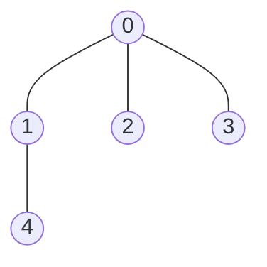
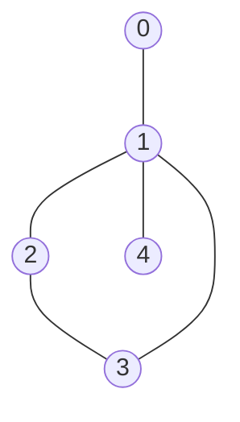

# Graph Valid Tree

## Problem

You're given a graph with `n` nodes labeled from 0 to n-1 and a list of undirected edges. Your task is to determine if this graph forms a valid tree. A valid tree has two critical properties: it must be connected (you can reach any node from any other node) and it must be acyclic (no cycles exist). Additionally, a tree with n nodes must have exactly n-1 edges. If there are fewer edges, the graph is disconnected; if there are more, cycles must exist. You can approach this problem in multiple ways: using depth-first search to detect cycles while tracking visited nodes, using breadth-first search with the same goal, or using Union-Find to detect whether connecting two nodes would create a cycle. Consider edge cases like a graph with no edges, a single node with no edges (which is a valid tree), and graphs that look tree-like but have isolated components.


**Diagram:**

Valid tree (n=5, edges=[[0,1],[0,2],[0,3],[1,4]]):


Invalid graph (n=5, edges=[[0,1],[1,2],[2,3],[1,3],[1,4]]):

This forms a cycle (1-2-3-1), so it's not a valid tree.


## Why This Matters

Tree validation is crucial in network topology verification, ensuring network configurations form valid spanning trees for routing protocols like STP (Spanning Tree Protocol) that prevent broadcast storms. Dependency resolution systems in package managers validate that dependency graphs form trees (or DAGs) to avoid circular dependencies. In distributed systems, verifying that node connections form valid tree topologies is essential for hierarchical data replication and efficient broadcast protocols. Version control systems use tree validation when merging branches to ensure the commit graph remains valid. The Union-Find data structure you'll learn here is fundamental to Kruskal's minimum spanning tree algorithm and network connectivity problems. Understanding cycle detection is critical for deadlock detection in operating systems and database transaction management.

## Constraints

- 1 <= n <= 2000
- 0 <= edges.length <= 5000
- edges[i].length == 2
- 0 <= ai, bi < n
- ai != bi
- There are no self-loops or repeated edges.

## Think About

1. What's the brute force approach? Why is it inefficient?
2. What property of the input can you exploit?
3. Would sorting or preprocessing help?
4. Can you reduce this to a problem you've seen before?

## Approach Hints

<details>
<summary>💡 Hint 1: Tree Properties</summary>

A valid tree with n nodes has exactly n-1 edges. It must be connected and acyclic. Can you verify these properties separately? First check if the edge count is correct, then verify connectivity and absence of cycles.

</details>

<details>
<summary>🎯 Hint 2: Detection Strategy</summary>

You can use graph traversal (DFS or BFS) to check connectivity and detect cycles. Start from any node and track visited nodes. If you visit n nodes and never encounter a visited node through a different path, you have a valid tree. Alternatively, Union-Find can efficiently detect cycles during edge insertion.

</details>

<details>
<summary>📝 Hint 3: Implementation Approach</summary>

**DFS Approach:**
1. Build adjacency list from edges
2. Start DFS from node 0, tracking parent to avoid false cycle detection
3. If you visit a node that's already visited (and it's not the parent), cycle exists
4. After DFS, check if all n nodes were visited

**Union-Find Approach:**
1. Check if edges.length == n - 1
2. Use union-find to process each edge
3. If union operation fails (nodes already connected), cycle exists
4. Check if all nodes are in one connected component

</details>

## Complexity Analysis

| Approach | Time | Space | Notes |
|----------|------|-------|-------|
| Brute Force (Generate all paths) | O(n!) | O(n) | Impractical for n > 10 |
| DFS/BFS | O(n + e) | O(n + e) | Build graph + traverse all nodes/edges |
| **Union-Find** | **O(n + e·α(n))** | **O(n)** | α(n) is inverse Ackermann (nearly constant) |

Note: For this problem, e is bounded by n-1 for valid trees, so all efficient approaches are O(n).

## Common Mistakes

### Mistake 1: Not checking edge count first
```python
# Wrong: Inefficient to traverse without basic validation
def validTree(n, edges):
    graph = build_graph(edges)
    return is_connected(graph) and not has_cycle(graph)

# Correct: Quick rejection of invalid inputs
def validTree(n, edges):
    if len(edges) != n - 1:
        return False
    graph = build_graph(edges)
    return is_connected_and_acyclic(graph, n)
```

### Mistake 2: False cycle detection (forgetting parent in DFS)
```python
# Wrong: Detecting parent as cycle
def dfs(node, visited, graph):
    visited.add(node)
    for neighbor in graph[node]:
        if neighbor in visited:
            return True  # False positive!
        if dfs(neighbor, visited, graph):
            return True
    return False

# Correct: Track parent to avoid false cycles
def dfs(node, parent, visited, graph):
    visited.add(node)
    for neighbor in graph[node]:
        if neighbor == parent:
            continue
        if neighbor in visited:
            return True  # Real cycle
        if dfs(neighbor, node, visited, graph):
            return True
    return False
```

### Mistake 3: Not verifying full connectivity
```python
# Wrong: Only checking for cycles
def validTree(n, edges):
    if len(edges) != n - 1:
        return False
    uf = UnionFind(n)
    for a, b in edges:
        if not uf.union(a, b):
            return False
    return True  # Missing connectivity check!

# Correct: Verify single component
def validTree(n, edges):
    if len(edges) != n - 1:
        return False
    uf = UnionFind(n)
    for a, b in edges:
        if not uf.union(a, b):
            return False
    return uf.count == 1  # All nodes in one component
```

## Variations

| Variation | Difficulty | Key Difference |
|-----------|------------|----------------|
| Count connected components in graph | Easy | Remove tree constraint |
| Detect cycle in undirected graph | Medium | Don't require connectivity |
| Minimum edges to make tree | Medium | Find how many edges to add/remove |
| Forest validation (multiple trees) | Medium | Allow multiple components |
| Directed graph valid tree | Hard | Handle directed edges, check for root |

## Practice Checklist

- [ ] **Day 0**: Solve using DFS with parent tracking (30 min)
- [ ] **Day 1**: Solve using BFS approach (25 min)
- [ ] **Day 3**: Implement Union-Find solution (30 min)
- [ ] **Day 7**: Code from memory, all three approaches (20 min)
- [ ] **Day 14**: Solve with variations (disconnected components) (15 min)
- [ ] **Day 30**: Speed run under time pressure (12 min)

**Strategy**: See [Graph Traversal Patterns](../strategies/patterns/graph-traversal.md)
