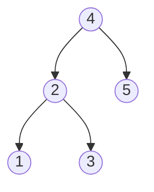

# Closest Binary Search Tree Value

## Problem

You're provided with the `root` node of a binary search tree (BST) along with a `target` number (which may be a decimal value). Your task is to find which value stored in the BST has the minimum absolute distance from the target. A BST is a tree where for every node, all values in the left subtree are smaller and all values in the right subtree are larger. For instance, if your BST contains [1, 2, 3, 4, 5] and the target is 3.714286, the closest value is 4 (distance 0.285714), not 3 (distance 0.714286). The key insight is that you don't need to check every node because the BST's sorted structure lets you eliminate half the tree at each step, just like binary search on a sorted array. When ties occur (two values equally close to the target), output the smaller value.


**Diagram:**



Example: For target = 3.714286, the closest value is 4.
For target = 3.5, the closest value is 3.


## Why This Matters

Finding the closest value in a BST is fundamental to database query optimization, where indexes are often stored as B-trees (a BST variant) and you need to quickly find records nearest to a search value. Autocomplete systems use this when suggesting the closest matching entry when no exact match exists. In geospatial applications, BSTs store sorted coordinates to find the nearest location to a GPS point. Machine learning nearest-neighbor classifiers often use tree-based spatial indexes for efficient lookups. This problem teaches you to exploit structural properties (the BST ordering) to achieve logarithmic performance instead of linear scanning, a crucial optimization technique that extends to skip lists, segment trees, and other hierarchical data structures.

## Examples

**Example 1:**
- Input: `root = [1], target = 4.428571`
- Output: `1`

## Constraints

- The number of nodes in the tree is in the range [1, 10⁴].
- 0 <= Node.val <= 10⁹
- -10⁹ <= target <= 10⁹

## Think About

1. What's the brute force approach? Why is it inefficient?
2. What property of the input can you exploit?
3. Would sorting or preprocessing help?
4. Can you reduce this to a problem you've seen before?

## Approach Hints

<details>
<summary>💡 Hint 1: BST Property</summary>

In a BST, for any node: all values in the left subtree are smaller, all values in the right subtree are larger. This means you can navigate toward the target like binary search. At each node, compare with target and decide which direction to explore.

</details>

<details>
<summary>🎯 Hint 2: Greedy Search Path</summary>

Start at root. At each node, update your closest value if the current node is closer to target. Then, if target < node.val, go left; otherwise go right. This eliminates half the tree at each step, giving you O(h) time where h is tree height.

</details>

<details>
<summary>📝 Hint 3: Implementation Details</summary>

**Iterative Approach:**
```
1. Initialize closest = root.val
2. current = root
3. While current is not null:
   - If |current.val - target| < |closest - target|:
       closest = current.val
   - Else if distances equal and current.val < closest:
       closest = current.val
   - If target < current.val:
       current = current.left
   - Else:
       current = current.right
4. Return closest
```

**Recursive Alternative:**
Track closest in each recursive call, update if current is closer.

</details>

## Complexity Analysis

| Approach | Time | Space | Notes |
|----------|------|-------|-------|
| Inorder Traversal | O(n) | O(h) | Visit all nodes, find minimum distance |
| DFS/BFS All Nodes | O(n) | O(n) | Unnecessary exploration |
| **Binary Search (Iterative)** | **O(h)** | **O(1)** | h = height, optimal for BST |
| **Binary Search (Recursive)** | **O(h)** | **O(h)** | Call stack space |

For balanced BST: h = O(log n). For skewed BST: h = O(n).

## Common Mistakes

### Mistake 1: Visiting all nodes unnecessarily
```python
# Wrong: O(n) when O(log n) is possible
def closestValue(root, target):
    def inorder(node):
        if not node:
            return []
        return inorder(node.left) + [node.val] + inorder(node.right)

    values = inorder(root)
    return min(values, key=lambda x: abs(x - target))

# Correct: Binary search exploitation
def closestValue(root, target):
    closest = root.val
    while root:
        if abs(root.val - target) < abs(closest - target):
            closest = root.val
        root = root.left if target < root.val else root.right
    return closest
```

### Mistake 2: Not handling ties correctly
```python
# Wrong: May not return smaller value on tie
def closestValue(root, target):
    closest = root.val
    while root:
        if abs(root.val - target) < abs(closest - target):
            closest = root.val
        root = root.left if target < root.val else root.right
    return closest

# Correct: Handle equal distances
def closestValue(root, target):
    closest = root.val
    while root:
        if abs(root.val - target) < abs(closest - target):
            closest = root.val
        elif abs(root.val - target) == abs(closest - target):
            closest = min(closest, root.val)  # Tie: pick smaller
        root = root.left if target < root.val else root.right
    return closest
```

### Mistake 3: Incorrect recursion logic
```python
# Wrong: Explores both subtrees even when unnecessary
def closestValue(root, target):
    if not root:
        return float('inf')
    left = closestValue(root.left, target)
    right = closestValue(root.right, target)
    candidates = [root.val, left, right]
    return min(candidates, key=lambda x: abs(x - target))

# Correct: Only explore promising subtree
def closestValue(root, target):
    def helper(node, closest):
        if not node:
            return closest
        if abs(node.val - target) < abs(closest - target):
            closest = node.val
        if target < node.val:
            return helper(node.left, closest)
        else:
            return helper(node.right, closest)
    return helper(root, root.val)
```

## Variations

| Variation | Difficulty | Key Difference |
|-----------|------------|----------------|
| Closest BST Value II (k closest values) | Hard | Use heap or two-stack approach |
| Closest value in sorted array | Easy | Pure binary search |
| Closest value in unsorted tree | Medium | Must visit all nodes |
| Range search in BST | Medium | Find all values in range [a, b] |
| Kth smallest element in BST | Medium | Inorder traversal position |

## Practice Checklist

- [ ] **Day 0**: Solve using iterative binary search (20 min)
- [ ] **Day 1**: Implement recursive version (18 min)
- [ ] **Day 3**: Code from memory, handle edge cases (15 min)
- [ ] **Day 7**: Solve Closest BST Value II (k values) (35 min)
- [ ] **Day 14**: Handle tie-breaking with custom comparator (20 min)
- [ ] **Day 30**: Speed run under time pressure (10 min)

**Strategy**: See [Binary Search Tree Pattern](../strategies/data-structures/trees.md)
