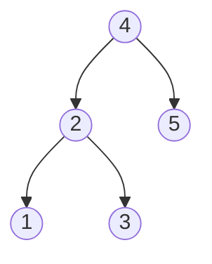

# Closest Binary Search Tree Value II

## Problem

You have a binary search tree with a root node, a target number (possibly a decimal), and a count `k`. Your task is to find and return the `k` node values from the tree that have the smallest absolute difference from the target number. For example, with the BST containing [1, 2, 3, 4, 5], target 3.714286, and k=2, the answer is [3, 4] because 4 is distance 0.286 away and 3 is distance 0.714 away (the two closest values). Unlike finding a single closest value, you now need to track multiple candidates efficiently. The naive approach of examining all n nodes and sorting by distance works but doesn't leverage the BST property. A smarter approach recognizes that inorder traversal of a BST yields sorted values, so the k closest values will be contiguous in that sorted sequence. The output sequence doesn't matter.

The problem guarantees that exactly one unique collection of `k` values will be nearest to the target.


**Diagram:**



Example: For target = 3.714286 and k = 2,
the closest values are [4, 3] (or [3, 4]).


## Why This Matters

Finding k nearest values is central to recommendation systems that suggest the k most relevant products based on a user's preference score. Search engines use k-nearest-neighbor algorithms with tree-based indexes to find the top k most relevant documents for a query. In financial trading systems, finding the k closest price points helps identify support and resistance levels. Medical diagnosis systems use k-nearest values to find similar patient cases in historical databases. This problem demonstrates the sliding window technique on sorted data and teaches you to maintain bounded-size heaps for tracking top-k elements, both patterns that appear frequently in streaming data analysis and real-time ranking systems.

## Examples

**Example 1:**
- Input: `root = [1], target = 0.000000, k = 1`
- Output: `[1]`

## Constraints

- The number of nodes in the tree is n.
- 1 <= k <= n <= 10⁴.
- 0 <= Node.val <= 10⁹
- -10⁹ <= target <= 10⁹

## Think About

1. What's the brute force approach? Why is it inefficient?
2. What property of the input can you exploit?
3. Would sorting or preprocessing help?
4. Can you reduce this to a problem you've seen before?

## Approach Hints

<details>
<summary>💡 Hint 1: Inorder Traversal + Sorted Property</summary>

Inorder traversal of a BST produces values in sorted order. Once you have a sorted array of all node values, finding the k closest to target becomes a sliding window or two-pointer problem on a sorted array. The k closest values will be contiguous in the sorted sequence.

</details>

<details>
<summary>🎯 Hint 2: Optimize with Heap</summary>

You don't need to collect all n values. Use a max-heap of size k to track the k closest values seen so far. As you traverse the tree (any order: inorder, preorder, level-order), maintain heap by distance. If heap has k elements and current is closer than heap max, pop heap max and push current.

</details>

<details>
<summary>📝 Hint 3: Optimal Two-Stack Approach</summary>

**Inorder + Sliding Window (Easiest to implement):**
```
1. Perform inorder traversal, collect all values in list
2. Find insertion point of target using binary search
3. Use two pointers (left, right) around target position
4. Expand window to collect k closest values
```

**Max-Heap Approach (Space efficient):**
```
1. Traverse tree (any order)
2. For each node:
   - Calculate distance = abs(node.val - target)
   - If heap.size < k: push (distance, node.val)
   - Else if distance < heap.max_distance:
       pop heap, push (distance, node.val)
3. Extract values from heap
```

**Two-Stack Optimal (Advanced):**
Use two stacks for predecessor and successor traversal around target.

</details>

## Complexity Analysis

| Approach | Time | Space | Notes |
|----------|------|-------|-------|
| Inorder + Sort | O(n log n) | O(n) | Unnecessary sorting |
| **Inorder + Two Pointers** | **O(n)** | **O(n)** | Simple, clean implementation |
| Max-Heap | O(n log k) | O(k) | Better space when k << n |
| Two-Stack (Optimal) | O(log n + k) | O(log n + k) | Complex but truly optimal |

For most interviews, inorder + two pointers is the sweet spot of clarity and efficiency.

## Common Mistakes

### Mistake 1: Using min-heap instead of max-heap
```python
# Wrong: Min-heap doesn't help maintain k closest
def closestKValues(root, target, k):
    heap = []
    def traverse(node):
        if not node: return
        heapq.heappush(heap, (abs(node.val - target), node.val))
        traverse(node.left)
        traverse(node.right)
    traverse(root)
    return [val for _, val in heapq.nsmallest(k, heap)]

# Correct: Max-heap of size k
def closestKValues(root, target, k):
    heap = []
    def traverse(node):
        if not node: return
        dist = abs(node.val - target)
        if len(heap) < k:
            heapq.heappush(heap, (-dist, node.val))
        elif dist < -heap[0][0]:
            heapq.heapreplace(heap, (-dist, node.val))
        traverse(node.left)
        traverse(node.right)
    traverse(root)
    return [val for _, val in heap]
```

### Mistake 2: Not exploiting BST sorted property
```python
# Suboptimal: Doesn't use inorder = sorted
def closestKValues(root, target, k):
    all_nodes = []
    def traverse(node):
        if not node: return
        all_nodes.append(node.val)
        traverse(node.left)
        traverse(node.right)
    traverse(root)
    all_nodes.sort()  # Unnecessary sort!
    # Find k closest...

# Better: Inorder already gives sorted order
def closestKValues(root, target, k):
    def inorder(node):
        if not node: return []
        return inorder(node.left) + [node.val] + inorder(node.right)

    sorted_vals = inorder(root)
    # Use two pointers to find k closest
```

### Mistake 3: Inefficient window expansion
```python
# Wrong: Linear search for closest k
def closestKValues(root, target, k):
    values = inorder(root)
    return sorted(values, key=lambda x: abs(x - target))[:k]

# Correct: Binary search + two-pointer expansion
def closestKValues(root, target, k):
    def inorder(node):
        return inorder(node.left) + [node.val] + inorder(node.right) if node else []

    values = inorder(root)
    # Binary search for closest to target
    left = bisect.bisect_left(values, target)
    right = left
    result = []

    for _ in range(k):
        if left < 0:
            result.append(values[right]); right += 1
        elif right >= len(values):
            result.append(values[left]); left -= 1
        elif abs(values[left] - target) <= abs(values[right] - target):
            result.append(values[left]); left -= 1
        else:
            result.append(values[right]); right += 1

    return result
```

## Variations

| Variation | Difficulty | Key Difference |
|-----------|------------|----------------|
| Closest BST Value (k=1) | Easy | Single value, simpler logic |
| Kth smallest element in BST | Medium | Don't need distance, just position |
| Find k closest elements in sorted array | Medium | No tree structure |
| Range sum BST | Easy | Find sum in range, not closest |
| Closest leaf node to target | Medium | Different tree metric |

## Practice Checklist

- [ ] **Day 0**: Solve using inorder + two pointers (30 min)
- [ ] **Day 1**: Implement max-heap approach (28 min)
- [ ] **Day 3**: Code from memory, both approaches (25 min)
- [ ] **Day 7**: Implement two-stack optimal solution (40 min)
- [ ] **Day 14**: Handle edge cases (k=n, target outside range) (20 min)
- [ ] **Day 30**: Speed run under time pressure (18 min)

**Strategy**: See [Binary Search Tree Pattern](../strategies/data-structures/trees.md)
