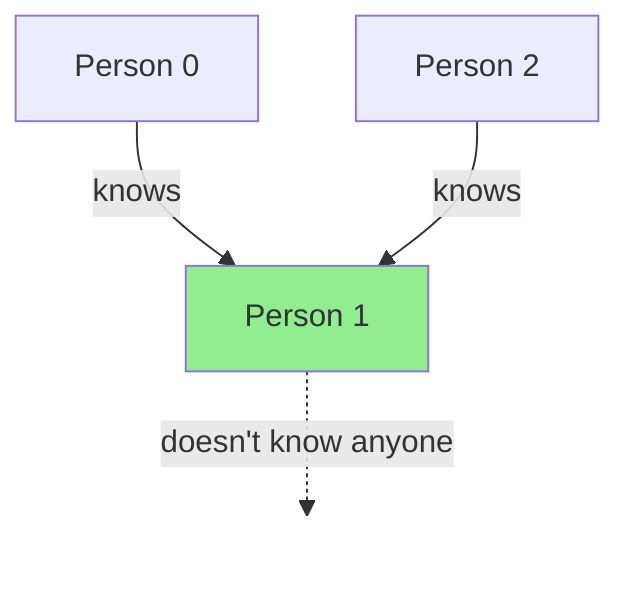
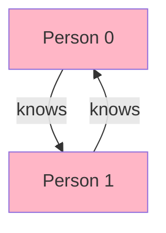

# Find the Celebrity

## Problem

At a gathering, there are `n` individuals numbered from `0` through `n - 1`. Among this group, at most one person may be a celebrity. A celebrity is characterized by two properties: every other person in the group knows them, while they themselves know nobody else. For example, if person 1 is known by everyone (0, 2, 3, etc.) but person 1 knows none of them, then person 1 is the celebrity. Your task is to identify this special person if they exist, or confirm their absence (return -1). The only way to gather information is by calling a provided API function `bool knows(a, b)` that tells you whether person `a` knows person `b`. The challenge is to minimize the number of API calls. Each call to knows(a, b) reveals useful information: if it returns true, then `a` cannot be the celebrity (celebrities know nobody); if it returns false, then `b` cannot be the celebrity (everyone knows the celebrity). This elimination strategy lets you identify one candidate, which you must then verify.

Your solution should use the minimum number of queries asymptotically.

Your function should return *the identifier of the celebrity if one exists*. Otherwise, return `-1`.


**Diagram:**

Example 1: Person 1 is the celebrity


Example 2: No celebrity


In Example 1: Person 1 is known by everyone (0 and 2) but knows no one.
In Example 2: Person 0 and 1 know each other, so neither can be a celebrity.


## Why This Matters

Finding influential nodes with specific connectivity patterns appears in social network analysis when identifying accounts that are widely followed but follow nobody back (verified celebrity accounts). PageRank and similar algorithms identify authoritative web pages that are linked to by many but link to few others. In distributed systems, leader election algorithms find nodes that all other nodes can communicate with but which don't initiate communication themselves. Security systems detect potential honeypots or monitoring nodes that observe all traffic but generate none. This problem teaches you API call optimization and information-maximizing query strategies, critical when dealing with rate-limited external services, expensive database queries, or network calls where each operation has significant cost. The elimination technique you develop here extends to any search problem where each query reduces the solution space.

## Constraints

- n == graph.length == graph[i].length
- 2 <= n <= 100
- graph[i][j] is 0 or 1.
- graph[i][i] == 1

## Think About

1. What's the brute force approach? Why is it inefficient?
2. What property of the input can you exploit?
3. Would sorting or preprocessing help?
4. Can you reduce this to a problem you've seen before?

## Approach Hints

<details>
<summary>💡 Hint 1: Elimination Strategy</summary>

Each knows(a, b) call eliminates at least one person from being the celebrity. If knows(a, b) is true, person a cannot be the celebrity (celebrities know nobody). If knows(a, b) is false, person b cannot be the celebrity (everyone knows the celebrity). Use this to narrow down candidates.

</details>

<details>
<summary>🎯 Hint 2: Two-Pass Algorithm</summary>

Pass 1: Find a candidate by elimination. Compare pairs of people - each comparison eliminates one person. After n-1 comparisons, you'll have one candidate remaining.

Pass 2: Verify the candidate. Check that: (1) the candidate knows nobody, and (2) everyone else knows the candidate. This requires 2(n-1) additional calls.

Total calls: (n-1) + 2(n-1) = 3n-3 = O(n).

</details>

<details>
<summary>📝 Hint 3: Implementation Details</summary>

**Two-Pointer Elimination:**
```
1. Initialize candidate = 0
2. For i from 1 to n-1:
   - If knows(candidate, i):
       candidate = i  // Current candidate eliminated
   // Else: i is eliminated, candidate stays
3. Verify candidate:
   - For each person j (j != candidate):
       - If knows(candidate, j) OR !knows(j, candidate):
           return -1
4. Return candidate
```

**Alternative Stack Approach:**
```
1. Push all people 0 to n-1 onto stack
2. While stack has > 1 person:
   - Pop two people a and b
   - If knows(a, b): push b (a eliminated)
   - Else: push a (b eliminated)
3. Candidate = stack.pop()
4. Verify candidate (same as above)
```

Both achieve O(n) calls and O(1) extra space.

</details>

## Complexity Analysis

| Approach | Time | Space | Notes |
|----------|------|-------|-------|
| Brute Force (Check everyone) | O(n²) | O(1) | n² knows() calls, too many |
| **Two-Pass Elimination** | **O(n)** | **O(1)** | 3n knows() calls, optimal |
| Stack Elimination | O(n) | O(n) | Same calls, but uses stack space |
| Graph Construction | O(n²) | O(n²) | Build full adjacency matrix, wasteful |

The two-pass elimination with O(1) space is optimal.

## Common Mistakes

### Mistake 1: Not verifying the candidate
```python
# Wrong: Candidate might not actually be celebrity
def findCelebrity(n):
    candidate = 0
    for i in range(1, n):
        if knows(candidate, i):
            candidate = i
    return candidate  # Wrong! Must verify

# Correct: Always verify
def findCelebrity(n):
    candidate = 0
    for i in range(1, n):
        if knows(candidate, i):
            candidate = i

    # Verify candidate
    for i in range(n):
        if i == candidate:
            continue
        if knows(candidate, i) or not knows(i, candidate):
            return -1
    return candidate
```

### Mistake 2: Too many knows() calls
```python
# Wrong: O(n²) calls checking everyone against everyone
def findCelebrity(n):
    for candidate in range(n):
        is_celebrity = True
        for other in range(n):
            if candidate == other:
                continue
            if knows(candidate, other) or not knows(other, candidate):
                is_celebrity = False
                break
        if is_celebrity:
            return candidate
    return -1

# Correct: O(n) calls with elimination
def findCelebrity(n):
    candidate = 0
    for i in range(1, n):
        if knows(candidate, i):
            candidate = i

    for i in range(n):
        if i == candidate:
            continue
        if knows(candidate, i) or not knows(i, candidate):
            return -1
    return candidate
```

### Mistake 3: Incomplete verification
```python
# Wrong: Only checking one direction
def findCelebrity(n):
    candidate = 0
    for i in range(1, n):
        if knows(candidate, i):
            candidate = i

    # Wrong: Only checking if others know candidate
    for i in range(n):
        if i != candidate and not knows(i, candidate):
            return -1
    return candidate  # Forgot to check if candidate knows anyone!

# Correct: Check both conditions
def findCelebrity(n):
    candidate = 0
    for i in range(1, n):
        if knows(candidate, i):
            candidate = i

    for i in range(n):
        if i == candidate:
            continue
        if knows(candidate, i) or not knows(i, candidate):
            return -1
    return candidate
```

## Variations

| Variation | Difficulty | Key Difference |
|-----------|------------|----------------|
| Find all mutual friends | Medium | Find pairs who know each other |
| Celebrity with minimum API calls | Hard | Minimize exact call count, not just O(n) |
| Multiple celebrities possible | Medium | Find all or count them |
| Weighted relationships | Hard | knows() returns confidence level |
| Celebrity in directed graph | Medium | Same problem, graph theory framing |

## Practice Checklist

- [ ] **Day 0**: Solve using two-pass elimination (25 min)
- [ ] **Day 1**: Implement stack-based approach (22 min)
- [ ] **Day 3**: Code from memory, count exact API calls (20 min)
- [ ] **Day 7**: Prove why O(n) is the lower bound (30 min)
- [ ] **Day 14**: Handle variation with multiple potential celebrities (28 min)
- [ ] **Day 30**: Speed run under time pressure (15 min)

**Strategy**: See [Greedy Algorithms](../strategies/patterns/greedy.md)
