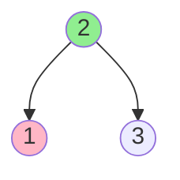
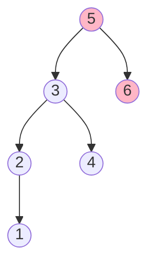

# Inorder Successor in BST

## Problem

You are provided with a binary search tree's root node along with a reference to a specific node `p` within that tree. Your objective is to identify and return the node that would come immediately after `p` when performing an inorder traversal of the tree. Inorder traversal visits nodes in sorted order: left subtree, then current node, then right subtree. For example, in a BST containing [1,2,3,4,5], the inorder sequence is 1→2→3→4→5, so the successor of 2 is 3. The inorder successor is defined as the tree node containing the minimum value that exceeds `p.val`. There are two cases to consider: if `p` has a right child, the successor is the leftmost node in that right subtree (the minimum value greater than `p`); if `p` has no right child, the successor is an ancestor where you last turned left during the search path. Should no such following node exist (when `p` is the largest value), return `null`.


**Diagram:**

Example 1: Find inorder successor of node 1

Input: root = [2,1,3], p = 1
Output: 2 (inorder: 1 → 2 → 3, successor of 1 is 2)

Example 2: Find inorder successor of node 6

Input: root = [5,3,6,2,4,null,null,1], p = 6
Output: null (6 is the largest value, no successor)


## Why This Matters

Database indexes use BST-like structures (B-trees, B+ trees) where finding the next record in sorted order is a fundamental operation for range queries and cursor navigation. File systems use tree structures to maintain sorted directory listings, requiring efficient next-item lookup. Autocomplete systems traverse sorted suggestion trees to find the next suggestion after the current selection. Undo/redo stacks in editors sometimes use tree-based history where finding the next state requires successor traversal. This problem teaches you to navigate trees using their structural properties rather than full traversal, achieving O(log n) instead of O(n) performance. The two-case analysis (successor in subtree vs ancestor) is a pattern that appears in many tree navigation problems and demonstrates how to combine local structure (right child) with global search (path from root).

## Constraints

- The number of nodes in the tree is in the range [1, 10⁴].
- -10⁵ <= Node.val <= 10⁵
- All Nodes will have unique values.

## Think About

1. What's the brute force approach? Why is it inefficient?
2. What property of the input can you exploit?
3. Would sorting or preprocessing help?
4. Can you reduce this to a problem you've seen before?

## Approach Hints

<details>
<summary>💡 Hint 1: Conceptual</summary>

In an inorder traversal of a BST, nodes appear in sorted order. The successor of node p is simply the next larger value. Think about two cases: (1) if p has a right subtree, where would the successor be? (2) if p has no right subtree, the successor must be an ancestor.

</details>

<details>
<summary>🎯 Hint 2: Approach</summary>

Use the BST property to avoid full traversal. If p has a right child, the successor is the leftmost node in the right subtree (minimum in right subtree). Otherwise, traverse from root: when you go left, that node is a potential successor; when you go right, it cannot be the successor.

</details>

<details>
<summary>📝 Hint 3: Algorithm</summary>

**Approach 1: Using BST Property (O(h) time)**
```
1. If p.right exists:
   - Find leftmost node in p.right subtree
   - Return that node

2. Otherwise (no right child):
   - Start from root, track successor candidate
   - While current != p:
     - If p.val < current.val:
       - successor = current (potential answer)
       - Move to current.left
     - Else:
       - Move to current.right
   - Return successor
```

**Approach 2: Inorder Traversal (O(n) time)**
```
1. Perform inorder traversal
2. Track previous node
3. When previous == p, current is successor
4. Return successor
```

</details>

## Complexity Analysis

| Approach | Time | Space | Notes |
|----------|------|-------|-------|
| Inorder Traversal | O(n) | O(h) | Visit all nodes, simple but inefficient |
| **BST Property Search** | **O(h)** | **O(1)** | Optimal, uses BST structure |
| With Parent Pointer | O(h) | O(1) | If nodes have parent links |
| Morris Traversal | O(n) | O(1) | Constant space but modifies tree temporarily |

## Common Mistakes

### Mistake 1: Always doing full inorder traversal

**Wrong:**
```python
def inorderSuccessor(root, p):
    # Always traverses entire tree - O(n)
    result = [None]
    prev = [None]

    def inorder(node):
        if not node:
            return
        inorder(node.left)
        if prev[0] == p:
            result[0] = node
        prev[0] = node
        inorder(node.right)

    inorder(root)
    return result[0]  # Works but inefficient
```

**Correct:**
```python
def inorderSuccessor(root, p):
    # O(h) using BST property
    successor = None

    # Case 1: p has right subtree
    if p.right:
        successor = p.right
        while successor.left:
            successor = successor.left
        return successor

    # Case 2: find ancestor where we last went left
    current = root
    while current:
        if p.val < current.val:
            successor = current
            current = current.left
        elif p.val > current.val:
            current = current.right
        else:
            break

    return successor
```

### Mistake 2: Not handling the case when p has no right child correctly

**Wrong:**
```python
def inorderSuccessor(root, p):
    if p.right:
        # Correct: find leftmost in right subtree
        node = p.right
        while node.left:
            node = node.left
        return node
    else:
        # Wrong: assumes parent pointer exists
        return p.parent  # p might not have parent pointer!
```

**Correct:**
```python
def inorderSuccessor(root, p):
    successor = None

    if p.right:
        node = p.right
        while node.left:
            node = node.left
        return node

    # Search from root to find ancestor
    current = root
    while current != p:
        if p.val < current.val:
            successor = current  # Save potential successor
            current = current.left
        else:
            current = current.right

    return successor
```

### Mistake 3: Confusing successor with next larger value search

**Wrong:**
```python
def inorderSuccessor(root, p):
    # This finds any node > p.val, not necessarily successor
    def findNext(node, target):
        if not node:
            return None
        if node.val > target:
            return node  # Wrong: might not be the immediate next
        return findNext(node.right, target)

    return findNext(root, p.val)
```

**Correct:**
```python
def inorderSuccessor(root, p):
    successor = None

    # Find the smallest value > p.val
    current = root
    while current:
        if current.val > p.val:
            successor = current  # Track smallest so far
            current = current.left  # Look for smaller
        else:
            current = current.right  # Need larger values

    return successor
```

## Variations

| Variation | Description | Difficulty |
|-----------|-------------|------------|
| Inorder Predecessor | Find the node that comes before p in inorder traversal | Medium |
| With Parent Pointer | Solve when each node has a parent pointer | Easy |
| kth Successor | Find the node k positions after p in inorder | Medium |
| Successor in Binary Tree | Same problem but in regular binary tree (not BST) | Medium |
| Range Successor | Find successor within a value range [low, high] | Medium |

## Practice Checklist

- [ ] Solve using BST property (O(h) time)
- [ ] Solve using inorder traversal (O(n) time)
- [ ] Handle edge case: p is the largest node
- [ ] Solve variation: inorder predecessor
- [ ] **Day 3**: Re-solve without looking at solution
- [ ] **Week 1**: Solve with parent pointer variation
- [ ] **Week 2**: Explain BST property approach to someone else
- [ ] **Month 1**: Solve successor in regular binary tree

**Strategy**: See [Tree Pattern](../prerequisites/trees.md)
