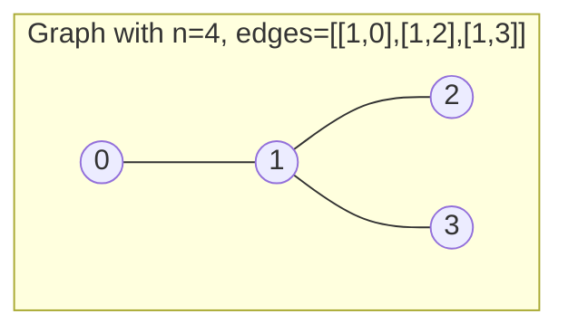
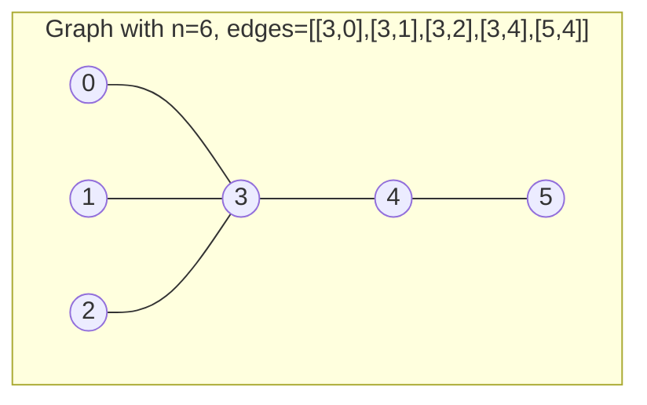

# Minimum Height Trees

## Problem

You're given an undirected tree graph - a connected graph with no cycles where every pair of nodes has exactly one path between them. The tree has `n` nodes labeled from `0` to `n - 1`, and you're given an array `edges` containing `n - 1` connections, where `edges[i] = [ai, bi]` means there's an edge between nodes `ai` and `bi`. Since the graph is undirected, you can traverse edges in either direction, and because it's a tree with n nodes, you'll always have exactly n-1 edges.

Here's the interesting part: in an undirected tree, you can choose any node as the root, and that choice affects the tree's height. The **height** of a rooted tree is the number of edges in the longest path from the root down to any leaf node. For example, if you root a tree at a node on the edge, the height might be 3, but if you root it at a central node, the height might only be 1. Your task is to find all nodes that, when chosen as the root, produce a **minimum height tree** (MHT) - a tree with the smallest possible height among all possible root choices.

For a concrete example, consider a tree with 4 nodes and edges [[1,0], [1,2], [1,3]]. This forms a star shape with node 1 at the center. If you root at node 0, the height is 2 (farthest leaf is 2 edges away through node 1). But if you root at node 1, the height is only 1 (all other nodes are direct children). So node 1 is the only MHT root, and you'd return [1]. Interestingly, a tree can have at most 2 MHT roots - this is a mathematical property related to the tree's center. Edge cases include a single node (height 0, return [0]), two nodes (both are MHT roots with height 0), and long chain-like trees where the middle one or two nodes are optimal.


**Diagram:**



```
Different roots produce different heights:

Root at 0:        Root at 1:        Root at 2:
    0                 1                 2
    │              ╱  │  ╲              │
    1             0   2   3             1
  ╱ │ ╲                               ╱ │ ╲
 2  3  ...                           0  3  ...
Height: 2         Height: 1         Height: 2

Answer: [1] (only node 1 produces minimum height tree)
```



```
Root at 3 or 4 both give minimum height of 2
Answer: [3, 4]
```


## Why This Matters

This problem teaches tree center finding and topological peeling algorithms that appear in network design, phylogenetic analysis, and distributed systems optimization. Network topology design places routers or servers at optimal central locations to minimize maximum communication latency - finding the network center minimizes the worst-case distance to any node. Evolutionary biology uses similar centroid-finding algorithms in phylogenetic tree reconstruction to identify ancestral species that minimize total evolutionary distance. Organizational hierarchy optimization places management nodes to minimize reporting chain length across all employees. Distributed database systems choose replication coordinator nodes that minimize maximum replication lag across all replicas. Content delivery networks select edge cache locations that minimize maximum distance to users. The algorithmic insight is topological peeling: you iteratively remove leaf nodes (degree 1) layer by layer, similar to peeling an onion, until only the central one or two nodes remain - these are the tree's center points. This works because the center minimizes the maximum distance to the periphery, and repeatedly removing leaves preserves this center while reducing the problem size, achieving O(n) time by processing each node and edge exactly once.

## Constraints

- 1 <= n <= 2 * 10⁴
- edges.length == n - 1
- 0 <= ai, bi < n
- ai != bi
- All the pairs (ai, bi) are distinct.
- The given input is **guaranteed** to be a tree and there will be **no repeated** edges.

## Think About

1. What's the brute force approach? Why is it inefficient?
2. What property of the input can you exploit?
3. Would sorting or preprocessing help?
4. Can you reduce this to a problem you've seen before?

## Approach Hints

<details>
<summary>💡 Hint 1: Center of the Tree</summary>

The minimum height tree(s) are rooted at the "center" of the tree. In graph theory, the center consists of nodes that minimize the maximum distance to all other nodes. Think about how to find such central nodes by progressively eliminating peripheral nodes (leaves).
</details>

<details>
<summary>🎯 Hint 2: Topological Peeling</summary>

Start from the outermost layer (leaf nodes with degree 1) and peel them off layer by layer, similar to topological sorting. The last remaining nodes after removing all leaves iteratively are the centers of the tree. There can be at most 2 such central nodes.
</details>

<details>
<summary>📝 Hint 3: Implementation Steps</summary>

Algorithm:
1. Build adjacency list and track degree of each node
2. Initialize a queue with all leaf nodes (degree == 1)
3. While more than 2 nodes remain:
   - Remove current layer of leaves
   - For each removed leaf, decrease neighbor's degree
   - Add new leaves (nodes with degree == 1) to next layer
4. Remaining nodes are the MHT roots

Time: O(n), Space: O(n)
</details>

## Complexity Analysis

| Approach | Time | Space | Notes |
|----------|------|-------|-------|
| Brute Force (BFS from each node) | O(n²) | O(n) | Calculate height for each root |
| DFS Height Calculation | O(n²) | O(n) | Similar to BFS approach |
| **Topological Peeling** | **O(n)** | **O(n)** | **Iteratively remove leaves** |
| Reverse BFS from Leaves | O(n) | O(n) | Similar to topological approach |

## Common Mistakes

### Mistake 1: Not Handling Single/Two Node Cases

```python
# WRONG: Fails for small graphs
def findMinHeightTrees(n, edges):
    adj = [[] for _ in range(n)]
    degree = [0] * n

    for u, v in edges:
        adj[u].append(v)
        adj[v].append(u)
        degree[u] += 1
        degree[v] += 1

    # Missing edge cases!
    leaves = [i for i in range(n) if degree[i] == 1]
```

```python
# CORRECT: Handle edge cases explicitly
def findMinHeightTrees(n, edges):
    if n <= 2:
        return list(range(n))

    adj = [[] for _ in range(n)]
    degree = [0] * n

    for u, v in edges:
        adj[u].append(v)
        adj[v].append(u)
        degree[u] += 1
        degree[v] += 1

    leaves = [i for i in range(n) if degree[i] == 1]
```

### Mistake 2: Not Tracking Remaining Nodes Correctly

```python
# WRONG: Infinite loop if not careful with counter
def findMinHeightTrees(n, edges):
    # ... setup code ...

    while leaves:  # Wrong condition!
        new_leaves = []
        for leaf in leaves:
            for neighbor in adj[leaf]:
                degree[neighbor] -= 1
                if degree[neighbor] == 1:
                    new_leaves.append(neighbor)
        leaves = new_leaves
    return leaves  # Returns empty list!
```

```python
# CORRECT: Track remaining node count
def findMinHeightTrees(n, edges):
    if n <= 2:
        return list(range(n))

    # ... setup code ...

    remaining = n
    while remaining > 2:
        remaining -= len(leaves)
        new_leaves = []

        for leaf in leaves:
            for neighbor in adj[leaf]:
                degree[neighbor] -= 1
                if degree[neighbor] == 1:
                    new_leaves.append(neighbor)

        leaves = new_leaves

    return leaves
```

### Mistake 3: Modifying Adjacency List During Iteration

```python
# WRONG: Modifying list while iterating
def findMinHeightTrees(n, edges):
    # ... setup ...

    while remaining > 2:
        for leaf in leaves:
            for neighbor in adj[leaf]:
                adj[neighbor].remove(leaf)  # Modifying during iteration!
                degree[neighbor] -= 1
```

```python
# CORRECT: Only update degree, don't modify adjacency list
def findMinHeightTrees(n, edges):
    # ... setup ...

    while remaining > 2:
        remaining -= len(leaves)
        new_leaves = []

        for leaf in leaves:
            for neighbor in adj[leaf]:
                degree[neighbor] -= 1  # Just update degree
                if degree[neighbor] == 1:
                    new_leaves.append(neighbor)

        leaves = new_leaves
```

## Variations

| Variation | Description | Key Difference |
|-----------|-------------|----------------|
| Tree Diameter | Find longest path in tree | Use two BFS/DFS passes |
| Tree Center Distance Sum | Minimize sum of distances | Similar center-finding approach |
| Weighted MHT | Edges have weights | Use weighted distance calculations |
| K-Center Problem | Find k nodes minimizing max distance | Generalization to k centers |
| Directed Tree Root | Find root in directed tree | Different topology constraints |
| Forest MHT | Multiple disconnected trees | Apply algorithm to each component |

## Practice Checklist

- [ ] Day 1: Implement topological peeling solution
- [ ] Day 2: Handle all edge cases (n=1, n=2)
- [ ] Day 3: Solve without hints
- [ ] Day 7: Prove why at most 2 centers exist
- [ ] Day 14: Speed test - solve in 20 minutes
- [ ] Day 30: Solve tree diameter problem

**Strategy**: See [Array Pattern](../prerequisites/graphs.md)
