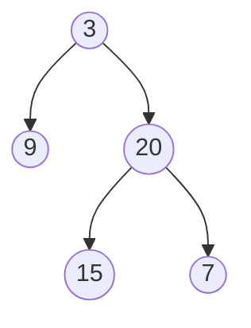
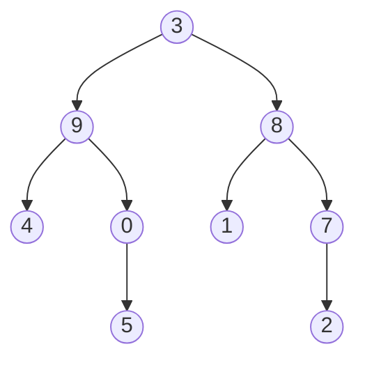

# Binary Tree Vertical Order Traversal

## Problem

Given the `root` node of a binary tree, your task is to produce a vertical order traversal of the tree's node values. Think of this as if you're looking at the tree from above and grouping nodes into vertical columns based on their horizontal position.

Here's how vertical columns work: imagine the root node sits at column 0. When you move to a left child, you move one column to the left (column decreases by 1). When you move to a right child, you move one column to the right (column increases by 1). This creates vertical "slices" through the tree, and you need to collect all nodes in each column together, ordered from top to bottom. For example, in a simple tree where the root has value 3, left child has value 9, and right child has value 20, the columns would be: column -1 contains node 9, column 0 contains node 3, and column 1 contains node 20. The important ordering rules are: first, group nodes by their column number from left to right. Second, within each column, list nodes from top to bottom (by level). Third, when multiple nodes occupy the same position (same row and same column), order them from left to right as they appear in that level. The result should be a list of lists, where each inner list represents one vertical column's values in the correct order.


**Diagram:**



```
Vertical columns (column numbers shown):
    -1     0     1     2
    │      │     │     │
    9      3     20    7
           │     │
           └─────15

Output: [[9], [3,15], [20], [7]]
```



```
Vertical columns:
   -2    -1     0     1     2
    │     │     │     │     │
    4     9     3     8     7
          │     │     │     │
          └─────0     1     2
                │
                5

Output: [[4], [9,5], [3,0,1], [8,2], [7]]
```


## Why This Matters

Vertical order traversal appears in many practical applications where spatial organization matters. In rendering organizational charts or file system hierarchies, you often need to group items by their horizontal position for display purposes. Database query optimizers use tree traversal variations to generate execution plans. Computer graphics systems organize scene graphs where objects need to be processed in specific spatial orders. This problem teaches you to combine multiple algorithmic concepts simultaneously: you need to track position coordinates while traversing, maintain groupings using hash maps, and ensure correct ordering through level-order traversal. The technique of associating metadata (like column numbers) with nodes during traversal is widely applicable, from annotating syntax trees in compilers to tracking distances in graph algorithms. Mastering this pattern gives you tools to solve complex traversal problems where simple recursion isn't enough.

## Constraints

- The number of nodes in the tree is in the range [0, 100].
- -100 <= Node.val <= 100

## Think About

1. What's the brute force approach? Why is it inefficient?
2. What property of the input can you exploit?
3. Would sorting or preprocessing help?
4. Can you reduce this to a problem you've seen before?

## Approach Hints

<details>
<summary>💡 Hint 1: Column Assignment Strategy</summary>

Assign each node a column number: root is column 0, left children decrease by 1, right children increase by 1. Nodes in the same column should be grouped together. Use BFS to ensure top-to-bottom ordering and left-to-right when nodes share the same position.
</details>

<details>
<summary>🎯 Hint 2: Data Structure Choice</summary>

Use a hash map to group nodes by column number: `{column: [node_values]}`. Pair each queue element with its column during BFS: `(node, column)`. Track the minimum and maximum column numbers to determine the output order. BFS naturally processes nodes level by level, ensuring correct top-to-bottom order.
</details>

<details>
<summary>📝 Hint 3: Implementation Steps</summary>

Algorithm:
1. Handle empty tree edge case
2. Initialize queue with (root, 0) and column map {}
3. BFS traversal:
   - Dequeue (node, col)
   - Add node.val to column_map[col]
   - Enqueue left child with (node.left, col-1)
   - Enqueue right child with (node.right, col+1)
   - Track min_col and max_col
4. Build result from min_col to max_col

Time: O(n), Space: O(n)
</details>

## Complexity Analysis

| Approach | Time | Space | Notes |
|----------|------|-------|-------|
| DFS + Sorting | O(n log n) | O(n) | Need to sort by row after DFS |
| **BFS + HashMap** | **O(n)** | **O(n)** | **Natural top-to-bottom order** |
| DFS + HashMap + Row Tracking | O(n log n) | O(n) | Track row for tie-breaking |

## Common Mistakes

### Mistake 1: Using DFS Without Row Tracking

```python
# WRONG: DFS doesn't guarantee top-to-bottom order
def verticalOrder(root):
    if not root:
        return []

    col_map = {}

    def dfs(node, col):
        if not node:
            return
        if col not in col_map:
            col_map[col] = []
        col_map[col].append(node.val)  # Wrong order!
        dfs(node.left, col - 1)
        dfs(node.right, col + 1)

    dfs(root, 0)
    return [col_map[col] for col in sorted(col_map.keys())]
```

```python
# CORRECT: Use BFS for level-order processing
from collections import deque

def verticalOrder(root):
    if not root:
        return []

    col_map = {}
    queue = deque([(root, 0)])
    min_col = max_col = 0

    while queue:
        node, col = queue.popleft()

        if col not in col_map:
            col_map[col] = []
        col_map[col].append(node.val)

        min_col = min(min_col, col)
        max_col = max(max_col, col)

        if node.left:
            queue.append((node.left, col - 1))
        if node.right:
            queue.append((node.right, col + 1))

    return [col_map[col] for col in range(min_col, max_col + 1)]
```

### Mistake 2: Not Handling Left-to-Right Order at Same Position

```python
# WRONG: Might process right before left at same level
def verticalOrder(root):
    # ... setup ...

    while queue:
        node, col = queue.popleft()
        col_map[col].append(node.val)

        # Order matters!
        if node.right:
            queue.append((node.right, col + 1))
        if node.left:  # Should be before right!
            queue.append((node.left, col - 1))
```

```python
# CORRECT: Process left before right
def verticalOrder(root):
    # ... setup ...

    while queue:
        node, col = queue.popleft()
        col_map[col].append(node.val)

        # Left first for correct ordering
        if node.left:
            queue.append((node.left, col - 1))
        if node.right:
            queue.append((node.right, col + 1))
```

### Mistake 3: Inefficient Result Construction

```python
# WRONG: Searching for min/max columns repeatedly
def verticalOrder(root):
    # ... BFS traversal ...

    # Inefficient: rebuilding range
    result = []
    for col in sorted(col_map.keys()):  # O(k log k) where k = columns
        result.append(col_map[col])
    return result
```

```python
# CORRECT: Track min/max during traversal
def verticalOrder(root):
    if not root:
        return []

    col_map = {}
    queue = deque([(root, 0)])
    min_col = max_col = 0  # Track during BFS

    while queue:
        node, col = queue.popleft()

        if col not in col_map:
            col_map[col] = []
        col_map[col].append(node.val)

        min_col = min(min_col, col)
        max_col = max(max_col, col)

        if node.left:
            queue.append((node.left, col - 1))
        if node.right:
            queue.append((node.right, col + 1))

    # O(k) construction
    return [col_map[col] for col in range(min_col, max_col + 1)]
```

## Variations

| Variation | Description | Key Difference |
|-----------|-------------|----------------|
| Top View of Tree | Only topmost node per column | Take first node in each column |
| Bottom View of Tree | Only bottommost node per column | Take last node in each column |
| Vertical Order with Sorting | Sort values within columns | Add sorting step per column |
| Level Order Traversal | Group by level instead of column | Standard BFS without column tracking |
| Diagonal Traversal | Group by diagonals | col+row instead of col |
| Zigzag Level Order | Alternate left-right per level | Reverse alternate levels |

## Practice Checklist

- [ ] Day 1: Implement BFS with column tracking
- [ ] Day 2: Solve top view and bottom view variations
- [ ] Day 3: Solve without hints
- [ ] Day 7: Compare BFS vs DFS approaches
- [ ] Day 14: Speed test - solve in 15 minutes
- [ ] Day 30: Solve diagonal traversal

**Strategy**: See [Tree Pattern](../strategies/data-structures/trees.md)
