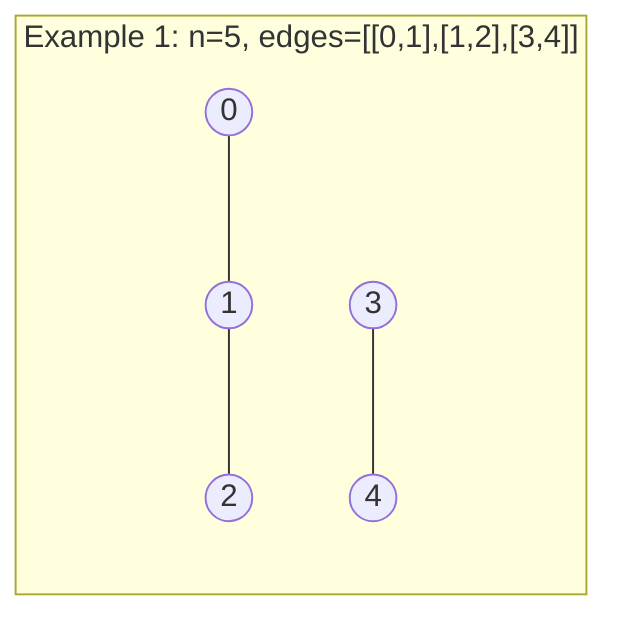
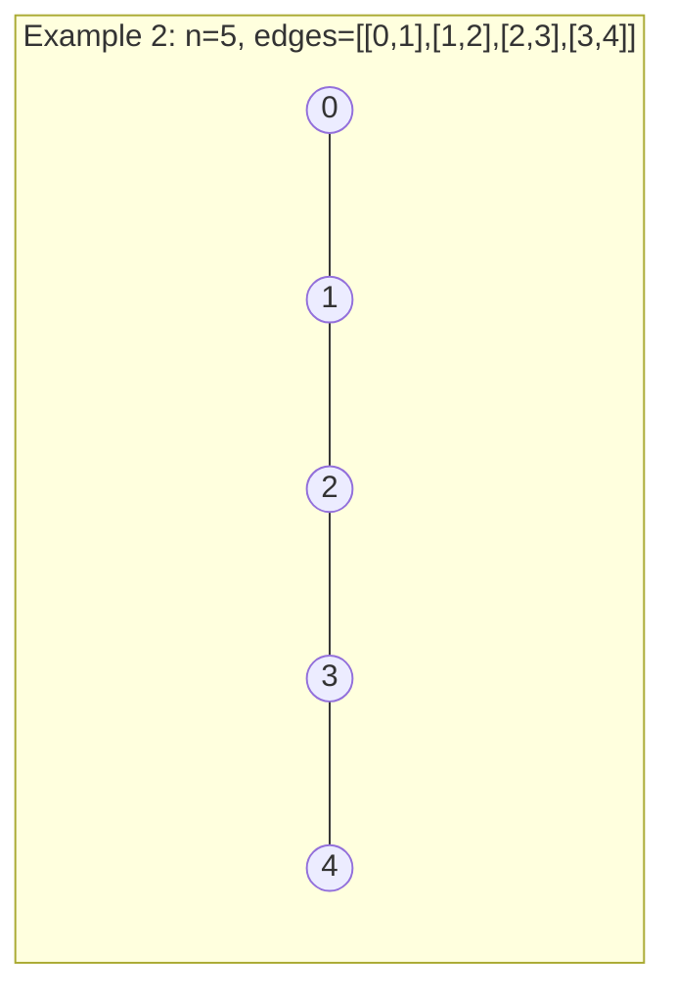

# Number of Connected Components in an Undirected Graph

## Problem

You're working with an undirected graph that has `n` nodes labeled from 0 to n-1. The graph is defined by two pieces of information: the total number of nodes `n`, and an array `edges` where each element `edges[i] = [ai, bi]` represents a bidirectional edge connecting node `ai` to node `bi`. In an undirected graph, if there's an edge between nodes A and B, you can travel from A to B or from B to A.

A connected component is a group of nodes where you can reach any node in the group from any other node in the group by following edges, but you cannot reach nodes outside the group without crossing into a different component. Think of it like islands: each island is a connected component where you can walk between any two points on the same island, but you'd need a boat to reach a different island. Your task is to count how many such separate components exist in the graph. For example, if you have 5 nodes with edges connecting nodes 0-1, 1-2, and 3-4, you have two components: one containing nodes {0, 1, 2} and another containing nodes {3, 4}. An isolated node with no edges forms its own component. The challenge is to efficiently identify and count these separate groups, which becomes non-trivial as graphs grow larger with potentially thousands of nodes and edges.


**Diagram:**



```
Component 1: {0, 1, 2}
Component 2: {3, 4}
Total components: 2
```



```
Component 1: {0, 1, 2, 3, 4}
Total components: 1 (all connected)
```


## Why This Matters

Connected components are fundamental to understanding network structure across countless domains. Social networks use component analysis to identify communities or detect isolated user groups. In computer networks, finding connected components helps identify network partitions or isolated subnets during outages. Image processing uses connected components to identify distinct objects in a binary image, where pixels of the same color form components. Bioinformatics applies this to protein interaction networks to find functional modules. This problem teaches you two important algorithmic paradigms: graph traversal (DFS/BFS) for exploring connectivity, and Union-Find (disjoint set) data structure for efficiently tracking and merging components. Union-Find in particular is a powerful technique that appears in Kruskal's minimum spanning tree algorithm, in network connectivity queries, and in various clustering algorithms. The optimization techniques you'll learn, like path compression and union by rank, demonstrate how careful data structure design can reduce complexity from linear to nearly constant time. Understanding when to use traversal versus Union-Find based on the problem's access patterns is valuable algorithmic intuition.

## Constraints

- The number of nodes n is between 1 and 2000
- The edges array length ranges from 1 to 5000
- Each edge consists of exactly 2 elements
- Node indices satisfy: 0 <= ai <= bi < n
- No self-loops exist (ai != bi)
- Duplicate edges are not present

## Think About

1. What's the brute force approach? Why is it inefficient?
2. What property of the input can you exploit?
3. Would sorting or preprocessing help?
4. Can you reduce this to a problem you've seen before?

## Approach Hints

<details>
<summary>💡 Hint 1: Graph Traversal Approach</summary>

Use DFS or BFS to explore each component. Start from an unvisited node, mark all reachable nodes as visited (they form one component), then move to the next unvisited node and repeat. Count how many times you start a new traversal - that's your component count.
</details>

<details>
<summary>🎯 Hint 2: Union-Find (Disjoint Set) Approach</summary>

Union-Find is perfect for this problem. Initialize each node as its own component (n components initially). For each edge, union the two nodes. If they're already in the same component, no change. If different, merge components and decrement count. This approach is very efficient with path compression and union by rank.
</details>

<details>
<summary>📝 Hint 3: Implementation Comparison</summary>

**DFS/BFS Approach:**
1. Build adjacency list from edges
2. Initialize visited array
3. For each unvisited node, run DFS/BFS and increment component count
4. Time: O(n + edges), Space: O(n + edges)

**Union-Find Approach:**
1. Initialize parent[i] = i for all nodes
2. For each edge (u, v), union(u, v)
3. Count distinct roots
4. Time: O(edges × α(n)), Space: O(n) where α is inverse Ackermann (nearly O(1))
</details>

## Complexity Analysis

| Approach | Time | Space | Notes |
|----------|------|-------|-------|
| DFS | O(n + e) | O(n + e) | e = number of edges |
| BFS | O(n + e) | O(n + e) | Similar to DFS |
| **Union-Find Basic** | **O(e × n)** | **O(n)** | **Without optimizations** |
| **Union-Find Optimized** | **O(e × α(n))** | **O(n)** | **With path compression & union by rank** |

## Common Mistakes

### Mistake 1: Counting Components Incorrectly with Union-Find

```python
# WRONG: Not tracking component count during union
class UnionFind:
    def __init__(self, n):
        self.parent = list(range(n))

    def find(self, x):
        if self.parent[x] != x:
            self.parent[x] = self.find(self.parent[x])
        return self.parent[x]

    def union(self, x, y):
        root_x = self.find(x)
        root_y = self.find(y)
        if root_x != root_y:
            self.parent[root_x] = root_y

def countComponents(n, edges):
    uf = UnionFind(n)
    for a, b in edges:
        uf.union(a, b)

    # Wrong: counting unique parents inefficiently
    return len(set(uf.find(i) for i in range(n)))
```

```python
# CORRECT: Track component count during union
class UnionFind:
    def __init__(self, n):
        self.parent = list(range(n))
        self.rank = [1] * n
        self.components = n  # Track component count

    def find(self, x):
        if self.parent[x] != x:
            self.parent[x] = self.find(self.parent[x])  # Path compression
        return self.parent[x]

    def union(self, x, y):
        root_x = self.find(x)
        root_y = self.find(y)

        if root_x != root_y:
            # Union by rank
            if self.rank[root_x] > self.rank[root_y]:
                self.parent[root_y] = root_x
            elif self.rank[root_x] < self.rank[root_y]:
                self.parent[root_x] = root_y
            else:
                self.parent[root_y] = root_x
                self.rank[root_x] += 1

            self.components -= 1  # Decrement on merge
            return True
        return False

def countComponents(n, edges):
    uf = UnionFind(n)
    for a, b in edges:
        uf.union(a, b)
    return uf.components
```

### Mistake 2: Not Building Adjacency List Correctly for DFS

```python
# WRONG: Forgetting bidirectional edges
def countComponents(n, edges):
    graph = [[] for _ in range(n)]

    for a, b in edges:
        graph[a].append(b)  # Only one direction!

    visited = [False] * n
    count = 0

    def dfs(node):
        visited[node] = True
        for neighbor in graph[node]:
            if not visited[neighbor]:
                dfs(neighbor)

    for i in range(n):
        if not visited[i]:
            dfs(i)
            count += 1

    return count
```

```python
# CORRECT: Add edges in both directions
def countComponents(n, edges):
    graph = [[] for _ in range(n)]

    for a, b in edges:
        graph[a].append(b)  # Bidirectional
        graph[b].append(a)

    visited = [False] * n
    count = 0

    def dfs(node):
        visited[node] = True
        for neighbor in graph[node]:
            if not visited[neighbor]:
                dfs(neighbor)

    for i in range(n):
        if not visited[i]:
            dfs(i)
            count += 1

    return count
```

### Mistake 3: Not Handling Isolated Nodes

```python
# WRONG: Only considering nodes that appear in edges
def countComponents(n, edges):
    visited = set()
    # ... build graph and run DFS ...

    # Missing isolated nodes that don't appear in any edge!
    return component_count
```

```python
# CORRECT: Initialize all nodes, handle isolated nodes
def countComponents(n, edges):
    graph = [[] for _ in range(n)]  # Initialize for ALL n nodes

    for a, b in edges:
        graph[a].append(b)
        graph[b].append(a)

    visited = [False] * n
    count = 0

    def dfs(node):
        visited[node] = True
        for neighbor in graph[node]:
            if not visited[neighbor]:
                dfs(neighbor)

    # Check ALL nodes (including isolated ones)
    for i in range(n):
        if not visited[i]:
            dfs(i)
            count += 1

    return count
```

## Variations

| Variation | Description | Key Difference |
|-----------|-------------|----------------|
| Directed Graph Components | Strongly connected components | Use Kosaraju's or Tarjan's algorithm |
| Weighted Graph Components | Edges have weights | Same connectivity, weights don't affect count |
| Dynamic Connectivity | Edges added/removed online | Maintain Union-Find with deletion |
| K-Connected Components | Find components with degree ≥ k | Filter nodes by degree first |
| Component Sizes | Return sizes of each component | Track size in Union-Find |
| Largest Component | Find size of largest component | Track max size during traversal |

## Practice Checklist

- [ ] Day 1: Implement DFS solution
- [ ] Day 2: Implement Union-Find solution
- [ ] Day 3: Solve without hints
- [ ] Day 7: Compare performance of both approaches
- [ ] Day 14: Speed test - solve in 15 minutes
- [ ] Day 30: Implement with path compression and union by rank

**Strategy**: See [Graph Pattern](../strategies/data-structures/graphs.md)
