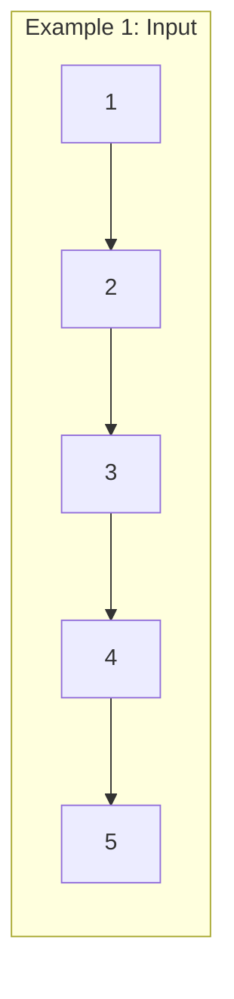
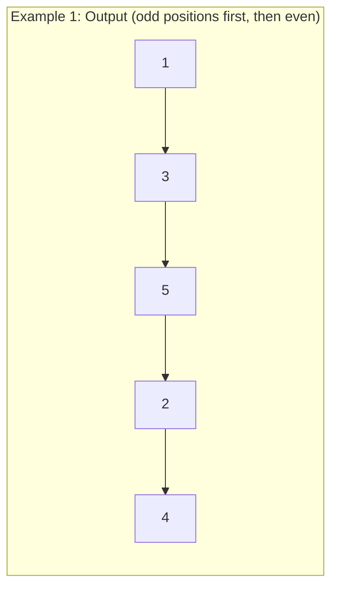
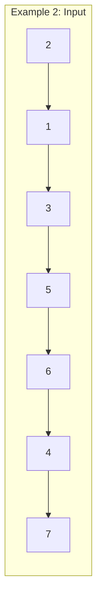
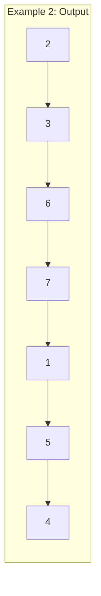

# Odd Even Linked List

## Problem

You're given the `head` of a singly linked list, and your task is to reorganize it so that all nodes at odd positions come first, followed by all nodes at even positions. Positions are counted starting from 1, so the first node is at position 1 (odd), the second at position 2 (even), the third at position 3 (odd), and so on.

To be completely clear about what "positions" means: we're talking about the original position in the list, not the node's value. If your list is `1 → 2 → 3 → 4 → 5`, the odd-positioned nodes are 1 (position 1), 3 (position 3), and 5 (position 5), while even-positioned nodes are 2 (position 2) and 4 (position 4). After reorganization, the list should become `1 → 3 → 5 → 2 → 4`. Notice that within each group (odd positions and even positions), the relative order is preserved: odd nodes appear in the same order they appeared originally (1 before 3 before 5), and even nodes maintain their original order (2 before 4). The challenge has strict efficiency requirements: you must solve this in O(n) time with only O(1) extra space, meaning you can't create a new list or use auxiliary data structures that grow with input size. You need to rearrange the existing nodes by rewiring the next pointers in place. This is trickier than it sounds because you need to carefully manage pointers to avoid losing references or creating cycles.


**Diagram:**





```
Positions:  1 → 3 → 5 → 2 → 4
            (odd positions) (even positions)
```





```
Positions:  2 → 3 → 6 → 7 → 1 → 5 → 4
            (positions 1,3,5,7) (positions 2,4,6)
```


## Why This Matters

Linked list manipulation is fundamental to systems programming and data structure implementation. Memory allocators use linked lists to track free memory blocks and must frequently reorganize them without additional allocations. Operating system schedulers maintain process queues as linked structures that require constant rearrangement. File systems use linked allocation where rearranging block pointers is critical for defragmentation. The specific skill of in-place pointer manipulation, where you rewire connections without creating new nodes, is essential for memory-constrained environments like embedded systems, kernel programming, or real-time systems where allocation during operation isn't permitted. This problem teaches you to maintain multiple simultaneous pointer references (odd pointer, even pointer, even head) and coordinate their movements, a pattern that appears in many linked list algorithms like reversing, merging, or partitioning. The requirement to maintain O(1) space forces you to think carefully about minimal state tracking, a valuable constraint that leads to elegant solutions. These pointer manipulation skills transfer directly to working with tree structures, graph representations, and other pointer-based data structures.

## Constraints

- The number of nodes in the linked list is in the range [0, 10⁴].
- -10⁶ <= Node.val <= 10⁶

## Think About

1. What's the brute force approach? Why is it inefficient?
2. What property of the input can you exploit?
3. Would sorting or preprocessing help?
4. Can you reduce this to a problem you've seen before?

## Approach Hints

<details>
<summary>💡 Hint 1: Separate the Lists</summary>

Instead of rearranging nodes in place with complex pointer swaps, consider building two separate linked lists: one for odd-positioned nodes and one for even-positioned nodes. As you traverse the original list, you can assign each node to the appropriate list based on its position. This separation makes the logic clearer and easier to manage.

</details>

<details>
<summary>🎯 Hint 2: Maintain Two Pointers</summary>

Use two pointers: one tracking the current odd-positioned node and another tracking the current even-positioned node. Keep a reference to the head of the even list so you can connect it to the end of the odd list later. In each iteration, advance both pointers by two positions (skipping the intermediate node that belongs to the other list).

</details>

<details>
<summary>📝 Hint 3: Algorithm Steps</summary>

```
1. Handle edge cases: if list is empty or has one node, return head
2. Initialize:
   - odd = head (first node is odd)
   - even = head.next (second node is even)
   - even_head = even (save even list start)
3. While even and even.next exist:
   - odd.next = even.next (connect odd to next odd)
   - odd = odd.next (move odd pointer)
   - even.next = odd.next (connect even to next even)
   - even = even.next (move even pointer)
4. Connect lists: odd.next = even_head
5. Return head
```

Key insight: Each pointer jumps over one node to reach the next node of the same parity.

</details>

## Complexity Analysis

| Approach | Time | Space | Notes |
|----------|------|-------|-------|
| Array Conversion | O(n) | O(n) | Convert to array, rearrange, rebuild list |
| Create New List | O(n) | O(n) | Build new list with new nodes |
| **Two Pointer In-Place** | **O(n)** | **O(1)** | **Rearrange pointers without extra nodes** |

The optimal approach achieves O(1) space by rewiring existing pointers rather than creating new nodes or auxiliary data structures.

## Common Mistakes

### Mistake 1: Losing Reference to Even List Head

**Wrong Approach:**
```python
# Losing track of where even list starts
def odd_even_list(head):
    if not head or not head.next:
        return head

    odd = head
    even = head.next
    # Missing: even_head = even

    while even and even.next:
        odd.next = even.next
        odd = odd.next
        even.next = odd.next
        even = even.next

    odd.next = even  # Wrong: even has moved, not the head!
    return head
```

**Correct Approach:**
```python
def odd_even_list(head):
    if not head or not head.next:
        return head

    odd = head
    even = head.next
    even_head = even  # Correct: save even list start

    while even and even.next:
        odd.next = even.next
        odd = odd.next
        even.next = odd.next
        even = even.next

    odd.next = even_head  # Correct: connect to even list head
    return head
```

### Mistake 2: Incorrect Loop Condition

**Wrong Approach:**
```python
# Wrong loop condition causes null pointer errors
while odd and odd.next:  # Wrong: should check even
    odd.next = even.next
    odd = odd.next
    even.next = odd.next  # Can fail if odd.next is None
    even = even.next
```

**Correct Approach:**
```python
# Check even pointer to ensure even.next exists
while even and even.next:  # Correct: even is further ahead
    odd.next = even.next
    odd = odd.next
    even.next = odd.next
    even = even.next
```

### Mistake 3: Not Terminating Even List

**Wrong Approach:**
```python
# Even list might point to odd nodes, creating cycle
while even and even.next:
    odd.next = even.next
    odd = odd.next
    even.next = odd.next
    even = even.next

odd.next = even_head  # even.next might still point forward!
return head
```

**Correct Approach:**
```python
# Even pointer naturally ends at None or is explicitly set
while even and even.next:
    odd.next = even.next
    odd = odd.next
    even.next = odd.next
    even = even.next

odd.next = even_head  # This is sufficient; even ends properly
return head
```

## Variations

| Variation | Difference | Key Insight |
|-----------|------------|-------------|
| Partition List | Separate by value threshold | Similar two-pointer technique with value comparison |
| Reorder List (L0→Ln→L1→Ln-1) | Interleave from both ends | Need to find middle, reverse second half, then merge |
| Swap Pairs | Swap adjacent nodes | Simpler version with pair swaps |
| Remove Nth Node From End | Delete specific position | Use fast/slow pointers to find position |
| Reverse Nodes in k-Group | Reverse every k nodes | More complex pointer manipulation |

## Practice Checklist

- [ ] Implement with two pointers (odd and even)
- [ ] Handle edge case: empty list
- [ ] Handle edge case: single node
- [ ] Handle edge case: two nodes
- [ ] Test with odd-length list (5 nodes)
- [ ] Test with even-length list (6 nodes)
- [ ] Verify no memory leaks or cycles
- [ ] Confirm O(1) space complexity
- [ ] Confirm O(n) time complexity
- [ ] Code without looking at solution

**Spaced Repetition Schedule:**
- First review: 24 hours
- Second review: 3 days
- Third review: 1 week
- Fourth review: 2 weeks
- Fifth review: 1 month

**Strategy**: See [Linked List Pattern](../strategies/data-structures/linked-lists.md)
