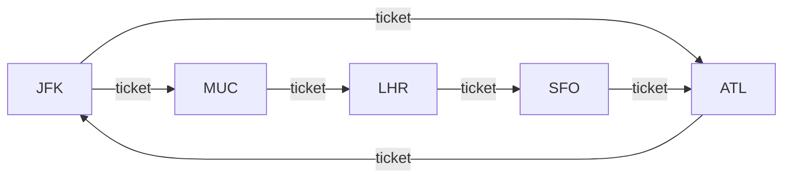
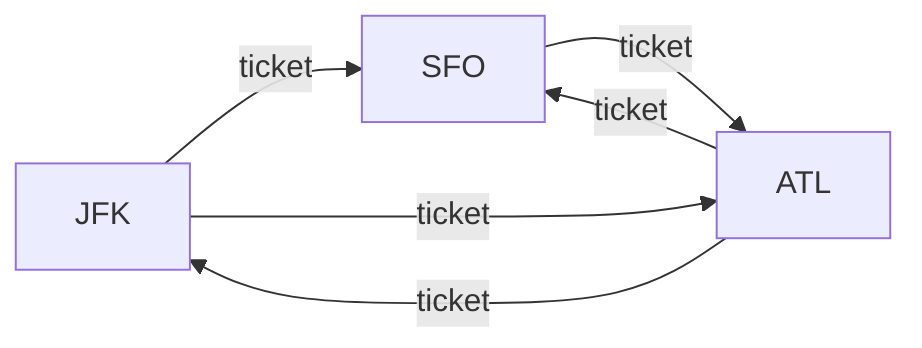

# Reconstruct Itinerary

## Problem

Given a collection of flight `tickets` represented as `tickets[i] = [fromi, toi]`, where each element indicates the origin and destination airports for a single flight, your task is to build and return the complete travel route in the correct sequence. Think of this as reconstructing a traveler's journey when you know all the individual flight segments they took but need to piece together the exact order they flew. Each ticket represents a directed edge in a graph, where airports are vertices and flights are edges connecting them.

The journey starts at `"JFK"` airport, so your reconstructed itinerary must always begin from this location. When multiple valid routes exist, select the one that comes first alphabetically when the entire path is considered as a string. For instance, if you can fly from JFK to either Atlanta (ATL) or Boston (BOS), you should choose ATL because it comes first alphabetically. This lexicographic ordering ensures a unique, deterministic answer. You can safely assume that at least one valid complete route exists, and each ticket must be used exactly once in your final itinerary, meaning you'll visit every flight segment without skipping or repeating any.

The challenge lies in handling cases where you might reach an airport with no outgoing flights before using all tickets, requiring backtracking or a clever traversal strategy. Edge cases include circular routes where you might return to airports you've visited before, and graphs with multiple edges between the same pair of airports (representing multiple flights on the same route).

**Diagram:**

Example 1: Multiple paths exist

Itinerary: `["JFK","MUC","LHR","SFO","ATL","JFK","ATL"]`

Example 2: Choosing lexicographically smallest

Choose path: `["JFK","ATL","JFK","SFO","ATL","SFO"]` (lexicographically smallest)


## Why This Matters

This problem directly models itinerary planning and route optimization systems used by travel booking platforms like Expedia or Kayak. When you book a multi-leg journey with connecting flights, the system must reconstruct a valid path through all your flight segments. Beyond travel, this represents finding an Eulerian path in a directed graph, a classic problem in graph theory that appears in GPS navigation (finding routes that traverse every road exactly once), DNA sequencing (assembling genome fragments), and even planning efficient delivery routes for logistics companies. Understanding Hierholzer's algorithm, which solves this elegantly, is valuable for any engineer working on routing, scheduling, or network traversal problems. The lexicographic ordering constraint adds real-world complexity, similar to how routing algorithms must choose between equally valid paths based on secondary criteria like cost or distance.

## Constraints

- 1 <= tickets.length <= 300
- tickets[i].length == 2
- fromi.length == 3
- toi.length == 3
- fromi and toi consist of uppercase English letters.
- fromi != toi

## Think About

1. What's the brute force approach? Why is it inefficient?
2. What property of the input can you exploit?
3. Would sorting or preprocessing help?
4. Can you reduce this to a problem you've seen before?

## Approach Hints

<details>
<summary>💡 Hint 1: Think About Eulerian Paths</summary>

This problem is about finding an Eulerian path in a directed graph - a path that visits every edge exactly once. The tickets are edges, and airports are vertices. Since you must use each ticket exactly once and return a valid path, you're looking for a way to traverse all edges. What algorithm finds Eulerian paths efficiently?

</details>

<details>
<summary>🎯 Hint 2: Hierholzer's Algorithm with Lexicographic Order</summary>

Build an adjacency list where each airport maps to a sorted list of its destinations. Use Hierholzer's algorithm: perform DFS, always choosing the lexicographically smallest unvisited destination. When you get stuck (no more outgoing edges), add the current airport to the result and backtrack. The key insight: build the path in reverse by adding nodes as you backtrack.

</details>

<details>
<summary>📝 Hint 3: Algorithm Steps</summary>

```
1. Build adjacency list: graph[from] = sorted list of destinations
   - Use a min-heap or sort the destinations for each airport
2. Initialize result as empty list
3. Define DFS function starting from "JFK":
   a. While current airport has outgoing flights:
      - Pop the smallest destination (lexicographically)
      - Recursively visit that destination
   b. Add current airport to result (postorder - after visiting all children)
4. Reverse result to get correct order
5. Return result
```

Key insight: We add airports to result in reverse order (postorder DFS). Airports with no outgoing edges are added first, building the path backwards.

</details>

## Complexity Analysis

| Approach | Time | Space | Notes |
|----------|------|-------|-------|
| Backtracking | O(E^d) | O(E) | Try all paths, exponential in degree |
| DFS with Sorting | O(E log E) | O(E) | Sort destinations once |
| **Hierholzer's Algorithm** | **O(E log E)** | **O(E)** | **Optimal for Eulerian path** |

Where E is the number of tickets (edges). The E log E comes from sorting the destination lists for each airport.

## Common Mistakes

### Mistake 1: Not Sorting Destinations

**Wrong Approach:**
```python
# Destinations not sorted, won't get lexicographically smallest path
from collections import defaultdict

def find_itinerary(tickets):
    graph = defaultdict(list)
    for src, dst in tickets:
        graph[src].append(dst)  # Wrong: not sorted

    result = []
    def dfs(airport):
        while graph[airport]:
            next_dest = graph[airport].pop(0)  # Takes first, not smallest
            dfs(next_dest)
        result.append(airport)

    dfs("JFK")
    return result[::-1]
```

**Correct Approach:**
```python
# Sort destinations to ensure lexicographic order
from collections import defaultdict

def find_itinerary(tickets):
    graph = defaultdict(list)
    for src, dst in tickets:
        graph[src].append(dst)

    # Sort destinations for each airport
    for airport in graph:
        graph[airport].sort(reverse=True)  # Reverse for efficient pop

    result = []
    def dfs(airport):
        while graph[airport]:
            next_dest = graph[airport].pop()  # Pop from end (smallest)
            dfs(next_dest)
        result.append(airport)

    dfs("JFK")
    return result[::-1]
```

### Mistake 2: Building Path in Wrong Order

**Wrong Approach:**
```python
# Adding to result before visiting children (preorder)
def find_itinerary(tickets):
    graph = defaultdict(list)
    for src, dst in tickets:
        graph[src].append(dst)
    for airport in graph:
        graph[airport].sort()

    result = []
    def dfs(airport):
        result.append(airport)  # Wrong: preorder won't handle dead ends
        while graph[airport]:
            next_dest = graph[airport].pop(0)
            dfs(next_dest)

    dfs("JFK")
    return result
```

**Correct Approach:**
```python
# Add to result after visiting children (postorder)
def find_itinerary(tickets):
    graph = defaultdict(list)
    for src, dst in tickets:
        graph[src].append(dst)
    for airport in graph:
        graph[airport].sort(reverse=True)

    result = []
    def dfs(airport):
        while graph[airport]:
            next_dest = graph[airport].pop()
            dfs(next_dest)
        result.append(airport)  # Correct: postorder handles backtracking

    dfs("JFK")
    return result[::-1]
```

### Mistake 3: Not Handling Multiple Edges Between Same Airports

**Wrong Approach:**
```python
# Using set removes duplicate tickets
def find_itinerary(tickets):
    graph = defaultdict(set)  # Wrong: set loses duplicate tickets
    for src, dst in tickets:
        graph[src].add(dst)
    # Rest of algorithm...
```

**Correct Approach:**
```python
# Use list to preserve all tickets, including duplicates
from collections import defaultdict

def find_itinerary(tickets):
    graph = defaultdict(list)  # Correct: list keeps duplicates
    for src, dst in tickets:
        graph[src].append(dst)
    for airport in graph:
        graph[airport].sort(reverse=True)
    # Rest of algorithm...
```

## Variations

| Variation | Difference | Key Insight |
|-----------|------------|-------------|
| Find Any Valid Itinerary | Don't need lexicographic smallest | Skip sorting, use standard DFS |
| Count Valid Itineraries | Count all possible paths | Use backtracking with ticket tracking |
| Eulerian Circuit | Must return to start | Check in-degree equals out-degree for all vertices |
| Chinese Postman Problem | Minimize duplicate edges | Find minimum edges to add for Eulerian path |
| Traveling Salesman | Visit each vertex once | NP-hard, different from visiting edges |

## Practice Checklist

- [ ] Implement using Hierholzer's algorithm
- [ ] Handle edge case: single ticket
- [ ] Handle edge case: multiple tickets same route
- [ ] Handle edge case: circular route
- [ ] Test with linear path (no branches)
- [ ] Test with branching paths
- [ ] Verify lexicographic ordering
- [ ] Confirm all tickets used exactly once
- [ ] Verify O(E log E) time complexity
- [ ] Code without looking at solution

**Spaced Repetition Schedule:**
- First review: 24 hours
- Second review: 3 days
- Third review: 1 week
- Fourth review: 2 weeks
- Fifth review: 1 month

**Strategy**: See [Graph Traversal Patterns](../strategies/data-structures/graphs.md)
