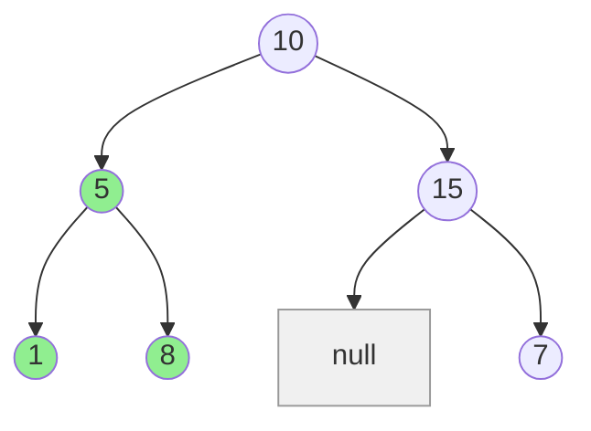

# Largest BST Subtree

## Problem

Given a binary tree's root node, identify the subtree with the maximum number of nodes that satisfies Binary Search Tree (BST) properties. A subtree is defined as any node along with all its descendants, forming a complete tree structure rooted at that node. Your goal is to find which subtree, when isolated from the larger tree, would form a valid BST and contains the most nodes.

A **Binary Search Tree (BST)** maintains these structural rules: every node in the left child subtree contains a value strictly smaller than its parent node, and every node in the right child subtree contains a value strictly larger than its parent node. This ordering property must hold recursively throughout the entire subtree, not just for immediate children. For example, a node with value 10 must have all values in its left subtree less than 10 and all values in its right subtree greater than 10.

The challenge here is that the overall tree might not be a BST, but it may contain valid BST subtrees embedded within it. You need to identify the largest one by node count. Edge cases include the entire tree being a valid BST (return the total node count), no valid BST existing except individual leaf nodes (return 1), and trees with duplicate values (which violate the BST property since we need strictly less-than and greater-than relationships).

**Diagram:**


The largest BST subtree is rooted at node 5, containing nodes {1, 5, 8} with size 3.


## Why This Matters

Database indexing systems use BST variants like B-trees and B+ trees to maintain sorted data for fast queries. When database corruption occurs or data is loaded from untrusted sources, systems may need to identify the largest valid BST portion that can be salvaged or verified. This problem also appears in compiler design when analyzing syntax trees to find the largest well-formed expression subtrees. File systems organize directories in tree structures, and validation tools must identify valid subtrees that meet specific ordering constraints. The technique of bottom-up tree validation with range tracking is fundamental to many tree algorithms, including validating BSTs, finding balanced subtrees, and optimizing search tree structures. Understanding this pattern prepares you for more complex tree problems in system design and data structure implementation.

## Examples

**Example 1:**
- Input: `root = [4,2,7,2,3,5,null,2,null,null,null,null,null,1]`
- Output: `2`

## Constraints

- The number of nodes in the tree is in the range [0, 10⁴].
- -10⁴ <= Node.val <= 10⁴

## Think About

1. What's the brute force approach? Why is it inefficient?
2. What property of the input can you exploit?
3. Would sorting or preprocessing help?
4. Can you reduce this to a problem you've seen before?

## Approach Hints

<details>
<summary>💡 Hint 1: Validate BST from Bottom-Up</summary>

For each node, you need to know if its subtree is a valid BST and, if so, how many nodes it contains. Think about what information you need from the left and right children to determine if the current node forms a valid BST. Consider tracking the minimum and maximum values in each subtree to validate the BST property.

</details>

<details>
<summary>🎯 Hint 2: Postorder Traversal with Range Tracking</summary>

Use postorder DFS (process children before parent). For each node, return a tuple containing:
1. Is this subtree a valid BST?
2. Size of the subtree (if BST)
3. Minimum value in subtree
4. Maximum value in subtree

A node forms a valid BST if both children are BSTs AND left_max < node.val < right_min.

</details>

<details>
<summary>📝 Hint 3: Algorithm Steps</summary>

```
Define helper function that returns (is_bst, size, min_val, max_val):

1. Base case: if node is None, return (True, 0, infinity, -infinity)
2. Recursively get info from left child: (left_bst, left_size, left_min, left_max)
3. Recursively get info from right child: (right_bst, right_size, right_min, right_max)
4. Check if current node forms BST:
   - Both children are BSTs
   - left_max < node.val < right_min
5. If valid BST:
   - size = left_size + right_size + 1
   - min_val = min(left_min, node.val)
   - max_val = max(right_max, node.val)
   - Update global maximum size
   - Return (True, size, min_val, max_val)
6. Else: return (False, 0, 0, 0)

Return global maximum at end.
```

Key insight: Process children first to get their BST status and ranges.

</details>

## Complexity Analysis

| Approach | Time | Space | Notes |
|----------|------|-------|-------|
| Validate Each Subtree | O(n²) | O(h) | Validate BST for each node separately |
| Inorder + Validation | O(n²) | O(n) | Inorder traversal for each subtree |
| **Postorder DFS** | **O(n)** | **O(h)** | **Single pass, optimal solution** |

Where n is number of nodes and h is tree height. The postorder approach visits each node exactly once.

## Common Mistakes

### Mistake 1: Not Checking Both Children Are BSTs

**Wrong Approach:**
```python
# Only checking value constraints, not if children are BSTs
def largest_bst_subtree(root):
    max_size = 0

    def dfs(node):
        nonlocal max_size
        if not node:
            return True, 0, float('inf'), float('-inf')

        left_bst, left_size, left_min, left_max = dfs(node.left)
        right_bst, right_size, right_min, right_max = dfs(node.right)

        # Wrong: missing check if children are BSTs
        if left_max < node.val < right_min:
            size = left_size + right_size + 1
            max_size = max(max_size, size)
            return True, size, min(left_min, node.val), max(right_max, node.val)

        return False, 0, 0, 0
```

**Correct Approach:**
```python
# Check both children are BSTs AND value constraints
def largest_bst_subtree(root):
    max_size = 0

    def dfs(node):
        nonlocal max_size
        if not node:
            return True, 0, float('inf'), float('-inf')

        left_bst, left_size, left_min, left_max = dfs(node.left)
        right_bst, right_size, right_min, right_max = dfs(node.right)

        # Correct: check all three conditions
        if left_bst and right_bst and left_max < node.val < right_min:
            size = left_size + right_size + 1
            max_size = max(max_size, size)
            return True, size, min(left_min, node.val), max(right_max, node.val)

        return False, 0, 0, 0

    dfs(root)
    return max_size
```

### Mistake 2: Wrong Base Case for Min/Max

**Wrong Approach:**
```python
# Base case returns 0 for min/max, breaks comparisons
def dfs(node):
    if not node:
        return True, 0, 0, 0  # Wrong: should be inf/-inf

    left_bst, left_size, left_min, left_max = dfs(node.left)
    right_bst, right_size, right_min, right_max = dfs(node.right)

    # left_max could be 0 even when left is None, breaks logic
    if left_bst and right_bst and left_max < node.val < right_min:
        # ...
```

**Correct Approach:**
```python
# Use infinity values for proper comparisons
def dfs(node):
    if not node:
        return True, 0, float('inf'), float('-inf')  # Correct

    left_bst, left_size, left_min, left_max = dfs(node.left)
    right_bst, right_size, right_min, right_max = dfs(node.right)

    # Now comparisons work correctly even when children are None
    if left_bst and right_bst and left_max < node.val < right_min:
        # ...
```

### Mistake 3: Not Updating Min/Max Correctly

**Wrong Approach:**
```python
# Using only node.val for min/max
if left_bst and right_bst and left_max < node.val < right_min:
    size = left_size + right_size + 1
    # Wrong: should consider children's min/max
    return True, size, node.val, node.val
```

**Correct Approach:**
```python
# Include children's min/max in the range
if left_bst and right_bst and left_max < node.val < right_min:
    size = left_size + right_size + 1
    min_val = min(left_min, node.val)  # Correct: leftmost node
    max_val = max(right_max, node.val)  # Correct: rightmost node
    return True, size, min_val, max_val
```

## Variations

| Variation | Difference | Key Insight |
|-----------|------------|-------------|
| Validate Binary Search Tree | Check if entire tree is BST | Same approach, return true/false |
| Count BST Subtrees | Count all valid BST subtrees | Increment counter for each valid BST |
| Largest Balanced Subtree | Find largest balanced subtree | Track height instead of BST property |
| Maximum Sum BST Subtree | Find BST with max sum | Track sum instead of size |
| Convert BST to Greater Tree | Modify BST values | Reverse inorder traversal |

## Practice Checklist

- [ ] Implement postorder DFS solution
- [ ] Handle edge case: empty tree
- [ ] Handle edge case: single node
- [ ] Handle edge case: entire tree is BST
- [ ] Handle edge case: no valid BST (all single nodes)
- [ ] Test with left-skewed tree
- [ ] Test with right-skewed tree
- [ ] Test with mixed valid/invalid subtrees
- [ ] Verify O(n) time complexity
- [ ] Code without looking at solution

**Spaced Repetition Schedule:**
- First review: 24 hours
- Second review: 3 days
- Third review: 1 week
- Fourth review: 2 weeks
- Fifth review: 1 month

**Strategy**: See [Tree Pattern](../strategies/data-structures/trees.md)
