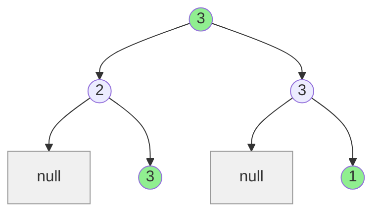
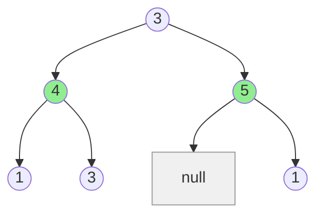

# House Robber III

## Problem

You're working with a neighborhood organized as a binary tree structure, where each node represents a house containing money. Think of this as houses arranged on a hillside where each property can have up to two child properties below it, connected by security-monitored paths. The tree has a single entry point at its root, representing the top house on the hill.

The neighborhood has a security system with a simple rule: if two houses connected by a direct parent-child relationship are both robbed on the same night, an alarm triggers immediately and you're caught. However, you're free to rob houses that aren't directly connected, such as a house and its grandchildren, or houses on completely different branches of the tree. This constraint creates an interesting optimization problem where you must balance robbing high-value houses against the limitation of skipping their immediate children.

Your task is to calculate the maximum money that can be stolen from the houses without triggering the alarm. You're given the `root` of the binary tree where each node's value represents the amount of money in that house. Edge cases include trees where robbing the root is optimal, trees where skipping the root for its children is better, single-node trees, and deeply nested chains where you must carefully alternate which houses to rob.

**Diagram:**

Example 1: Input `[3,2,3,null,3,null,1]`, Output: `7`

Rob houses 3 + 3 + 1 = 7 (skip connected parent-child pairs)

Example 2: Input `[3,4,5,1,3,null,1]`, Output: `9`

Rob houses 4 + 5 = 9 (better than robbing root)


## Why This Matters

This problem models resource allocation with dependency constraints, appearing in scheduling systems where certain tasks cannot run simultaneously. Consider CPU scheduling where parent processes and their immediate children might conflict over shared resources, but grandchild processes are independent. It also represents investment portfolio optimization where you can't invest in both a company and its direct subsidiary due to regulatory restrictions, but you can invest in non-adjacent levels of corporate hierarchy. Social network influence maximization faces similar constraints: you might not be able to directly target users who are immediate neighbors in a social graph, but you can target strategically separated nodes. The technique of tracking multiple states (rob vs. skip) during tree traversal is a fundamental dynamic programming pattern that extends to many tree-based optimization problems, making this essential practice for technical interviews and real-world algorithm design.

## Constraints

- The number of nodes in the tree is in the range [1, 10⁴].
- 0 <= Node.val <= 10⁴

## Think About

1. What's the brute force approach? Why is it inefficient?
2. What property of the input can you exploit?
3. Would sorting or preprocessing help?
4. Can you reduce this to a problem you've seen before?

## Approach Hints

<details>
<summary>💡 Hint 1: Two Choices at Each Node</summary>

At each node, you have two mutually exclusive choices:
1. Rob this house - you get its value but CANNOT rob its children
2. Skip this house - you CAN rob its children

The maximum at each node is the better of these two options. How can you track both possibilities as you traverse the tree?

</details>

<details>
<summary>🎯 Hint 2: Postorder DFS with State Tracking</summary>

Use postorder traversal (process children first). For each node, return a pair of values:
- `rob_current`: maximum money if we rob this node
- `skip_current`: maximum money if we skip this node

For a node:
- If we rob it: `node.val + skip_left + skip_right` (can't rob children)
- If we skip it: `max(rob_left, skip_left) + max(rob_right, skip_right)` (take best from children)

</details>

<details>
<summary>📝 Hint 3: Algorithm Steps</summary>

```
Define helper function that returns (rob, skip):

1. Base case: if node is None, return (0, 0)
2. Recursively process left child: (rob_left, skip_left)
3. Recursively process right child: (rob_right, skip_right)
4. Calculate two scenarios:
   rob_current = node.val + skip_left + skip_right
   skip_current = max(rob_left, skip_left) + max(rob_right, skip_right)
5. Return (rob_current, skip_current)

At root, return max(rob_root, skip_root)
```

Key insight: Each node needs to know the best outcome from both robbing and skipping its children.

</details>

## Complexity Analysis

| Approach | Time | Space | Notes |
|----------|------|-------|-------|
| Naive Recursion | O(2^n) | O(h) | Explore all combinations, exponential |
| Recursion + Memoization | O(n) | O(n) | Cache results for each node |
| **Postorder DP** | **O(n)** | **O(h)** | **Optimal: single pass, only recursion stack** |

Where n is number of nodes and h is tree height. The postorder DP approach is optimal with O(h) space.

## Common Mistakes

### Mistake 1: Forgetting to Consider Skipping Current Node

**Wrong Approach:**
```python
# Only considering robbing current node
def rob(root):
    if not root:
        return 0

    # Wrong: only one scenario considered
    rob_current = root.val
    if root.left:
        rob_current += rob(root.left.left) + rob(root.left.right)
    if root.right:
        rob_current += rob(root.right.left) + rob(root.right.right)

    return rob_current  # Missing: comparison with skipping current
```

**Correct Approach:**
```python
# Consider both robbing and skipping
def rob(root):
    def dfs(node):
        if not node:
            return 0, 0

        rob_left, skip_left = dfs(node.left)
        rob_right, skip_right = dfs(node.right)

        # Correct: calculate both scenarios
        rob_current = node.val + skip_left + skip_right
        skip_current = max(rob_left, skip_left) + max(rob_right, skip_right)

        return rob_current, skip_current

    return max(dfs(root))
```

### Mistake 2: Accessing Grandchildren Directly Without Memoization

**Wrong Approach:**
```python
# Recomputing grandchildren values repeatedly
def rob(root):
    if not root:
        return 0

    # Wrong: exponential time, recomputes same subtrees
    rob_current = root.val
    if root.left:
        rob_current += rob(root.left.left) + rob(root.left.right)
    if root.right:
        rob_current += rob(root.right.left) + rob(root.right.right)

    skip_current = rob(root.left) + rob(root.right)

    return max(rob_current, skip_current)
```

**Correct Approach:**
```python
# Use tuple to pass both states, avoiding recomputation
def rob(root):
    def dfs(node):
        if not node:
            return 0, 0

        rob_left, skip_left = dfs(node.left)  # Compute once
        rob_right, skip_right = dfs(node.right)  # Compute once

        rob_current = node.val + skip_left + skip_right
        skip_current = max(rob_left, skip_left) + max(rob_right, skip_right)

        return rob_current, skip_current

    return max(dfs(root))
```

### Mistake 3: Taking Max Incorrectly When Skipping

**Wrong Approach:**
```python
# Wrong logic when node is skipped
rob_current = node.val + skip_left + skip_right
skip_current = rob_left + rob_right  # Wrong: must also rob children
```

**Correct Approach:**
```python
# When skipping, take the BEST from each child (rob or skip)
rob_current = node.val + skip_left + skip_right
skip_current = max(rob_left, skip_left) + max(rob_right, skip_right)
```

## Variations

| Variation | Difference | Key Insight |
|-----------|------------|-------------|
| House Robber I (Array) | Linear arrangement | Simple DP with previous two states |
| House Robber II (Circular) | Houses in circle | Solve twice: exclude first or last |
| Delete and Earn | Array with values to collect | Similar to House Robber with grouping |
| Maximum Sum with Non-Adjacent | General non-adjacent constraint | Same DP pattern |
| Paint House | Multiple choices per node | Extend to k states instead of 2 |

## Practice Checklist

- [ ] Implement naive recursive solution (understand exponential time)
- [ ] Implement with memoization
- [ ] Implement optimal postorder DP solution
- [ ] Handle edge case: empty tree
- [ ] Handle edge case: single node
- [ ] Handle edge case: all values are 0
- [ ] Test with left-skewed tree
- [ ] Test with right-skewed tree
- [ ] Test with balanced tree
- [ ] Code without looking at solution

**Spaced Repetition Schedule:**
- First review: 24 hours
- Second review: 3 days
- Third review: 1 week
- Fourth review: 2 weeks
- Fifth review: 1 month

**Strategy**: See [Tree Pattern](../strategies/data-structures/trees.md)
