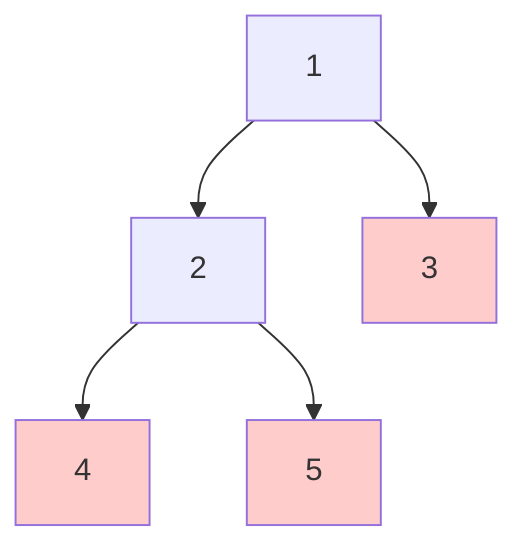

# Find Leaves of Binary Tree

## Problem

Imagine you're simulating the process of autumn leaves falling from a tree, layer by layer. You start with the root of a binary tree, and you need to collect nodes in a specific order: first gather all the current leaf nodes (nodes with no children), remove them from the tree, then repeat the process with the newly-exposed leaves, continuing until the entire tree is gone. For example, in a tree where the root has value 1 with children 2 and 3, and node 2 has children 4 and 5, the first round would collect nodes [4, 5, 3] (all current leaves). After removing those, node 2 becomes a leaf, so round two collects [2]. Finally, the root becomes a leaf, so round three collects [1]. Your output should be a list of lists, where each inner list contains the node values collected in that round. The key insight is that you don't actually need to simulate the deletion process at all - instead, you can think about this problem in terms of a node's "height from the bottom." A leaf has height 0 (it gets removed first), a node whose children are all leaves has height 1 (it gets removed second), and so on. All nodes at the same height get removed in the same round. Edge cases include a tree with just one node (the root, which is immediately a leaf), a completely unbalanced tree (essentially a linked list where nodes are removed one at a time), and trees where multiple branches have different depths.

**Diagram:**



```
Process of removing leaves:

Initial tree:        After round 1:      After round 2:      After round 3:
      1                    1                   1              (empty)
     / \                  /
    2   3                2
   / \
  4   5

Round 1: Remove [4, 5, 3] (all leaves)
Round 2: Remove [2] (becomes a leaf)
Round 3: Remove [1] (root becomes a leaf)

Output: [[4,5,3], [2], [1]]
```


## Why This Matters

This problem models dependency resolution systems where you need to process items in layers based on their dependencies - exactly like package managers (npm, pip, Maven) that must install libraries in the correct order, or build systems (Make, Gradle) that compile source files respecting dependency graphs. In organizational hierarchies, this technique helps with layoff planning or restructuring by identifying positions that can be eliminated in each phase without breaking reporting chains. In computer graphics, rendering engines use this pattern for layer compositing, where effects must be applied bottom-up (leaves to root) to produce correct visual results. The height-based grouping technique you'll learn here is fundamental in compiler design for expression evaluation (evaluating sub-expressions before outer expressions) and in network routing protocols that calculate the shortest path by processing nodes layer by layer from the destination backwards. Understanding post-order traversal and height calculation is also essential for balancing operations in self-balancing trees like AVL trees and Red-Black trees.

## Examples

**Example 1:**
- Input: `root = [1]`
- Output: `[[1]]`
- Explanation: A tree with only the root node has one leaf, so the output is a single collection containing that node.

## Constraints

- The number of nodes in the tree is in the range [1, 100].
- -100 <= Node.val <= 100

## Think About

1. What's the brute force approach? Why is it inefficient?
2. What property of the input can you exploit?
3. Would sorting or preprocessing help?
4. Can you reduce this to a problem you've seen before?

## Approach Hints

<details>
<summary>💡 Hint 1: Rethink the Problem</summary>

Instead of simulating the removal process, think about what determines when a node gets removed. Nodes at the same "level" are removed together. What tree property captures this concept? Consider that a leaf node has a certain characteristic that changes as we move up the tree.
</details>

<details>
<summary>🎯 Hint 2: Height-Based Grouping</summary>

The key insight is that all nodes removed in the same round share the same "height" from the bottom. A leaf has height 0, a node whose children are all leaves has height 1, and so on. Use a post-order traversal (visit children before parent) to calculate each node's height and group nodes by height.
</details>

<details>
<summary>📝 Hint 3: DFS Implementation</summary>

Pseudocode:
```
function dfs(node):
    if node is null:
        return -1

    left_height = dfs(node.left)
    right_height = dfs(node.right)

    current_height = max(left_height, right_height) + 1

    // Add node's value to result[current_height]
    add node.val to result at index current_height

    return current_height
```
The result array will naturally group nodes by their removal round.
</details>

## Complexity Analysis

| Approach | Time | Space | Notes |
|----------|------|-------|-------|
| Brute Force (Simulation) | O(n²) | O(n) | Repeatedly scan tree to find/remove leaves |
| **Height-Based DFS** | **O(n)** | **O(h)** | Visit each node once; h is tree height for recursion stack |

## Common Mistakes

**Mistake 1: Attempting to actually remove nodes**
```python
# Wrong: Modifying tree structure unnecessarily
def findLeaves(root):
    result = []
    while root:
        leaves = []
        root = removeLeaves(root, leaves)  # Complex and error-prone
        result.append(leaves)
    return result
```

```python
# Correct: Calculate heights without modification
def findLeaves(root):
    result = []

    def getHeight(node):
        if not node:
            return -1
        left = getHeight(node.left)
        right = getHeight(node.right)
        height = max(left, right) + 1

        if height == len(result):
            result.append([])
        result[height].append(node.val)
        return height

    getHeight(root)
    return result
```

**Mistake 2: Using level-order traversal instead of height calculation**
```python
# Wrong: BFS doesn't capture removal order
def findLeaves(root):
    result = []
    queue = [root]
    while queue:
        level = []
        for _ in range(len(queue)):
            node = queue.pop(0)
            if isLeaf(node):  # This doesn't work correctly
                level.append(node.val)
```

**Mistake 3: Incorrect height calculation**
```python
# Wrong: Not handling null nodes properly
def getHeight(node):
    if not node:
        return 0  # Should be -1
    return max(getHeight(node.left), getHeight(node.right)) + 1
# This makes leaf nodes have height 1 instead of 0
```

## Variations

| Variation | Difference | Hint |
|-----------|-----------|------|
| Return nodes in reverse order | Output from root to leaves | Reverse the final result array |
| Find nodes at specific height | Return only nodes at height k | During DFS, only add to result when height equals k |
| Binary tree pruning | Remove subtrees based on condition | Similar DFS but with conditional removal |
| Delete leaves with target value | Remove only leaves matching value | Iterate removal until no target leaves remain |

## Practice Checklist

- [ ] First attempt (blind)
- [ ] Reviewed solution
- [ ] Attempted again after 1 day
- [ ] Attempted again after 3 days
- [ ] Attempted again after 1 week
- [ ] Attempted again after 2 weeks

**Strategy**: See [Tree Pattern](../strategies/data-structures/trees.md)
