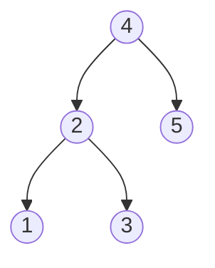
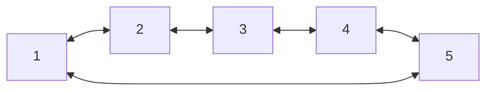

# Convert Binary Search Tree to Sorted Doubly Linked List

## Problem

Your task is to transform a Binary Search Tree (BST) into a sorted circular doubly-linked list, performing the conversion in place without allocating new nodes. Think of this as "rewiring" the tree structure into a list structure by repurposing the existing pointers. In a BST, each node has `left` and `right` child pointers; in the resulting doubly-linked list, these same pointers should represent `previous` and `next` connections. The "circular" aspect means the list wraps around: the smallest node's `left` pointer points to the largest node, and the largest node's `right` pointer points back to the smallest node, forming a closed loop. For example, a BST with values [1, 2, 3, 4, 5] arranged in tree form should become a circular list where 1's left points to 5, each middle node connects to its neighbors, and 5's right points back to 1. The key to solving this lies in recognizing that an inorder traversal of a BST visits nodes in ascending sorted order, which is exactly the order we want for the linked list. As you traverse, you need to maintain a reference to the previously visited node so you can establish the bidirectional links. The tricky parts are handling the circular connection (linking the first and last nodes after the traversal completes) and ensuring you don't lose track of the first node (smallest value) which will be your return value. Edge cases include an empty tree (return null), a single-node tree (node points to itself circularly), and ensuring all child pointers are properly nullified during the transformation.

## Why This Matters

This problem directly applies to memory-efficient data structure transformations in systems with limited resources, such as embedded systems, database internals, and cache implementations. Understanding how to repurpose existing pointers without additional memory allocation is crucial when developing low-level systems code where memory is constrained or allocation overhead is prohibitive. Database systems use similar tree-to-list conversions when flattening B-tree indexes for range scans or when merging sorted segments in log-structured storage engines. File system implementations convert directory tree structures to sorted lists for efficient iteration during backup or search operations. The in-place modification skill you develop here extends to optimizing garbage collection algorithms, implementing custom memory allocators, and building lock-free concurrent data structures where minimizing allocation is critical for performance. The pattern of transforming between hierarchical and linear representations appears in compilers (converting syntax trees to instruction sequences), XML/JSON processors (flattening nested structures for streaming), and graph algorithms (converting trees to traversal orderings). Mastering inorder traversal while maintaining state connections strengthens your understanding of tree properties and pointer manipulation, foundational skills for technical interviews at companies building high-performance systems.


**Diagram:**

Original BST:


Converted to Sorted Circular Doubly Linked List:


In-order traversal: 1 → 2 → 3 → 4 → 5
Circular: 5.next = 1, 1.prev = 5


## Why This Matters

Linked lists teach pointer manipulation and in-place modifications. Understanding node relationships is key to many advanced structures.

## Examples

**Example 1:**
- Input: `root = [2,1,3]`
- Output: `[1,2,3]`

## Constraints

- The number of nodes in the tree is in the range [0, 2000].
- -1000 <= Node.val <= 1000
- All the values of the tree are **unique**.

## Think About

1. What's the brute force approach? Why is it inefficient?
2. What property of the input can you exploit?
3. Would sorting or preprocessing help?
4. Can you reduce this to a problem you've seen before?

## Approach Hints

<details>
<summary>💡 Hint 1: Leverage inorder traversal of BST</summary>

Inorder traversal of a BST visits nodes in sorted order. During the traversal, instead of just visiting nodes, modify their pointers to form a doubly linked list. Keep track of the previously visited node to link it with the current node.
</details>

<details>
<summary>🎯 Hint 2: Track first and last nodes for circular connection</summary>

During inorder traversal, track the first node (smallest value) and the last node (largest value). After traversal completes, connect them to make the list circular. Use a helper variable to remember the previously visited node for linking.
</details>

<details>
<summary>📝 Hint 3: Inorder traversal with pointer modification</summary>

```
1. Initialize: prev = None, first = None, last = None
2. Inorder traversal (recursively):
   - If node is None, return
   - Recursively process left subtree
   - Process current node:
     - If prev is None: first = node (smallest node)
     - Else: prev.right = node, node.left = prev
     - prev = node
   - Recursively process right subtree
3. After traversal:
   - last = prev
   - Make circular: last.right = first, first.left = last
4. Return first

Time: O(n), Space: O(h) for recursion stack
```
</details>

## Complexity Analysis

| Approach | Time Complexity | Space Complexity | Notes |
|----------|----------------|------------------|-------|
| Inorder Traversal (Recursive) | O(n) | O(h) | h = tree height, recursion stack |
| Inorder Traversal (Iterative) | O(n) | O(h) | Explicit stack for iteration |
| Morris Traversal | O(n) | O(1) | Constant space but more complex |

## Common Mistakes

### Mistake 1: Not handling circular connection properly

```python
# Wrong: Forgetting to make the list circular
def tree_to_doubly_list_wrong(root):
    if not root:
        return None

    prev = [None]
    first = [None]

    def inorder(node):
        if not node:
            return
        inorder(node.left)

        if prev[0]:
            prev[0].right = node
            node.left = prev[0]
        else:
            first[0] = node

        prev[0] = node
        inorder(node.right)

    inorder(root)
    # Missing: Connect first and last to make circular!
    return first[0]
```

```python
# Correct: Connect first and last nodes
def tree_to_doubly_list_correct(root):
    if not root:
        return None

    first = None
    prev = None

    def inorder(node):
        nonlocal first, prev
        if not node:
            return

        inorder(node.left)

        if prev:
            prev.right = node
            node.left = prev
        else:
            first = node  # Smallest node

        prev = node
        inorder(node.right)

    inorder(root)
    # Make circular
    first.left = prev
    prev.right = first

    return first
```

### Mistake 2: Incorrect pointer updates during traversal

```python
# Wrong: Not tracking prev correctly
def tree_to_doubly_list_wrong(root):
    def inorder(node):
        if not node:
            return None
        left = inorder(node.left)
        right = inorder(node.right)
        # Can't properly link nodes this way
        return node
```

```python
# Correct: Use nonlocal or class variable to track state
class Solution:
    def tree_to_doubly_list_correct(self, root):
        if not root:
            return None

        self.first = None
        self.prev = None

        def inorder(node):
            if not node:
                return

            inorder(node.left)

            # Link with previous node
            if self.prev:
                self.prev.right = node
                node.left = self.prev
            else:
                self.first = node

            self.prev = node
            inorder(node.right)

        inorder(root)
        self.first.left = self.prev
        self.prev.right = self.first
        return self.first
```

## Variations

| Variation | Difficulty | Description |
|-----------|-----------|-------------|
| Binary Tree Inorder Traversal | Easy | Basic inorder traversal - M094 |
| Flatten BST to Sorted List | Medium | Similar but singly linked - M426 |
| Convert Sorted List to BST | Medium | Reverse operation - M109 |
| Flatten Binary Tree to Linked List | Medium | Preorder to linked list |

## Practice Checklist

- [ ] Day 1: Solve using recursive inorder traversal (25-35 min)
- [ ] Day 2: Implement using iterative inorder with stack (30 min)
- [ ] Day 7: Re-solve and handle edge case (single node, empty tree) (20 min)
- [ ] Day 14: Implement Morris traversal for O(1) space (40 min)
- [ ] Day 30: Explain why inorder traversal gives sorted order for BST (10 min)

**Strategy**: See [Linked List Pattern](../strategies/data-structures/linked-lists.md)
