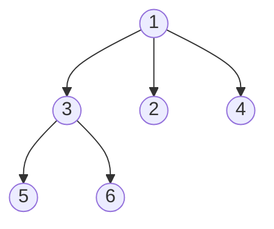
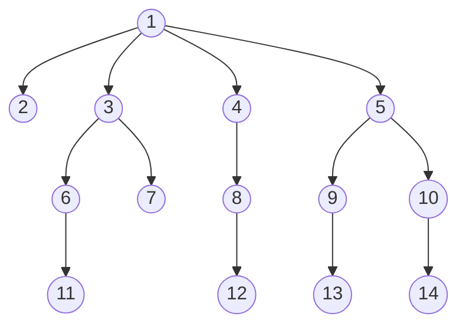

# Serialize and Deserialize N-ary Tree

## Problem

Serialization is the process of converting a complex data structure into a flat sequence of bytes (typically a string) that can be written to disk, transmitted over a network, or stored in a database, and then later reconstructed back to its original form through deserialization. Your challenge is to design and implement both serialization and deserialization algorithms for an N-ary tree, where each node can have any number of children (not just two like in binary trees). Think of this like saving a family tree to a text file and then being able to rebuild the exact same family relationships from that file. The catch is that unlike binary trees where you know every node has at most left and right children, N-ary trees have variable branching, so you need to encode how many children each node has. You have complete creative freedom in your encoding scheme—you could use delimiters (like brackets or null markers), encode child counts explicitly, use level-order traversal with separators, or even invent your own notation. The only requirements are that your `serialize` function must convert any N-ary tree to a string, and your `deserialize` function must reconstruct the exact original tree structure from that string. For example, you might encode the tree structure `1 [3[5 6] 2 4]` where brackets indicate parent-child relationships, or use level-order with null delimiters like `1,null,3,2,4,null,5,6,null,null,null,null`. Edge cases include empty trees (return empty string), single-node trees, very deep trees (testing recursion limits), and trees with many children per node. Your solution must be stateless, meaning you can't use global variables or class members to track state between serialization and deserialization calls.

## Why This Matters

Serialization is ubiquitous in modern software systems for data persistence, inter-process communication, caching, and distributed computing. Every time you save application state, send data over REST APIs (JSON serialization), store objects in Redis or Memcached, or transmit messages between microservices, you're using serialization. Database systems serialize complex objects like indexes, query plans, and stored procedures for storage on disk. Compilers serialize abstract syntax trees (ASTs) for incremental compilation and build caching. Distributed systems like Apache Kafka, RabbitMQ, and gRPC rely on efficient serialization protocols (Protobuf, Avro, MessagePack) to minimize network bandwidth and latency. Understanding how to design custom serialization formats teaches you the trade-offs between human readability (JSON, XML), space efficiency (binary formats), and parsing complexity. The challenge of encoding variable-structure data (like N-ary trees with unpredictable branching) mirrors real-world problems like serializing heterogeneous configuration files, polymorphic object hierarchies, and arbitrary nested data structures. Machine learning systems serialize trained models for deployment, web browsers serialize DOM trees for caching, and version control systems serialize file trees for commits. Mastering serialization deepens your understanding of data representation, encoding schemes, and how to design protocols that balance simplicity, efficiency, and robustness, skills essential for backend engineering, distributed systems, and data engineering roles.

As an illustration, consider this `3-ary` tree:



One possible serialization could be `[1 [3[5 6] 2 4]]`. This is merely one approach; you are not required to use this specific format.

Alternatively, you could adopt a level order traversal approach where null values mark the boundaries between sibling groups.



Using this approach, the tree shown above might be serialized as `[1,null,2,3,4,5,null,null,6,7,null,8,null,9,10,null,null,11,null,12,null,13,null,null,14]`.

These are merely suggestions. Feel free to explore different encoding strategies and develop your own creative solution.

## Why This Matters

This problem develops fundamental algorithmic thinking and problem-solving skills.

## Examples

**Example 1:**
- Input: `root = [1,null,2,3,4,5,null,null,6,7,null,8,null,9,10,null,null,11,null,12,null,13,null,null,14]`
- Output: `[1,null,2,3,4,5,null,null,6,7,null,8,null,9,10,null,null,11,null,12,null,13,null,null,14]`

**Example 2:**
- Input: `root = [1,null,3,2,4,null,5,6]`
- Output: `[1,null,3,2,4,null,5,6]`

**Example 3:**
- Input: `root = []`
- Output: `[]`

## Constraints

- The number of nodes in the tree is in the range [0, 10⁴].
- 0 <= Node.val <= 10⁴
- The height of the n-ary tree is less than or equal to 1000
- Do not use class member/global/static variables to store states. Your encode and decode algorithms should be stateless.

## Think About

1. What's the brute force approach? Why is it inefficient?
2. What property of the input can you exploit?
3. Would sorting or preprocessing help?
4. Can you reduce this to a problem you've seen before?

## Approach Hints

<details>
<summary>💡 Hint 1: Use level-order traversal with delimiters</summary>

Use BFS (level-order traversal) to serialize. For each node, store its value followed by all its children. Use a special delimiter (like null or "#") to mark the end of each node's children list. During deserialization, use the delimiter to know when to stop adding children to the current node.
</details>

<details>
<summary>🎯 Hint 2: Encode children count for each node</summary>

Another approach is to encode the number of children for each node. Format: `[value, num_children, child1, child2, ...]`. This makes deserialization straightforward - for each node, you know exactly how many children to expect and can recursively deserialize them.
</details>

<details>
<summary>📝 Hint 3: Serialization algorithms</summary>

```
Approach 1: Level-order with null delimiters
Serialize:
  1. BFS traversal using queue
  2. For each node: append value, append all children values
  3. Append null as delimiter after children
  4. Join with commas: "1,null,3,2,4,null,5,6,null,null,null,null"

Deserialize:
  1. Split string by comma
  2. Use queue for BFS reconstruction
  3. Track parent nodes and add children until hitting null

Approach 2: Preorder with children count
Serialize:
  1. For each node: [value, num_children, child1, child2, ...]
  2. Recursively serialize children

Deserialize:
  1. Read value and num_children
  2. Recursively deserialize that many children
  3. Create node and attach children

Time: O(n), Space: O(n)
```
</details>

## Complexity Analysis

| Approach | Time Complexity | Space Complexity | Notes |
|----------|----------------|------------------|-------|
| Level-order with delimiters | O(n) | O(n) | Queue for BFS, string storage |
| Preorder with children count | O(n) | O(h) | Recursion stack height h |
| Parenthetical notation | O(n) | O(n) | String building and parsing |

## Common Mistakes

### Mistake 1: Not handling variable number of children correctly

```python
# Wrong: Assuming each node has exactly 2 children (binary tree thinking)
def serialize_wrong(root):
    if not root:
        return "null"
    # Wrong: doesn't encode how many children
    return f"{root.val},{serialize(root.children[0])},{serialize(root.children[1])}"
```

```python
# Correct: Encode number of children or use delimiter
def serialize_correct(root):
    if not root:
        return ""

    result = []
    queue = [root]

    while queue:
        node = queue.pop(0)
        result.append(str(node.val))

        for child in node.children:
            queue.append(child)

        # Add delimiter to mark end of this node's children
        result.append("#")

    return ",".join(result)
```

### Mistake 2: Incorrect deserialization state tracking

```python
# Wrong: Not properly tracking which children belong to which parent
def deserialize_wrong(data):
    if not data:
        return None
    values = data.split(",")
    root = Node(int(values[0]), [])
    # Missing: how to know which values are children of which node?
    return root
```

```python
# Correct: Use queue and delimiter to track parent-child relationships
def deserialize_correct(data):
    if not data:
        return None

    values = data.split(",")
    root = Node(int(values[0]), [])
    queue = [root]
    i = 1

    while queue:
        parent = queue.pop(0)
        # Skip the parent's value, already processed
        i += 1  # Move past the delimiter from previous

        # Add children until we hit delimiter
        while i < len(values) and values[i] != "#":
            child = Node(int(values[i]), [])
            parent.children.append(child)
            queue.append(child)
            i += 1

    return root
```

## Variations

| Variation | Difficulty | Description |
|-----------|-----------|-------------|
| Serialize Binary Tree | Medium | Simpler with only 2 children - M297 |
| Encode N-ary Tree to Binary Tree | Hard | Convert N-ary to binary then serialize - M431 |
| Serialize N-ary Tree with Compression | Hard | Minimize serialized string size |
| Serialize Graph | Hard | Handle cycles and multiple parents |

## Practice Checklist

- [ ] Day 1: Solve using level-order with delimiters (30-40 min)
- [ ] Day 2: Implement using children count encoding (35 min)
- [ ] Day 7: Re-solve with parenthetical notation (25 min)
- [ ] Day 14: Compare with binary tree serialization (M297) (20 min)
- [ ] Day 30: Explain trade-offs between different encoding schemes (15 min)

**Strategy**: See [Bfs Pattern](../strategies/patterns/graph-traversal.md)
