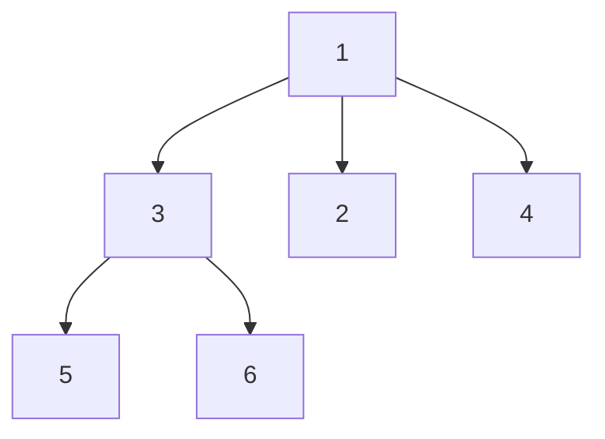
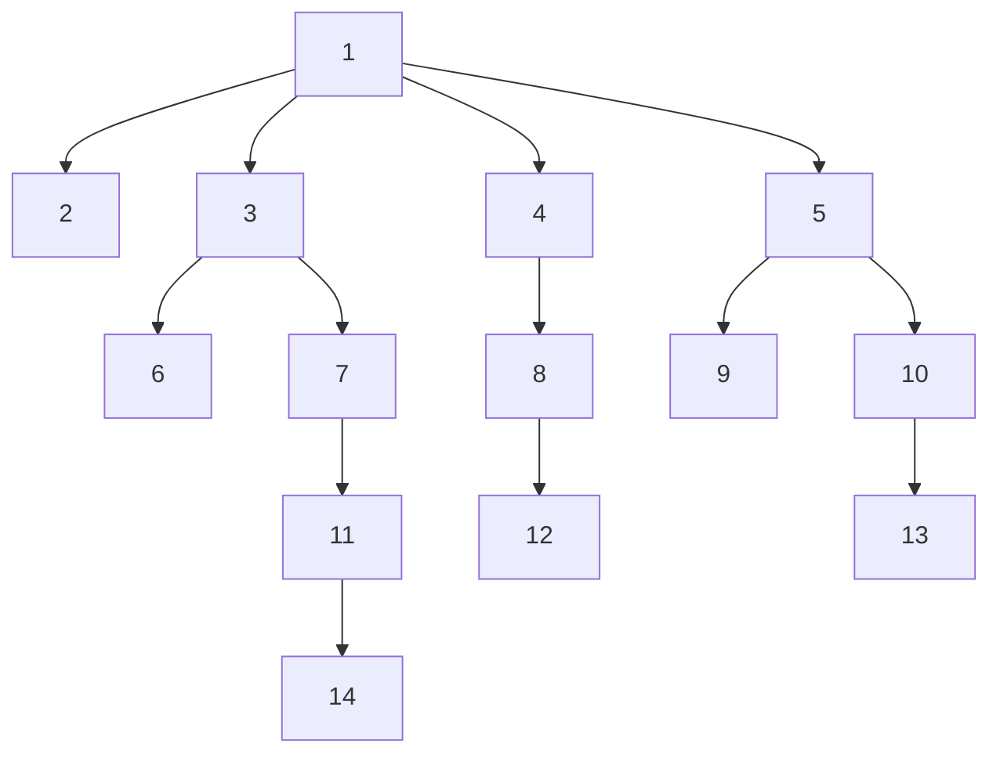

# N-ary Tree Level Order Traversal

## Problem

Given an N-ary tree (where each node can have any number of children, not just two), your task is to perform a level-order traversal and return the node values grouped by their depth level. Level-order traversal, also known as breadth-first traversal, processes all nodes at depth 0 (the root), then all nodes at depth 1 (root's children), then all nodes at depth 2 (grandchildren), and so on, working layer by layer from top to bottom. The result should be a list of lists, where each inner list contains all node values at a particular level in left-to-right order. For example, if your tree has root 1 with children [3, 2, 4], and node 3 has children [5, 6], the level-order traversal would be `[[1], [3, 2, 4], [5, 6]]`—first the root alone, then its three children, then the two grandchildren. The challenge extends binary tree level-order traversal to handle variable numbers of children per node. While binary trees have predictable structure (at most 2 children), N-ary trees require iterating through a dynamic collection of children. The classic approach uses a queue data structure: enqueue the root, then repeatedly dequeue a node, record its value, and enqueue all its children. To group nodes by level, you need to track how many nodes belong to the current level before moving to the next. Edge cases include an empty tree (return empty list), a single node with no children (return `[[node.val]]`), and trees with varying widths (some levels narrow, others very wide). Using an efficient queue implementation matters for large trees to avoid O(n) dequeue operations.

## Why This Matters

Level-order traversal is the foundation for many hierarchical data processing tasks in real-world systems. File system explorers use breadth-first traversal to display directory listings level by level, ensuring users see top-level folders before deeply nested subdirectories. Web crawlers perform breadth-first traversal of hyperlinks to discover pages near the starting URL before venturing into deep link chains, which helps prioritize important content. Organizational charts and management hierarchies are traversed level-by-level when broadcasting announcements (CEO to VPs to directors to managers). Social network analysis uses BFS to find shortest paths between people, discover communities, and measure influence (friends, friends-of-friends, etc.). In AI and game development, BFS explores game trees and state spaces to find shortest solutions (like solving puzzles or pathfinding in strategy games). Package managers resolve dependency trees level by level to determine installation order, ensuring parent packages are processed before their dependencies. Build systems (like Make, Gradle, Bazel) traverse dependency graphs in level order for parallel build execution. Mastering level-order traversal with proper node grouping strengthens your understanding of queue-based algorithms, essential for job scheduling, message processing, and any scenario requiring ordered exploration of hierarchical or graph structures. This is a frequent interview question for roles involving data structures, system design, and backend engineering.

**Diagram:**

Example 1: N-ary tree with level order traversal


Example 2: Another N-ary tree



## Why This Matters

This problem develops fundamental algorithmic thinking and problem-solving skills.

## Constraints

- The height of the n-ary tree is less than or equal to 1000
- The total number of nodes is between [0, 10⁴]

## Think About

1. What's the brute force approach? Why is it inefficient?
2. What property of the input can you exploit?
3. Would sorting or preprocessing help?
4. Can you reduce this to a problem you've seen before?

## Approach Hints

<details>
<summary>💡 Hint 1: Conceptual Understanding</summary>
Level-order traversal processes all nodes at depth d before moving to depth d+1. This is identical to BFS for binary trees, but extended to handle an arbitrary number of children per node. Think about how you would visit nodes layer by layer.
</details>

<details>
<summary>🎯 Hint 2: Data Structure Choice</summary>
A queue is the perfect data structure for level-order traversal. Enqueue the root, then repeatedly dequeue a node, collect its value, and enqueue all its children. To group nodes by level, track the current level size before processing each level.
</details>

<details>
<summary>📝 Hint 3: Algorithm Steps</summary>
```
1. Initialize result list and queue with root node
2. While queue is not empty:
   - Record current queue size (level_size)
   - Create empty list for current level
   - For level_size iterations:
     - Dequeue node
     - Add node value to current level list
     - Enqueue all children of node
   - Add current level list to result
3. Return result
```
</details>

## Complexity Analysis

| Approach | Time Complexity | Space Complexity | Notes |
|----------|----------------|------------------|-------|
| BFS with Queue | O(n) | O(w) | n = total nodes, w = max width of tree |
| DFS with Level Tracking | O(n) | O(h) | h = height of tree, recursion stack |
| Iterative DFS | O(n) | O(n) | Uses explicit stack, less intuitive |

**Recommended approach**: BFS with queue for clarity and natural level grouping.

## Common Mistakes

**Mistake 1: Not grouping nodes by level**
```python
# Wrong: Returns flat list of all values
def levelOrder(root):
    if not root:
        return []
    queue = [root]
    result = []
    while queue:
        node = queue.pop(0)
        result.append(node.val)  # Lost level information
        queue.extend(node.children)
    return result
```

```python
# Correct: Groups nodes by level
def levelOrder(root):
    if not root:
        return []
    queue = [root]
    result = []
    while queue:
        level_size = len(queue)  # Capture current level size
        current_level = []
        for _ in range(level_size):
            node = queue.pop(0)
            current_level.append(node.val)
            queue.extend(node.children)
        result.append(current_level)
    return result
```

**Mistake 2: Forgetting null check for children**
```python
# Wrong: Assumes children is always a list
def levelOrder(root):
    if not root:
        return []
    queue = [root]
    result = []
    while queue:
        level_size = len(queue)
        current_level = []
        for _ in range(level_size):
            node = queue.pop(0)
            current_level.append(node.val)
            for child in node.children:  # Crashes if children is None
                queue.append(child)
        result.append(current_level)
    return result
```

```python
# Correct: Handles None children gracefully
def levelOrder(root):
    if not root:
        return []
    queue = [root]
    result = []
    while queue:
        level_size = len(queue)
        current_level = []
        for _ in range(level_size):
            node = queue.pop(0)
            current_level.append(node.val)
            if node.children:  # Check before iterating
                queue.extend(node.children)
        result.append(current_level)
    return result
```

**Mistake 3: Using inefficient dequeue operation**
```python
# Wrong: O(n) for each pop(0) operation
def levelOrder(root):
    if not root:
        return []
    queue = [root]  # List as queue
    result = []
    while queue:
        level_size = len(queue)
        current_level = []
        for _ in range(level_size):
            node = queue.pop(0)  # O(n) operation
            current_level.append(node.val)
            if node.children:
                queue.extend(node.children)
        result.append(current_level)
    return result
```

```python
# Correct: Use collections.deque for O(1) operations
from collections import deque

def levelOrder(root):
    if not root:
        return []
    queue = deque([root])  # Deque for efficient operations
    result = []
    while queue:
        level_size = len(queue)
        current_level = []
        for _ in range(level_size):
            node = queue.popleft()  # O(1) operation
            current_level.append(node.val)
            if node.children:
                queue.extend(node.children)
        result.append(current_level)
    return result
```

## Variations

| Variation | Difference | Key Insight |
|-----------|-----------|-------------|
| Binary Tree Level Order | Max 2 children per node | Same BFS approach, simpler iteration |
| Right Side View | Return rightmost node per level | Track last node in each level |
| Zigzag Level Order | Alternate left-to-right direction | Reverse alternate levels or use deque |
| Level Averages | Compute average per level | Sum values while building each level |
| Bottom-Up Level Order | Return levels in reverse | BFS normally, then reverse result list |

## Practice Checklist

Use spaced repetition to master this problem:

- [ ] Day 1: Solve using BFS with queue
- [ ] Day 2: Solve using DFS with level tracking
- [ ] Day 4: Implement without looking at notes
- [ ] Day 7: Solve and explain to someone else
- [ ] Day 14: Solve variations (zigzag, right side view)
- [ ] Day 30: Speed test - solve in under 10 minutes

**Strategy**: See [Bfs Pattern](../strategies/patterns/graph-traversal.md)
