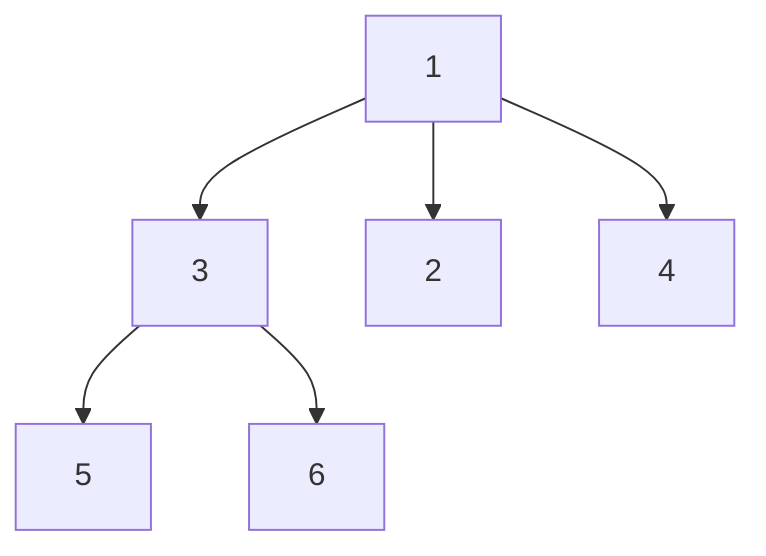
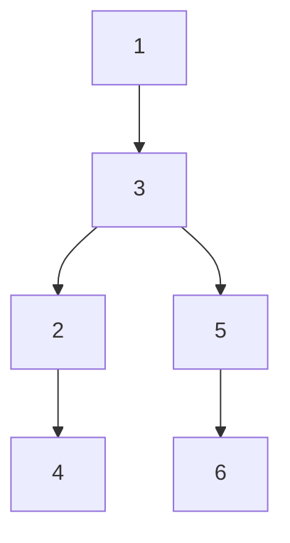

# Encode N-ary Tree to Binary Tree

## Problem

Your challenge is to design a reversible encoding scheme that converts any N-ary tree (where nodes can have arbitrary numbers of children) into a binary tree (where nodes have at most two children), and then decode that binary tree back to the exact original N-ary structure. This is like compressing a complex hierarchical organization chart (where managers can have any number of direct reports) into a strict binary format (where each person has at most two connections) while preserving all relationships perfectly. The classic solution uses the "left-child, right-sibling" representation: for each N-ary node, map its first child to the binary node's left pointer, and link all remaining children in a chain using right pointers, creating a "next sibling" relationship. For example, if an N-ary node has children [A, B, C, D], the binary encoding would place A as the left child, then B as A's right child, C as B's right child, and D as C's right child, forming a chain. This elegantly maps parent-child relationships (left pointers) and sibling relationships (right pointers) using only two pointers per node. When decoding, you reverse the process: the left child of a binary node becomes the first child of the N-ary node, and following the chain of right pointers from that first child gives you all subsequent children. Edge cases include nodes with no children (left pointer is null), nodes with many children (long right-sibling chains), and deep trees where encoding changes the structure dramatically. The critical requirement is that your encode and decode functions must be stateless—no global variables or class members to track state, ensuring thread-safety and functional purity.

## Why This Matters

Tree encoding and representation transformations are fundamental to compiler design, serialization protocols, and data structure optimization. Programming language compilers convert N-ary abstract syntax trees (ASTs), where nodes like function calls can have many arguments, into binary intermediate representations for optimization and code generation. XML/HTML parsers transform document trees with variable-width nodes (elements with many children) into binary formats for efficient processing. Memory-constrained systems use binary tree representations because they're simpler to implement and often more cache-friendly than N-ary structures with dynamic child arrays. The left-child right-sibling technique you'll learn is the standard way to implement N-ary trees using only binary tree nodes, appearing in operating system process trees (where processes can spawn many children), file system directory structures, and game engine scene graphs. Understanding structural isomorphisms—recognizing that different representations can encode the same information—is crucial for designing space-efficient data structures, cross-platform serialization formats, and backward-compatible protocol evolution. Database systems use similar encoding when converting logical query trees (with N-way joins) to binary operator trees for execution. This problem deepens your understanding of pointer-based data structures and teaches you to think about information preservation during transformations, skills valued in systems programming, database internals, and compiler engineering roles. It's a favorite interview question at companies building language tools, databases, or high-performance systems.

For instance, you might transform the following `3-ary` tree into a binary tree using this approach:

N-ary Tree:


Possible Binary Tree encoding (one approach):


**Input:** root = [1,null,3,2,4,null,5,6]

This is merely one example approach that *may or may not* be optimal. You are encouraged to explore alternative strategies and develop your own creative solution.

## Why This Matters

Tree problems develop recursive thinking and hierarchical data navigation. Mastering tree traversals unlocks graph algorithms.

## Examples

**Example 1:**
- Input: `root = [1,null,3,2,4,null,5,6]`
- Output: `[1,null,3,2,4,null,5,6]`

**Example 2:**
- Input: `root = [1,null,2,3,4,5,null,null,6,7,null,8,null,9,10,null,null,11,null,12,null,13,null,null,14]`
- Output: `[1,null,2,3,4,5,null,null,6,7,null,8,null,9,10,null,null,11,null,12,null,13,null,null,14]`

**Example 3:**
- Input: `root = []`
- Output: `[]`

## Constraints

- The number of nodes in the tree is in the range [0, 10⁴].
- 0 <= Node.val <= 10⁴
- The height of the n-ary tree is less than or equal to 1000
- Do not use class member/global/static variables to store states. Your encode and decode algorithms should be stateless.

## Think About

1. What's the brute force approach? Why is it inefficient?
2. What property of the input can you exploit?
3. Would sorting or preprocessing help?
4. Can you reduce this to a problem you've seen before?

## Approach Hints

<details>
<summary>💡 Hint 1: Conceptual Understanding</summary>
The classic "left-child, right-sibling" encoding is perfect for this problem. Map the first child of an N-ary node to the left child of the binary node, and map all siblings to a right-linked chain. This preserves both parent-child and sibling relationships using only two pointers.
</details>

<details>
<summary>🎯 Hint 2: Encoding Strategy</summary>
For each N-ary node: 1) If it has children, make the first child the left child of the binary node, 2) Link all remaining children as a right-linked chain starting from the first child. This creates a binary tree where left means "first child" and right means "next sibling".
</details>

<details>
<summary>📝 Hint 3: Decoding Algorithm</summary>
```
Encode:
1. If N-ary node is null, return null
2. Create binary node with same value
3. If N-ary node has children:
   - Binary node.left = encode(first child)
   - Link remaining siblings: current = binary node.left
   - For each remaining child in N-ary children:
     - current.right = encode(child)
     - current = current.right
4. Return binary node

Decode (reverse process):
1. If binary node is null, return null
2. Create N-ary node with same value
3. Traverse right chain from binary node.left:
   - Each node in chain becomes a child of N-ary node
4. Recursively decode each child
5. Return N-ary node
```
</details>

## Complexity Analysis

| Approach | Time Complexity | Space Complexity | Notes |
|----------|----------------|------------------|-------|
| Left-child Right-sibling | O(n) encode, O(n) decode | O(h) | h = height, recursion stack |
| Level-order encoding | O(n) encode, O(n) decode | O(w) | w = max width, queue space |
| Preorder with markers | O(n) encode, O(n) decode | O(n) | Requires string serialization |

**Recommended approach**: Left-child right-sibling for elegant tree-to-tree mapping.

## Common Mistakes

**Mistake 1: Not handling empty children list**
```python
# Wrong: Crashes when node has no children
def encode(root):
    if not root:
        return None
    binary_node = TreeNode(root.val)
    if root.children:
        binary_node.left = encode(root.children[0])
        current = binary_node.left
        for child in root.children[1:]:  # Crashes if children is empty
            current.right = encode(child)
            current = current.right
    return binary_node
```

```python
# Correct: Checks if children exist and not empty
def encode(root):
    if not root:
        return None
    binary_node = TreeNode(root.val)
    if root.children and len(root.children) > 0:  # Explicit check
        binary_node.left = encode(root.children[0])
        current = binary_node.left
        for i in range(1, len(root.children)):
            current.right = encode(root.children[i])
            current = current.right
    return binary_node
```

**Mistake 2: Incorrect sibling chain reconstruction**
```python
# Wrong: Loses children after first one in decode
def decode(root):
    if not root:
        return None
    nary_node = Node(root.val, [])
    child = root.left
    while child:
        nary_node.children.append(decode(child))  # Recursive call loses chain
        child = child.right
    return nary_node
```

```python
# Correct: Traverses chain before recursion
def decode(root):
    if not root:
        return None
    nary_node = Node(root.val, [])
    # Collect all children in the right-linked chain
    child = root.left
    while child:
        nary_node.children.append(decode(child))
        child = child.right
    return nary_node
```

**Mistake 3: Using global/static state**
```python
# Wrong: Uses class variable (violates stateless requirement)
class Codec:
    def __init__(self):
        self.mapping = {}  # Shared state between encode/decode

    def encode(self, root):
        if not root:
            return None
        binary_node = TreeNode(root.val)
        self.mapping[id(root)] = binary_node  # Stateful
        # ... rest of encoding
        return binary_node
```

```python
# Correct: Purely functional, no shared state
class Codec:
    def encode(self, root):
        if not root:
            return None
        binary_node = TreeNode(root.val)
        if root.children:
            binary_node.left = self.encode(root.children[0])
            current = binary_node.left
            for i in range(1, len(root.children)):
                current.right = self.encode(root.children[i])
                current = current.right
        return binary_node  # No state stored

    def decode(self, root):
        if not root:
            return None
        nary_node = Node(root.val, [])
        child = root.left
        while child:
            nary_node.children.append(self.decode(child))
            child = child.right
        return nary_node
```

## Variations

| Variation | Difference | Key Insight |
|-----------|-----------|-------------|
| Serialize to string | Convert to string format | Use preorder with child count markers |
| Encode K-ary to binary | Fixed K children | Can optimize with array indexing |
| Lossy encoding | Allow information loss | Multiple N-ary trees map to same binary |
| Balanced encoding | Minimize binary tree height | Use different child distribution strategy |
| Breadth-first encoding | Level-order based | Use queue, encode level information |

## Practice Checklist

Use spaced repetition to master this problem:

- [ ] Day 1: Implement left-child right-sibling encoding
- [ ] Day 2: Solve using alternative encoding scheme
- [ ] Day 4: Implement without looking at notes
- [ ] Day 7: Solve and explain encoding/decoding invariants
- [ ] Day 14: Solve variations (string serialization)
- [ ] Day 30: Speed test - solve in under 20 minutes

**Strategy**: See [Tree Pattern](../strategies/data-structures/trees.md)
